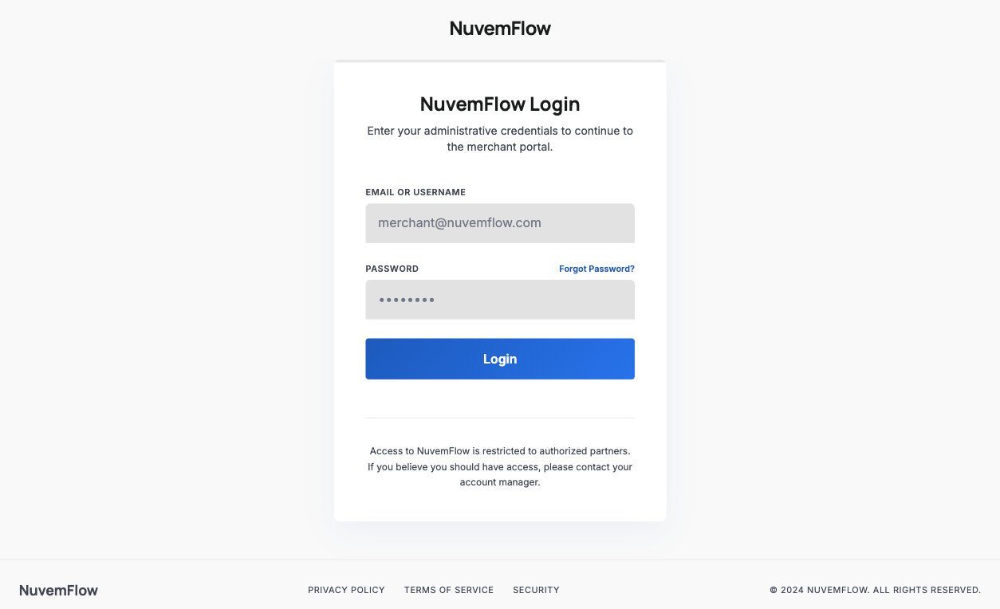
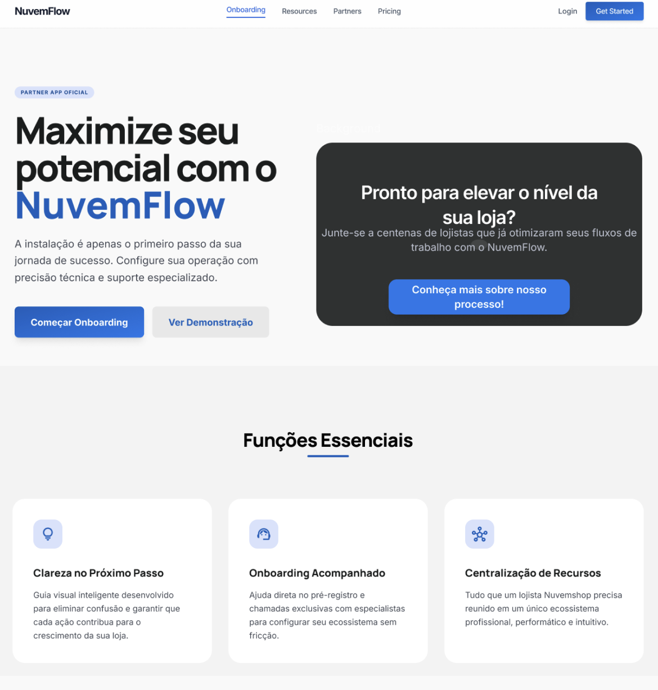

# Landing Page

A instalação do aplicativo representa apenas o primeiro passo da jornada do parceiro. Para aqueles que ingressarão em um fluxo de gestão e onboarding acompanhado, a exibição de uma **Landing Page** proporciona maior **clareza, alinhamento e compreensão dos próximos passos** para o merchant.

## Funções Essenciais da Landing Page

### 1. Clareza e Direcionamento do Próximo Passo

- Após a instalação, a Landing Page deve atuar como um **guia visual**, orientando o merchant sobre as próximas ações.
- Esse direcionamento é essencial para evitar a queda de engajamento logo após a instalação do aplicativo.

### 2. Preparação para o Onboarding Acompanhado

- Em fluxos que exigem gestão e acompanhamento, a Landing Page deve ser o ponto central para que o parceiro:
  - complete o **pré-cadastro**;
  - agende o primeiro contato (quando aplicável); ou
  - obtenha a informação de que o time responsável entrará em contato.

### 3. Centralização de Recursos

- A Landing Page funciona como um **hub temporário**, centralizando a documentação essencial, como **FAQs, vídeos tutoriais e políticas de parceria**.
- Isso otimiza a conexão com o merchant, permitindo que ele obtenha, de forma **self-service**, o conhecimento inicial necessário sobre processos e próximos passos.

Sem uma etapa intermediária de orientação, corremos o risco de gerar uma desistência do merchant no uso da aplicação. Abaixo, comparamos dois cenários de fluxo pós-instalação:

### Cenário 1: Instalação Direta (sem landing page)

Neste modelo, o merchant instala o app e é imediatamente confrontado com a tela de Login/Autenticação.

- **O Problema:** Se o merchant descobriu o app através da App Store e ainda não possui uma parceria comercial ou conta ativa, ele encontrará uma barreira intransponível.
- **A Frustração:** Como ele obtém as credenciais?
  - Existe um portal de cadastro?
  - Onde estão os canais de suporte ou vendas?
- **Consequência:** Sem instruções claras, o merchant desinstala o aplicativo por não saber como prosseguir com a parceria, resultando em perda de oportunidade de negócio.
- **A Falha de Experiência (UX):** Em muitas implementações, a solução adotada é o redirecionamento direto para o site institucional. Essa prática não é considerada uma boa experiência, pois:
  - **Quebra de Contexto:** O usuário é removido abruptamente do ambiente nativo do aplicativo para um navegador externo, gerando desorientação.
  - **Fricção de Conversão:** O esforço exigido para sair do app, preencher cadastros em um outro site e depois retornar ao app aumenta drasticamente a taxa de abandono.
  - **Percepção de Valor:** O app deixa de parecer uma ferramenta de trabalho e passa a ser visto apenas como um "atalho" para um site, diminuindo a relevância da instalação.

   

### Cenário 2: Fluxo Otimizado (com landing page)

Ao incluir uma Landing Page logo após a instalação, oferecemos um mapa claro para dois perfis distintos de usuários:

1. Para o usuário que já é parceiro, a landing page oferece um caminho direto e rápido.
   - **Ação:** Botão de "Já sou parceiro / Fazer Login".
   - **Resultado:** Experiência fluida e sem fricção para quem já sabe o que fazer.
2. Para o Prospect (novo usuário) onde a landing page atua como um guia de onboarding.
   - **Ação:** Botão de "Quero ser parceiro" ou "Saiba mais".
   - **Fluxo de Onboarding:**
     - **Visibilidade:** Apresentação rápida dos benefícios do app.
     - **Próximos Passos:** Instruções claras sobre como iniciar a parceria comercial.
     - **Conversão:** Direcionamento para um formulário de contato, WhatsApp de vendas ou página de pré-cadastro.

     

## Benefícios do Fluxo

- **Aumento da taxa de ativação:** Parceiros bem informados e corretamente direcionados apresentam maior probabilidade de concluir o onboarding e se tornarem usuários ativos do aplicativo.
- **Qualificação antecipada:** A Landing Page pode incluir formulários que auxiliam na qualificação e segmentação do parceiro, permitindo uma abordagem mais personalizada antes do primeiro contato.
- **Experiência profissional e confiável:** Um fluxo estruturado transmite profissionalismo e confiança, reforçando o valor da parceria e do aplicativo desde o início.
