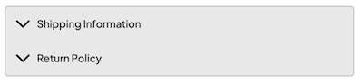
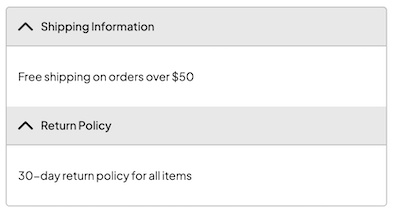

import { Alert, Text, Box } from '@nimbus-ds/components';
import AppTypes from '@site/src/components/AppTypes';

An `accordion` is a collapsible content component that allows users to expand and collapse sections of content.
It's commonly used to organize information into manageable sections, improving the user experience by reducing visual clutter.

The accordion is a compound component composed of `Root`, `Item`, `Header`, and `Content` subcomponents.





### Usage

```typescript title="Example"
import type { NubeSDK } from "@tiendanube/nube-sdk-types";
import { Accordion, Text } from "@tiendanube/nube-sdk-jsx";

function MyComponent() {
  return (
    <Accordion.Root defaultValue="shipping-info">
      <Accordion.Item value="shipping-info">
        <Accordion.Header showIcon>Shipping Information</Accordion.Header>
        <Accordion.Content>
          <Text>Free shipping on orders over $50</Text>
        </Accordion.Content>
      </Accordion.Item>
      <Accordion.Item value="return-policy">
        <Accordion.Header showIcon>Return Policy</Accordion.Header>
        <Accordion.Content>
          <Text>30-day return policy for all items</Text>
        </Accordion.Content>
      </Accordion.Item>
    </Accordion.Root>
  );
}

export function App(nube: NubeSDK) {
  nube.send("ui:slot:set", () => ({
    ui: {
      slots: {
        after_line_items: <MyComponent />,
      },
    },
  }));
}
```

## Subcomponents

### Accordion.Root

The root container that manages the accordion state.

| Property     | Type                  | Required | Description                                   |
| ------------ | --------------------- | -------- | --------------------------------------------- |
| children     | NubeChildrenComponent | No       | Accordion items to be rendered.               |
| defaultValue | string                | No       | Default expanded item value.                  |
| style        | StyleSheet            | No       | Custom styles for the accordion root.         |
| id           | string                | No       | Optional unique identifier for the component. |

### Accordion.Item

Individual accordion item container.

| Property | Type                  | Required | Description                                   |
| -------- | --------------------- | -------- | --------------------------------------------- |
| children | NubeChildrenComponent | No       | Header and content components.                |
| value    | string                | Yes      | Unique value to identify the accordion item.  |
| id       | string                | No       | Optional unique identifier for the component. |
| style    | StyleSheet            | No       | Custom styles for the accordion item.         |

### Accordion.Header

The clickable header that toggles the accordion item.

| Property | Type       | Required | Description                            |
| -------- | ---------- | -------- | -------------------------------------- |
| children | string     | No       | Text content of the header.            |
| showIcon | boolean    | No       | Whether to show expand/collapse icon.  |
| style    | StyleSheet | No       | Custom styles for the header.          |

### Accordion.Content

The collapsible content area of the accordion item.

| Property | Type                  | Required | Description                                    |
| -------- | --------------------- | -------- | ---------------------------------------------- |
| children | NubeChildrenComponent | No       | Content to be displayed when item is expanded. |
| style    | StyleSheet            | No       | Custom styles for the content area.            |
