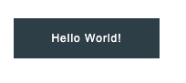

import { Alert, Text, Box } from '@nimbus-ds/components';
import AppTypes from '@site/src/components/AppTypes';

:::warning
This SDK is a Work In Progress! All features are subject to change.
:::

A `button` is a clickable element used to trigger actions.
It supports properties such as `children`, `variant`, `onClick`, and style configurations.



### Usage

```typescript title="Example"
import { Button } from "@tiendanube/nube-sdk-jsx";

<Button variant="primary" onClick={() => {}}>
  Click here
</Button>;
```

### Properties

| Property | Type                                                   | Required | Description                                  |
| -------- | ------------------------------------------------------ | -------- | -------------------------------------------- |
| children | string                                                 | No       | Text or content of the button.               |
| disabled | boolean                                                | No       | Whether the button is disabled.              |
| variant  | "primary"<br/>"secondary"<br/>"transparent"<br/>"link" | No       | Button style variant.                        |
| width    | Size                                                   | No       | Width of the button (e.g., "100%", "200px"). |
| height   | Size                                                   | No       | Height of the button.                        |
| onClick  | NubeComponentButtonEventHandler                        | No       | Function called when the button is clicked.  |
| style    | StyleSheet                                             | No       | Custom styles for the button.                |

