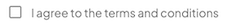
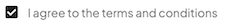

import { Alert, Text, Box } from '@nimbus-ds/components';
import AppTypes from '@site/src/components/AppTypes';

Checkbox allows the user to select one or more items from a set. Checkboxes can be used to turn an option on or off.





### Usage

```typescript title="Example"
import type { NubeSDK } from "@tiendanube/nube-sdk-types";
import { Checkbox } from "@tiendanube/nube-sdk-jsx";

function MyComponent() {
  return (
    <Checkbox
      name="terms"
      label="I agree to the terms and conditions"
      checked={false}
      onChange={() => {}}
    />
  );
}

export function App(nube: NubeSDK) {
  nube.send("ui:slot:set", () => ({
    ui: {
      slots: {
        after_line_items: <MyComponent />,
      },
    },
  }));
}
```

### Event Handlers

The checkbox component supports an event handler that receives an object with the following properties:

```typescript
onChange: (data: {
  type: "change";       // The type of event
  state: NubeSDKState;  // The current state of the SDK
  value?: boolean;      // The new checked state of the checkbox
}) => void
```

Example usage:

```tsx title="Checkbox with onChange handler"
import type {
  NubeSDK,
  NubeComponentCheckEventHandler,
} from "@tiendanube/nube-sdk-types";
import { Checkbox, Box, Text, Toast } from "@tiendanube/nube-sdk-jsx";

function MyComponent(nube: NubeSDK) {
  // Typed event handler for checkbox
  const handleGiftWrapChange: NubeComponentCheckEventHandler = (event) => {
    // event.type is "change"
    // event.value is boolean (checked state)
    // event.state is the full NubeSDKState
    const isChecked = event.value ?? false;
    const cartTotal = event.state.cart?.prices?.total ?? 0;
    const storeName = event.state.store?.name ?? "Store";

    console.log("Checkbox changed:", {
      type: event.type,
      isChecked,
      cartTotal,
      storeName,
    });

    // Show toast notification
    nube.send("ui:slot:set", () => ({
      ui: {
        slots: {
          corner_top_right: (
            <Toast.Root
              variant={isChecked ? "success" : "info"}
              duration={3000}
            >
              <Toast.Title>
                {isChecked ? "Gift Wrap Added" : "Gift Wrap Removed"}
              </Toast.Title>
              <Toast.Description>
                {isChecked
                  ? `Gift wrapping will be added to your ${storeName} order`
                  : "Gift wrapping has been removed from your order"}
              </Toast.Description>
            </Toast.Root>
          ),
        },
      },
    }));
  };

  return (
    <Box direction="col" gap={12}>
      <Text modifiers={["bold"]}>Order Options</Text>

      <Checkbox
        name="gift_wrap"
        label="Add gift wrapping to my order (+$5.00)"
        checked={false}
        onChange={handleGiftWrapChange}
      />
    </Box>
  );
}

export function App(nube: NubeSDK) {
  nube.send("ui:slot:set", () => ({
    ui: {
      slots: {
        after_line_items: MyComponent(nube),
      },
    },
  }));
}
```

### Properties

| Property | Type                           | Required | Description                                             |
| -------- | ------------------------------ | -------- | ------------------------------------------------------- |
| name     | string                         | Yes      | The name of the checkbox, used to identify it in forms. |
| label    | string                         | Yes      | The label text displayed next to the checkbox.          |
| checked  | boolean                        | Yes      | The current checked state of the checkbox.              |
| onChange | NubeComponentCheckEventHandler | No       | Function called when the checkbox state changes.        |
| style    | StyleSheet                     | No       | Custom styles for the checkbox.                         |
