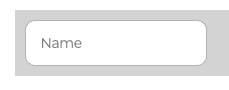

import { Alert, Text, Box } from '@nimbus-ds/components';
import AppTypes from '@site/src/components/AppTypes';

:::warning
This SDK is a Work In Progress! All features are subject to change.
:::

A `field` represents a text input element in a form.
It supports properties like `name`, `label`, and event handlers (`onChange`, `onBlur`, `onFocus`).



### Usage

```tsx [JSX]
import { Field } from "@tiendanube/nube-sdk-jsx";

<Field
  name="email"
  label="Email"
  onChange={() => {}}
  onBlur={() => {}}
  onFocus={() => {}}
/>;
```

### Properties

| Property | Type                           | Required | Description                                                        |
| -------- | ------------------------------ | -------- | -------------------------------------------------------------------|
| name     | string                         | Yes      | The name of the field, used to identify it in forms.               |
| label    | string                         | Yes      | The label text displayed above the field.                          |
| value    | string                         | No       | The current value of the field input.                              |
| mark     | string                         | No       | Format mask for the field input (e.g., "000.000.000-00" for CPF).  |
| style    | StyleSheet                     | No       | Custom styles for the field.                                       |
| autoFocus| boolean                        | No       | Whether the field should automatically receive focus when mounted. |
| onChange | NubeComponentFieldEventHandler | No       | Function called when the field value changes.                      |
| onBlur   | NubeComponentFieldEventHandler | No       | Function called when the field loses focus.                        |
| onFocus  | NubeComponentFieldEventHandler | No       | Function called when the field receives focus.                     |

### Event Handlers

The field component supports three event handlers that receive an object with the following properties:

```typescript
onChange: (data: {
  type: "change";       // The type of event
  state: NubeSDKState;  // The current state of the SDK
  value?: string;       // The new value of the field
}) => void

onBlur: (data: {
  type: "blur";         // The type of event
  state: NubeSDKState;  // The current state of the SDK
  value?: string;       // The current value of the field
}) => void

onFocus: (data: {
  type: "focus";        // The type of event
  state: NubeSDKState;  // The current state of the SDK
  value?: string;       // The current value of the field
}) => void
```

