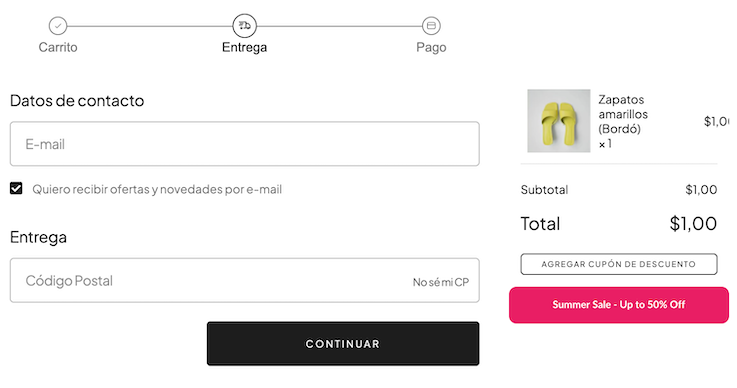
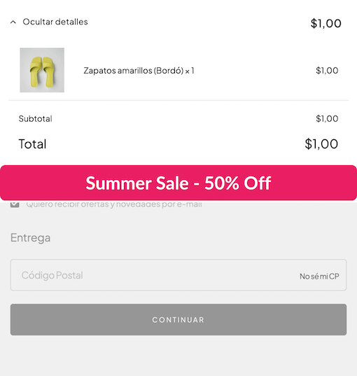
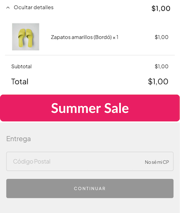

import { Alert, Text, Box } from '@nimbus-ds/components';
import AppTypes from '@site/src/components/AppTypes';

Used to display images. It supports properties such as `src`, `alt`, `width`, `height`, and responsive `sources` for different screen sizes.


### Usage

```typescript title="Basic Example"
import type { NubeSDK } from "@tiendanube/nube-sdk-types";
import { Image, Box } from "@tiendanube/nube-sdk-jsx";

function MyComponent() {
  return (
    <Box direction="col" gap={16}>
      {/* Basic image */}
      <Image
        src="https://app-insti-cdn.nuvemshop.com.br/site/dist/images/widgets/closing-cta/image-3.webp"
        alt="Nuvemshop Logo"
      />
    </Box>
  );
}

export function App(nube: NubeSDK) {
  nube.send("ui:slot:set", () => ({
    ui: {
      slots: {
        after_line_items: <MyComponent />,
      },
    },
  }));
}
```

### Responsive Images with Multiple Sources

The `Image` component supports multiple sources with media queries, allowing you to serve different images based on screen size. This is particularly useful for banners and responsive layouts where you want to optimize the image for different devices.

When you provide the `sources` prop, the component renders a `<picture>` element with multiple `<source>` tags, enabling the browser to select the most appropriate image based on the viewport width.

**Desktop**



**Tablet**



**Mobile**



```typescript title="Responsive Banner Example"
import type { NubeSDK } from "@tiendanube/nube-sdk-types";
import { Image, Box } from "@tiendanube/nube-sdk-jsx";

function ResponsiveBanner() {
  return (
    <Box direction="col" gap={16}>
      <Image
        src="https://placehold.co/400x60/e91e63/white?text=Summer+Sale"
        alt="Promotional banner"
        sources={[
          {
            src: "https://placehold.co/1200x200/e91e63/white?text=Summer+Sale+-+Up+to+50%25+Off",
            media: "(min-width: 768px)",
          },
          {
            src: "https://placehold.co/800x150/e91e63/white?text=Summer+Sale+-+50%25+Off",
            media: "(min-width: 480px)",
          },
        ]}
        style={{ width: "100%", borderRadius: "8px" }}
      />
    </Box>
  );
}

export function App(nube: NubeSDK) {
  nube.send("ui:slot:set", () => ({
    ui: {
      slots: {
        after_line_items: <ResponsiveBanner />,
      },
    },
  }));
}
```

:::info
The browser evaluates the media queries in the `sources` array from top to bottom and uses the first matching source. The `src` prop serves as the fallback image when no media query matches or for browsers that don't support the `picture` element.
:::

### Properties

| Property | Type          | Required | Description                                                     |
| -------- | ------------- | -------- | --------------------------------------------------------------- |
| src      | string        | Yes      | URL of the image to display. Must use "https://".               |
| alt      | string        | Yes      | Alternative text for the image, used for accessibility.         |
| sources  | ImageSource[] | No       | Array of alternative image sources with optional media queries. |
| width    | Size          | No       | Width of the image (e.g., "100px", "50%", "auto", 100).         |
| height   | Size          | No       | Height of the image (same format as width).                     |
| id       | string        | No       | Optional unique identifier for the component.                   |
| style    | StyleSheet    | No       | Custom styles for the image.                                    |

### ImageSource

| Property | Type   | Required | Description                                    |
| -------- | ------ | -------- | ---------------------------------------------- |
| src      | string | Yes      | The alternative image source URL (https only). |
| media    | string | No       | Optional media query to match this source.     |
