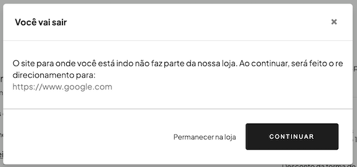

import { Alert, Text, Box } from '@nimbus-ds/components';
import AppTypes from '@site/src/components/AppTypes';

The `Link` component is used to render clickable hyperlinks that navigate users to different URLs.
It supports properties such as `href`, `children`, `target`, and styling options.

### Availability

<Alert appearance="warning" title="Checkout Limitation">
  In checkout applications, the Link component can only be rendered on the success page. For storefront applications, it is available on all pages.
</Alert>

### Usage



```typescript title="Example"
import { Link } from "@tiendanube/nube-sdk-jsx";

function MyComponent() {
  return (
    <Link href="https://www.google.com">Hello World</Link>
  );
}
```

You can also open links in a new tab:

```typescript title="Example with target"
import { Link, Box } from "@tiendanube/nube-sdk-jsx";

function MyComponent() {
  return (
    <Box>
      <Link href="https://www.tiendanube.com" target="_blank">
        Visit Tiendanube
      </Link>
    </Box>
  );
}
```

### External vs Internal Links

When using the `Link` component, the behavior differs based on whether the URL is external or internal:

- **External links**: When a user clicks on a link to an external domain (outside the store), a confirmation modal will appear asking the user for permission to redirect. This provides an extra layer of security and transparency.
- **Internal links**: Links to pages within the same store domain do not trigger the confirmation modal and navigate directly.

This behavior is automatic and does not require any additional configuration from the developer.

### Properties

| Property | Type       | Required | Description                                                             |
| -------- | ---------- | -------- | ----------------------------------------------------------------------- |
| href     | string     | Yes      | The URL destination of the link. Must use "https://" or "http://".      |
| children | string     | Yes      | The text content or label of the link.                                  |
| target   | "_blank"   | No       | Opens the link in a new tab. Only "_blank" is supported.                |
| color    | string     | No       | The link color (can be CSS variable like "var(--primary-color)").       |
| style    | StyleSheet | No       | Custom styles for the link.                                             |
| id       | string     | No       | Optional unique identifier for the component.                           |

