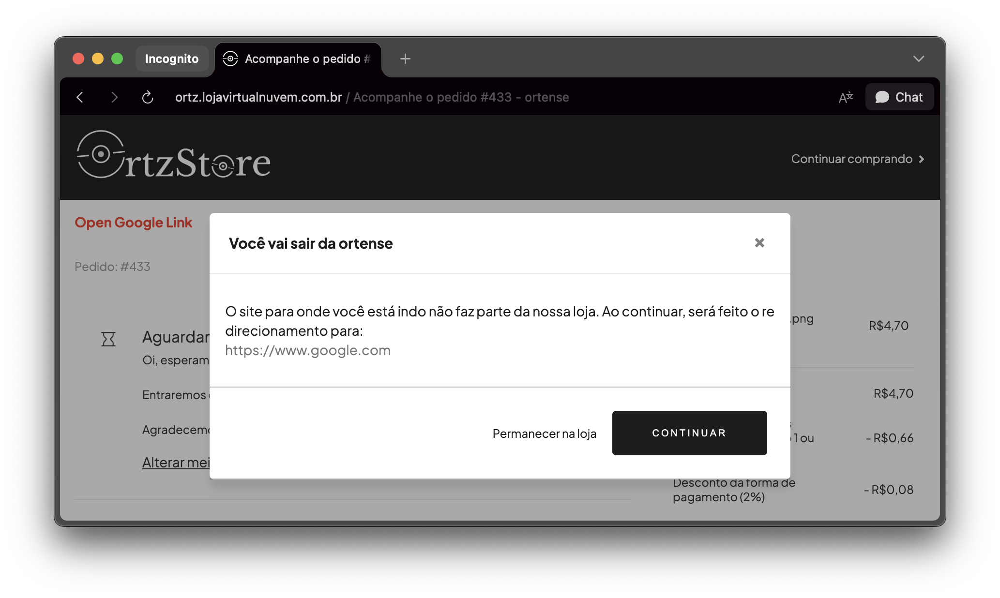

import { Alert, Text, Box } from '@nimbus-ds/components';
import AppTypes from '@site/src/components/AppTypes';

The `Link` component is used to render clickable hyperlinks that navigate users to different URLs.
It supports properties such as `href`, `children`, `target`, and styling options.

<Alert appearance="warning" title="Important">
  The Link component is available in the storefront and the success page in checkout. It is not available on other pages or UI slots.
</Alert>



### Usage

```typescript title="Example"
import type { NubeSDK } from "@tiendanube/nube-sdk-types";
import { Link, Box } from "@tiendanube/nube-sdk-jsx";

function MyComponent() {
  return (
    <Box direction="col" gap={8}>
      {/* Basic link */}
      <Link href="https://www.tiendanube.com">Visit Tiendanube</Link>

      {/* Link that opens in a new tab */}
      <Link href="https://www.tiendanube.com" target="_blank">
        Open in new tab
      </Link>

      {/* Link with variant */}
      <Link href="https://www.tiendanube.com" variant="primary">
        Primary link
      </Link>
    </Box>
  );
}

export function App(nube: NubeSDK) {
  nube.send("ui:slot:set", () => ({
    ui: {
      slots: {
        after_line_items: <MyComponent />,
      },
    },
  }));
}
```

### External vs Internal Links

When using the `Link` component, the behavior differs based on whether the URL is external or internal:

- **External links**: When a user clicks on a link to an external domain (outside the store), a confirmation modal will appear asking the user for permission to redirect. This provides an extra layer of security and transparency.
- **Internal links**: Links to pages within the same store domain do not trigger the confirmation modal and navigate directly.

This behavior is automatic and does not require any additional configuration from the developer.

### Properties

| Property | Type                                                   | Required | Description                                                        |
| -------- | ------------------------------------------------------ | -------- | ------------------------------------------------------------------ |
| href     | string                                                 | Yes      | The URL destination of the link. Must use "https://" or "http://". |
| children | string                                                 | Yes      | The text content or label of the link.                             |
| target   | "\_blank"                                              | No       | Opens the link in a new tab. Only "\_blank" is supported.          |
| variant  | "primary"<br/>"secondary"<br/>"transparent"<br/>"link" | No       | Link style variant.                                                |
| style    | StyleSheet                                             | No       | Custom styles for the link.                                        |
| id       | string                                                 | No       | Optional unique identifier for the component.                      |
