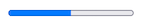

import { Alert, Text, Box } from '@nimbus-ds/components';
import AppTypes from '@site/src/components/AppTypes';

The `Progress` component is used to display a progress indicator that shows the completion status of a task or operation.
It supports configurable `value` and `max` properties to represent the current progress and maximum value.



### Usage

```typescript title="Example"
import type { NubeSDK } from "@tiendanube/nube-sdk-types";
import { Progress } from "@tiendanube/nube-sdk-jsx";

export function App(nube: NubeSDK) {
  nube.render("before_main_content", <Progress value={50} max={100} />);
}
```

### Properties

| Property | Type       | Required | Description                                                     |
| -------- | ---------- | -------- | --------------------------------------------------------------- |
| value    | number     | Yes      | The current progress value.                                     |
| max      | number     | No       | The maximum value representing 100% completion. Default is 100. |
| style    | StyleSheet | No       | Custom styles for the progress bar.                             |
