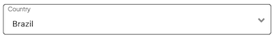
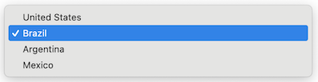

import { Alert, Text, Box } from '@nimbus-ds/components';
import AppTypes from '@site/src/components/AppTypes';

A `select` represents a dropdown input element that allows users to choose from a predefined list of options.
It supports properties such as `name`, `label`, `options`, and event handlers (`onChange`, `onBlur`, `onFocus`).





### Usage

```typescript title="Example"
import type { NubeSDK } from "@tiendanube/nube-sdk-types";
import { Box, Select } from "@tiendanube/nube-sdk-jsx";

function MyComponent() {
  return (
    <Box>
      <Select
        name="country"
        label="Country"
        value="br"
        options={[
          { value: "us", label: "United States" },
          { value: "br", label: "Brazil" },
          { value: "ar", label: "Argentina" },
          { value: "mx", label: "Mexico" },
        ]}
        onChange={() => {}}
      />
    </Box>
  );
}

export function App(nube: NubeSDK) {
  nube.send("ui:slot:set", () => ({
    ui: {
      slots: {
        after_line_items: <MyComponent />,
      },
    },
  }));
}
```

### Event Handlers

The select component supports an event handler that receives an object with the following properties:

```typescript
onChange: (data: {
  type: "change";       // The type of event
  state: NubeSDKState;  // The current state of the SDK
  value?: string;       // The new selected value
}) => void
```

Example usage:

```tsx title="Select with onChange handler"
import type {
  NubeSDK,
  NubeComponentSelectEventHandler,
} from "@tiendanube/nube-sdk-types";
import { Select, Box, Text } from "@tiendanube/nube-sdk-jsx";

function MyComponent(nube: NubeSDK) {
  const handleChange: NubeComponentSelectEventHandler = (event) => {
    // event.type is "change"
    // event.value may be string | undefined — use nullish coalescing to provide a default
    // event.state is the full NubeSDKState
    const selectedValue = event.value ?? "";

    console.log("Selected country:", selectedValue);
  };

  return (
    <Box direction="col" gap={12}>
      <Text modifiers={["bold"]}>Shipping Destination</Text>

      <Select
        name="country"
        label="Country"
        value="br"
        options={[
          { value: "us", label: "United States" },
          { value: "br", label: "Brazil" },
          { value: "ar", label: "Argentina" },
          { value: "mx", label: "Mexico" },
        ]}
        onChange={handleChange}
      />
    </Box>
  );
}

export function App(nube: NubeSDK) {
  nube.send("ui:slot:set", () => ({
    ui: {
      slots: {
        after_line_items: MyComponent(nube),
      },
    },
  }));
}
```

### SelectOption Type

Each option in the `options` array should follow this structure:

```typescript
type SelectOption = {
  value: string; // The value that will be submitted with the form
  label: string; // The text displayed to the user
};
```

### Properties

| Property | Type                            | Required | Description                                                   |
| -------- | ------------------------------- | -------- | ------------------------------------------------------------- |
| name     | string                          | Yes      | The name of the select, used to identify it in forms.         |
| label    | string                          | Yes      | The label text displayed above the select.                    |
| options  | SelectOption[]                  | Yes      | Array of options available for selection.                     |
| value    | string                          | No       | The current selected value of the select.                     |
| disabled | boolean                         | No       | Whether the select is disabled and cannot be interacted with. |
| style    | StyleSheet                      | No       | Custom styles for the select.                                 |
| onChange | NubeComponentSelectEventHandler | No       | Function called when the selected value changes.              |
