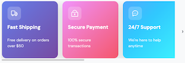
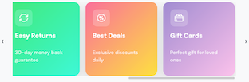

import { Alert, Text, Box } from '@nimbus-ds/components';
import AppTypes from '@site/src/components/AppTypes';

The `SideScroll` component creates a horizontal scrollable container for displaying content in a row.
It's useful for creating carousels, image galleries, or any horizontal list of items that may overflow the available width.
The component supports customizable scrollbar visibility, spacing between items, and scroll step configuration.

<Alert appearance="warning" title="Important">
  The SideScroll component is only available in storefront. It is not available in checkout.
</Alert>

<div style={{marginTop: '24px', marginBottom: '24px'}}>





</div>

### Usage

```typescript title="Example"
import { Box, Row, SideScroll, Text, Icon } from "@tiendanube/nube-sdk-jsx";
import type { NubeSDK, NubeComponentIconName } from "@tiendanube/nube-sdk-types";

type FeatureCard = {
  title: string;
  description: string;
  icon: NubeComponentIconName;
  gradient: string;
  iconColor: string;
};

const features: FeatureCard[] = [
  {
    title: "Fast Shipping",
    description: "Free delivery on orders over $50",
    icon: "truck",
    gradient: "linear-gradient(135deg, #667eea 0%, #764ba2 100%)",
    iconColor: "#ffffff",
  },
  {
    title: "Secure Payment",
    description: "100% secure transactions",
    icon: "lock",
    gradient: "linear-gradient(135deg, #f093fb 0%, #f5576c 100%)",
    iconColor: "#ffffff",
  },
  {
    title: "24/7 Support",
    description: "We're here to help anytime",
    icon: "chat-dots",
    gradient: "linear-gradient(135deg, #4facfe 0%, #00f2fe 100%)",
    iconColor: "#ffffff",
  },
  {
    title: "Easy Returns",
    description: "30-day money back guarantee",
    icon: "repeat",
    gradient: "linear-gradient(135deg, #43e97b 0%, #38f9d7 100%)",
    iconColor: "#ffffff",
  },
  {
    title: "Best Deals",
    description: "Exclusive discounts daily",
    icon: "discount-circle",
    gradient: "linear-gradient(135deg, #fa709a 0%, #fee140 100%)",
    iconColor: "#ffffff",
  },
  {
    title: "Gift Cards",
    description: "Perfect gift for loved ones",
    icon: "gift-card",
    gradient: "linear-gradient(135deg, #a18cd1 0%, #fbc2eb 100%)",
    iconColor: "#ffffff",
  },
];

function FeatureCardComponent({
  feature,
}: {
  feature: FeatureCard;
  key?: string;
}) {
  return (
    <Box
      width="200px"
      padding="20px"
      borderRadius="16px"
      direction="col"
      style={{
        background: feature.gradient,
        boxShadow: "0 10px 30px rgba(0, 0, 0, 0.15)",
        minHeight: "180px",
      }}
    >
      <Box
        width="48px"
        height="48px"
        borderRadius="12px"
        style={{
          background: "rgba(255, 255, 255, 0.2)",
        }}
        justifyContent="center"
        alignItems="center"
      >
        <Icon name={feature.icon} size="24px" color={feature.iconColor} />
      </Box>
      <Box direction="col" gap="8px" style={{ marginTop: "16px" }}>
        <Text
          modifiers={["bold"]}
          style={{
            color: "#ffffff",
            fontSize: "18px",
          }}
        >
          {feature.title}
        </Text>
        <Text
          style={{
            color: "rgba(255, 255, 255, 0.85)",
            fontSize: "14px",
            lineHeight: "1.5",
          }}
        >
          {feature.description}
        </Text>
      </Box>
    </Box>
  );
}

function SideScrollShowcase() {
  return (
    <Box padding="24px" style={{ background: "#f8f9fa" }}>
      <Row gap="8px" style={{ marginBottom: "16px", alignItems: "center" }}>
        <Icon name="star" size="20px" color="#fbbf24" />
        <Text
          heading={3}
          modifiers={["bold"]}
          style={{ color: "#1f2937", margin: 0 }}
        >
          Why Shop With Us
        </Text>
      </Row>
      <Text
        style={{
          color: "#6b7280",
          fontSize: "14px",
          marginBottom: "20px",
          display: "block",
        }}
      >
        Swipe or scroll horizontally to see more cards →
      </Text>
      <SideScroll width="700px" gap="16px">
        {features.map((feature, index) => (
          <FeatureCardComponent key={index.toString()} feature={feature} />
        ))}
      </SideScroll>
    </Box>
  );
}

export function App(nube: NubeSDK) {
  nube.render("before_main_content", <SideScrollShowcase />);
}
```

### Properties

| Property      | Type                  | Required | Description                                                       |
| ------------- | --------------------- | -------- | ----------------------------------------------------------------- |
| children      | NubeChildrenComponent | No       | Array of child components nested inside the scroll container.     |
| width         | Size                  | No       | Width of the scroll container (e.g., "100%", "400px").            |
| gap           | Size                  | No       | Spacing between child elements (e.g., "1rem", "16px").            |
| hideScrollbar | boolean               | No       | Whether to hide the scrollbar while keeping scroll functionality. |
| step          | number                | No       | Number of pixels to scroll when using navigation controls.        |
| style         | NubeComponentStyle    | No       | Custom styles for the scroll container.                           |
