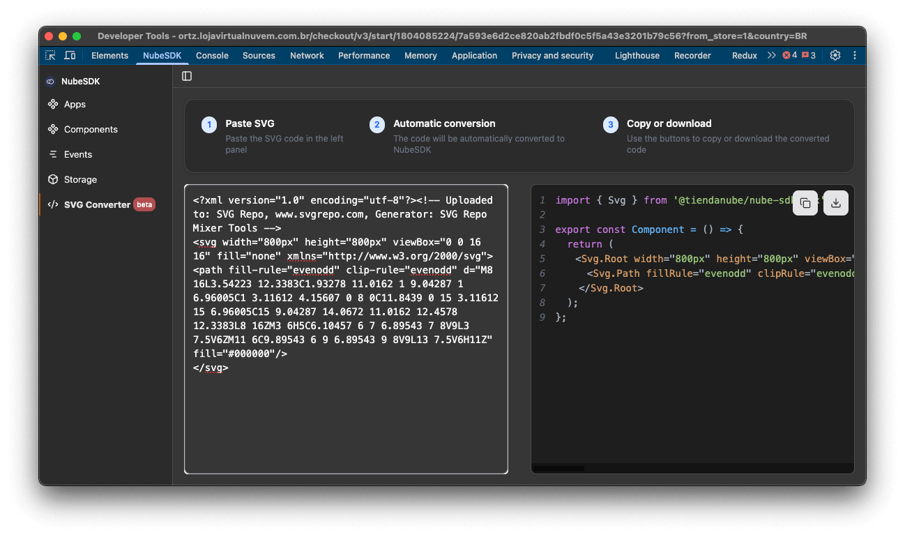

import { Alert, Text, Box } from '@nimbus-ds/components';
import AppTypes from '@site/src/components/AppTypes';

The `SVG` component allows you to create scalable vector graphics within your NubeSDK application.
It supports all standard SVG tags and properties, providing a comprehensive set of SVG elements including `Root`, `Circle`, `Text`, `Rect`, `Line`, `Path`, `Polygon`, `Polyline`, `Ellipse`, and more.

### Usage

```typescript title="Example"
import type { NubeSDK } from "@tiendanube/nube-sdk-types";
import { Svg } from "@tiendanube/nube-sdk-jsx";

export function App(nube: NubeSDK) {
	nube.render("before_main_content", () => {
		return (
			<Svg.Root width="100" height="100" viewBox="0 0 100 100">
				<Svg.Circle
					cx="50"
					cy="50"
					r="40"
					fill="#4F46E5"
					stroke="#312E81"
					strokeWidth="2"
				/>
				<Svg.Text
					x="50"
					y="55"
					textAnchor="middle"
					fill="white"
					fontSize="12"
					fontFamily="Arial, sans-serif"
				>
					SVG
				</Svg.Text>
			</Svg.Root>
		);
	});
}
```

### Tips

#### SVG Converter Tool



The NubeSDK Devtools includes an SVG Converter tool that automatically converts SVG code to NubeSDK JSX components. This tool makes it easy to integrate existing SVG graphics into your NubeSDK application.

[Download NubeSDK Devtools](https://github.com/TiendaNube/nube-sdk/releases/tag/nube-devtools-005)

### Best Practices

- Always wrap SVG elements in `Svg.Root` to define the canvas
