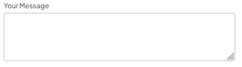

import { Alert, Text, Box } from '@nimbus-ds/components';
import AppTypes from '@site/src/components/AppTypes';

A `textarea` represents a multi-line text input field that allows users to enter longer texts.
It supports properties such as `name`, `label`, and event handlers (`onChange`, `onBlur`, `onFocus`).



### Usage

```typescript title="Example"
import type { NubeSDK } from "@tiendanube/nube-sdk-types";
import { Box, Textarea } from "@tiendanube/nube-sdk-jsx";

function MyComponent() {
  return (
    <Box>
      <Textarea
        name="message"
        label="Your Message"
        maxLength={300}
        row={3}
        onChange={() => {}}
      />
    </Box>
  );
}

export function App(nube: NubeSDK) {
  nube.send("ui:slot:set", () => ({
    ui: {
      slots: {
        after_line_items: <MyComponent />,
      },
    },
  }));
}
```

### Event Handlers

The textarea component supports event handlers that receive an object with the following properties:

```typescript
onChange: (data: {
  type: "change";       // The type of event
  state: NubeSDKState;  // The current state of the SDK
  value?: string;       // The new value of the textarea
}) => void

onBlur: (data: {
  type: "blur";         // The type of event
  state: NubeSDKState;  // The current state of the SDK
  value?: string;       // The current value of the textarea
}) => void

onFocus: (data: {
  type: "focus";        // The type of event
  state: NubeSDKState;  // The current state of the SDK
  value?: string;       // The current value of the textarea
}) => void
```

Example usage:

```tsx title="Textarea with onChange handler"
import type {
  NubeSDK,
  NubeComponentTextareaEventHandler,
} from "@tiendanube/nube-sdk-types";
import { Textarea, Box, Text } from "@tiendanube/nube-sdk-jsx";

function MyComponent(nube: NubeSDK) {
  const handleChange: NubeComponentTextareaEventHandler = (event) => {
    // event.type is "change"
    // event.value is string (textarea content)
    // event.state is the full NubeSDKState
    const textValue = event.value ?? "";

    console.log("Textarea value:", textValue);
  };

  return (
    <Box direction="col" gap={12}>
      <Text modifiers={["bold"]}>Leave a Message</Text>

      <Textarea
        name="message"
        label="Your Message"
        maxLength={300}
        row={4}
        onChange={handleChange}
      />
    </Box>
  );
}

export function App(nube: NubeSDK) {
  nube.send("ui:slot:set", () => ({
    ui: {
      slots: {
        after_line_items: MyComponent(nube),
      },
    },
  }));
}
```

### Properties

| Property  | Type                              | Required | Description                                                           |
| --------- | --------------------------------- | -------- | --------------------------------------------------------------------- |
| name      | string                            | Yes      | The name of the textarea, used to identify it in forms.               |
| label     | string                            | Yes      | The label text displayed above the textarea.                          |
| value     | string                            | No       | The current value of the textarea.                                    |
| maxLength | number                            | No       | The maximum number of characters allowed in the textarea.             |
| row       | number                            | No       | The number of visible text lines in the textarea.                     |
| mask      | string                            | No       | Format mask for the field input (e.g., "000.000.000-00" for CPF).     |
| autoFocus | boolean                           | No       | Whether the textarea should automatically receive focus when mounted. |
| style     | StyleSheet                        | No       | Custom styles for the textarea.                                       |
| onChange  | NubeComponentTextareaEventHandler | No       | Function called when the textarea value changes.                      |
| onBlur    | NubeComponentTextareaEventHandler | No       | Function called when the textarea loses focus.                        |
| onFocus   | NubeComponentTextareaEventHandler | No       | Function called when the textarea receives focus.                     |
