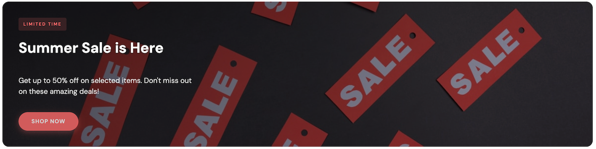
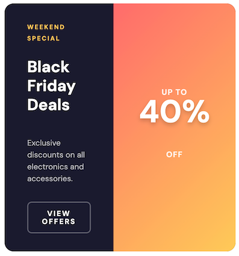

import { Alert, Text, Box } from '@nimbus-ds/components';

# Banner

Banners are essential for displaying promotional content, announcements, or special offers to customers. In this section, we'll create two versatile banner components using NubeSDK.

## Overview

This section includes:

- Full-width hero banner with background image
- Split banner with discount badge

---

## Hero Banner

A full-width hero banner with a background image, overlay, and call-to-action button. Perfect for highlighting major promotions or seasonal campaigns.



```tsx title="src/components/HeroBanner.tsx"
import {
  Box,
  Column,
  Image,
  Text,
  Button,
  Fragment,
} from "@tiendanube/nube-sdk-jsx";
import { styled } from "@tiendanube/nube-sdk-ui";
import type { NubeSDKState } from "@tiendanube/nube-sdk-types";

interface HeroBannerProps {
  backgroundImage: string;
  tag?: string;
  title: string;
  subtitle?: string;
  buttonText?: string;
  onClick?: (args: { state: NubeSDKState }) => void;
}

const BannerContainer = styled(Box)`
  position: relative;
  width: calc(100% - 32px);
  min-height: 280px;
  border-radius: 16px;
  overflow: hidden;
  margin: 16px;
`;

const Background = styled(Image)`
  position: absolute;
  top: 0;
  left: 0;
  width: 100%;
  height: 100%;
  object-fit: cover;
`;

const Overlay = styled(Box)`
  position: absolute;
  top: 0;
  left: 0;
  width: 100%;
  height: 100%;
  background: linear-gradient(
    135deg,
    rgba(0, 0, 0, 0.7) 0%,
    rgba(0, 0, 0, 0.3) 100%
  );
`;

const Content = styled(Column)`
  position: relative;
  z-index: 1;
  padding: 40px;
  justify-content: center;
  align-items: flex-start;
  min-height: 280px;
  gap: 12px;
`;

const Tag = styled(Text)`
  font-size: 11px;
  font-weight: 700;
  color: #ff6b6b;
  text-transform: uppercase;
  letter-spacing: 2px;
  background: rgba(255, 107, 107, 0.15);
  padding: 6px 12px;
  border-radius: 4px;
`;

const Title = styled(Text)`
  font-size: 36px;
  font-weight: 800;
  color: #ffffff;
  line-height: 1.1;
  max-width: 500px;
  text-shadow: 0 2px 4px rgba(0, 0, 0, 0.3);
`;

const Subtitle = styled(Text)`
  font-size: 18px;
  color: rgba(255, 255, 255, 0.9);
  line-height: 1.5;
  max-width: 450px;
`;

const ActionButton = styled(Button)`
  background: #ff6b6b;
  color: #ffffff;
  font-weight: 700;
  padding: 16px 32px;
  border-radius: 50px;
  border: none;
  cursor: pointer;
  font-size: 14px;
  text-transform: uppercase;
  letter-spacing: 1px;
  margin-top: 8px;
  box-shadow: 0 4px 15px rgba(255, 107, 107, 0.4);
`;

export function HeroBanner({
  backgroundImage,
  tag,
  title,
  subtitle,
  buttonText,
  onClick,
}: HeroBannerProps) {
  return (
    <BannerContainer>
      <Background
        src={backgroundImage}
        alt={title}
        width="100%"
        height="280px"
      />
      <Overlay />
      <Content>
        {tag ? <Tag>{tag}</Tag> : <Fragment />}
        <Title>{title}</Title>
        {subtitle ? <Subtitle>{subtitle}</Subtitle> : <Fragment />}
        {buttonText ? (
          <ActionButton onClick={onClick}>{buttonText}</ActionButton>
        ) : (
          <Fragment />
        )}
      </Content>
    </BannerContainer>
  );
}
```

### Usage

```tsx title="src/main.tsx"
import type { NubeSDK } from "@tiendanube/nube-sdk-types";
import { HeroBanner } from "./components/HeroBanner";

export function App(nube: NubeSDK) {
  nube.send("ui:slot:set", () => ({
    ui: {
      slots: {
        before_main_content: (
          <HeroBanner
            backgroundImage="https://images.unsplash.com/photo-1607083206968-13611e3d76db?w=1200&h=600&fit=crop"
            tag="Limited Time"
            title="Summer Sale is Here"
            subtitle="Get up to 50% off on selected items. Don't miss out on these amazing deals!"
            buttonText="Shop Now"
            onClick={({ state }) => {
              console.log("Banner clicked", state.store?.name);
            }}
          />
        ),
      },
    },
  }));
}
```

---

## Split Banner

A split banner with a content section and a prominent discount badge. Ideal for showcasing percentage discounts or special offers.



```tsx title="src/components/SplitBanner.tsx"
import { Row, Column, Text, Button, Fragment } from "@tiendanube/nube-sdk-jsx";
import { styled } from "@tiendanube/nube-sdk-ui";
import type { NubeSDKState } from "@tiendanube/nube-sdk-types";

interface SplitBannerProps {
  tag?: string;
  title: string;
  description?: string;
  buttonText?: string;
  discount: string;
  discountLabelTop?: string;
  discountLabelBottom?: string;
  onClick?: (args: { state: NubeSDKState }) => void;
}

const BannerContainer = styled(Row)`
  background: #1a1a2e;
  border-radius: 16px;
  overflow: hidden;
  margin: 16px;
  width: calc(100% - 32px);
  min-height: 220px;
`;

const ContentSection = styled(Column)`
  flex: 1;
  padding: 32px 40px;
  justify-content: center;
  gap: 12px;
`;

const DiscountSection = styled(Column)`
  width: 280px;
  background: linear-gradient(135deg, #ff6b6b 0%, #feca57 100%);
  align-items: center;
  justify-content: center;
`;

const DiscountBadge = styled(Text)`
  font-size: 56px;
  font-weight: 900;
  color: #ffffff;
  text-shadow: 0 4px 8px rgba(0, 0, 0, 0.2);
`;

const DiscountLabel = styled(Text)`
  font-size: 14px;
  font-weight: 600;
  color: rgba(255, 255, 255, 0.9);
  text-transform: uppercase;
  letter-spacing: 1px;
`;

const Tag = styled(Text)`
  font-size: 11px;
  font-weight: 700;
  color: #feca57;
  text-transform: uppercase;
  letter-spacing: 2px;
`;

const Title = styled(Text)`
  font-size: 28px;
  font-weight: 800;
  color: #ffffff;
  line-height: 1.2;
`;

const Description = styled(Text)`
  font-size: 14px;
  color: rgba(255, 255, 255, 0.7);
  line-height: 1.5;
`;

const ActionButton = styled(Button)`
  background: transparent;
  color: #ffffff;
  font-weight: 600;
  padding: 12px 24px;
  border-radius: 8px;
  border: 2px solid rgba(255, 255, 255, 0.3);
  font-size: 13px;
  margin-top: 4px;
  cursor: pointer;
`;

export function SplitBanner({
  tag,
  title,
  description,
  buttonText,
  discount,
  discountLabelTop = "Up to",
  discountLabelBottom = "Off",
  onClick,
}: SplitBannerProps) {
  return (
    <BannerContainer>
      <ContentSection>
        {tag ? <Tag>{tag}</Tag> : <Fragment />}
        <Title>{title}</Title>
        {description ? <Description>{description}</Description> : <Fragment />}
        {buttonText ? (
          <ActionButton onClick={onClick}>{buttonText}</ActionButton>
        ) : (
          <Fragment />
        )}
      </ContentSection>
      <DiscountSection>
        <DiscountLabel>{discountLabelTop}</DiscountLabel>
        <DiscountBadge>{discount}</DiscountBadge>
        <DiscountLabel>{discountLabelBottom}</DiscountLabel>
      </DiscountSection>
    </BannerContainer>
  );
}
```

### Usage

```tsx title="src/main.tsx"
import type { NubeSDK } from "@tiendanube/nube-sdk-types";
import { SplitBanner } from "./components/SplitBanner";

export function App(nube: NubeSDK) {
  nube.send("ui:slot:set", () => ({
    ui: {
      slots: {
        before_main_content: (
          <SplitBanner
            tag="Weekend Special"
            title="Black Friday Deals"
            description="Exclusive discounts on all electronics and accessories."
            buttonText="View Offers"
            discount="40%"
            discountLabelTop="Up to"
            discountLabelBottom="Off"
            onClick={({ state }) => {
              console.log("Banner clicked", state.store?.name);
            }}
          />
        ),
      },
    },
  }));
}
```

---

## Best Practices

1. **Optimize images**: Use compressed images for hero banners to ensure fast loading
2. **Keep text concise**: Banner messages should be short and impactful
3. **Use contrasting colors**: Ensure text is readable against the background
4. **Consider mobile**: Test your banners on different screen sizes
5. **Clear call-to-action**: Make buttons stand out with distinctive styling

## Related Components

- [Box](../components/box) - For layout and positioning
- [Column](../components/column) - For vertical layouts
- [Row](../components/row) - For horizontal layouts
- [Text](../components/text) - For banner content
- [Button](../components/button) - For call-to-action elements
- [Image](../components/image) - For background images
- [Fragment](../components/fragment) - For conditional rendering
