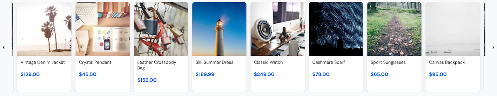

import { Alert, Text, Box } from '@nimbus-ds/components';

# Carousel

A carousel (or slider) is a common UI pattern used to showcase multiple images, products, or promotional content in a limited space. In this example, we'll create a responsive image carousel using NubeSDK components.

## Overview

This carousel implementation features:

- Horizontal scrolling with smooth navigation
- Touch-friendly for mobile devices
- Customizable image dimensions



## Implementation

First, let's create our carousel component:

```tsx title="src/components/Carousel.tsx"
import {
  SideScroll,
  Image,
  Column,
  Text,
  Fragment,
} from "@tiendanube/nube-sdk-jsx";
import { styled } from "@tiendanube/nube-sdk-ui";

interface Product {
  id: number;
  name: string;
  price: number;
  image: string;
}

interface CarouselProps {
  products: Product[];
  title?: string;
}

const CarouselContainer = styled(Column)`
  padding: 16px;
  background: #f8f9fa;
  border-radius: 8px;
`;

const CarouselTitle = styled(Text)`
  font-size: 18px;
  font-weight: 600;
  color: #333;
  margin-bottom: 12px;
`;

const ProductCard = styled(Column)`
  flex-shrink: 0;
  width: 160px;
  background: #fff;
  border-radius: 8px;
  overflow: hidden;
  box-shadow: 0 2px 8px rgba(0, 0, 0, 0.1);
`;

const ProductInfo = styled(Column)`
  padding: 10px;
  gap: 4px;
`;

const ProductName = styled(Text)`
  font-size: 13px;
  font-weight: 500;
  color: #333;
  line-height: 1.3;
`;

const ProductPrice = styled(Text)`
  font-size: 15px;
  font-weight: 700;
  color: #0070f3;
`;

export function Carousel({ products, title }: CarouselProps) {
  return (
    <CarouselContainer>
      {title ? <CarouselTitle>{title}</CarouselTitle> : <Fragment />}
      <SideScroll gap="12px" hideScrollbar width="100%">
        {products.map((product) => (
          <ProductCard key={product.id}>
            <Image
              src={product.image}
              alt={product.name}
              width="160px"
              height="160px"
              style={{ objectFit: "cover" }}
            />
            <ProductInfo>
              <ProductName>{product.name}</ProductName>
              <ProductPrice>${product.price.toFixed(2)}</ProductPrice>
            </ProductInfo>
          </ProductCard>
        ))}
      </SideScroll>
    </CarouselContainer>
  );
}
```

## Usage

Here's how to use the carousel in your application:

```tsx title="src/main.tsx"
import type { NubeSDK } from "@tiendanube/nube-sdk-types";
import { Carousel } from "./components/Carousel";

const products = [
  {
    id: 1,
    name: "Aurora Sneakers",
    price: 89.99,
    image: "https://picsum.photos/seed/shoes1/160/160",
  },
  {
    id: 2,
    name: "Vintage Denim Jacket",
    price: 129.0,
    image: "https://picsum.photos/seed/jacket1/160/160",
  },
  {
    id: 3,
    name: "Crystal Pendant",
    price: 45.5,
    image: "https://picsum.photos/seed/jewel1/160/160",
  },
  {
    id: 4,
    name: "Leather Crossbody Bag",
    price: 156.0,
    image: "https://picsum.photos/seed/bag1/160/160",
  },
  {
    id: 5,
    name: "Silk Summer Dress",
    price: 189.99,
    image: "https://picsum.photos/seed/dress1/160/160",
  },
  {
    id: 6,
    name: "Classic Watch",
    price: 249.0,
    image: "https://picsum.photos/seed/watch1/160/160",
  },
  {
    id: 7,
    name: "Cashmere Scarf",
    price: 78.0,
    image: "https://picsum.photos/seed/scarf1/160/160",
  },
  {
    id: 8,
    name: "Sport Sunglasses",
    price: 65.0,
    image: "https://picsum.photos/seed/glass1/160/160",
  },
  {
    id: 9,
    name: "Canvas Backpack",
    price: 95.0,
    image: "https://picsum.photos/seed/backp1/160/160",
  },
  {
    id: 10,
    name: "Wool Beanie",
    price: 35.0,
    image: "https://picsum.photos/seed/beanie1/160/160",
  },
  {
    id: 11,
    name: "Linen Shirt",
    price: 72.0,
    image: "https://picsum.photos/seed/shirt1/160/160",
  },
  {
    id: 12,
    name: "Running Shorts",
    price: 48.0,
    image: "https://picsum.photos/seed/shorts1/160/160",
  },
];

export function App(nube: NubeSDK) {
  nube.send("ui:slot:set", () => ({
    ui: {
      slots: {
        before_footer: <Carousel products={products} />,
      },
    },
  }));
}
```

## Best Practices

1. **Optimize images**: Use appropriately sized images to ensure fast loading
2. **Provide alt text**: Always include descriptive alt text for accessibility
3. **Consider mobile**: Test your carousel on different screen sizes
4. **Limit items**: Too many items can overwhelm users; consider pagination for large sets

## Related Components

- [SideScroll](../components/sidescroll) - The horizontal scrolling container
- [Image](../components/image) - For displaying images
- [Box](../components/box) - For layout and styling
