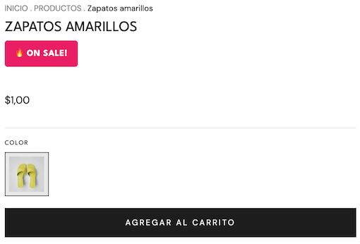

import { Alert, Text, Box } from '@nimbus-ds/components';

# Extra Info Based on Tags

Display additional product information dynamically based on product tags. This pattern is useful for showing badges, labels, or special notices based on product attributes.

## Overview

This example demonstrates how to:

- Read product tags from the store state
- Conditionally render badges based on tag values
- Customize tag configurations with emojis and colors

---

## Tag Badges

A component that displays colorful badges based on product tags. Perfect for highlighting product attributes like "On Sale", "New Arrival", "Organic", etc.



```tsx title="src/components/TagBadges.tsx"
import type { NubeComponent } from "@tiendanube/nube-sdk-types";
import { Box, Text, Fragment } from "@tiendanube/nube-sdk-jsx";
import { styled } from "@tiendanube/nube-sdk-ui";

interface TagConfig {
  tag: string;
  label: string;
  emoji?: string;
  background: string;
}

interface TagBadgesProps {
  tags: string | string[];
  customTags?: TagConfig[];
}

const BadgeText = styled(Text)`
  background: #e91e63;
  color: #ffffff;
  padding: 8px 14px;
  border-radius: 4px;
  font-size: 12px;
  font-weight: 700;
  text-transform: uppercase;
  letter-spacing: 0.5px;
`;

const BadgesContainer = styled(Box)`
  display: flex;
  flex-wrap: wrap;
  gap: 8px;
  margin: 8px 0;
`;

// Default tag configurations
const defaultTagConfigs: TagConfig[] = [
  {
    tag: "organic",
    label: "Organic Product",
    emoji: "🌿",
    background: "#2ecc71",
  },
  { tag: "sale", label: "On Sale!", emoji: "🔥", background: "#e91e63" },
  {
    tag: "limited",
    label: "Limited Edition",
    emoji: "⚡",
    background: "#9b59b6",
  },
  { tag: "new", label: "New Arrival", emoji: "✨", background: "#3498db" },
  {
    tag: "bestseller",
    label: "Best Seller",
    emoji: "🏆",
    background: "#f39c12",
  },
  { tag: "eco", label: "Eco-Friendly", emoji: "♻️", background: "#27ae60" },
];

// Helper to normalize tags to array
function normalizeTags(tags: string | string[]): string[] {
  if (Array.isArray(tags)) {
    return tags.map((t) => t.trim().toLowerCase());
  }
  return tags.split(",").map((t) => t.trim().toLowerCase());
}

// Helper to check if product has a specific tag
function hasTag(normalizedTags: string[], tagToFind: string): boolean {
  return normalizedTags.includes(tagToFind.toLowerCase());
}

// Build badges based on tags
function buildTagBadges(
  tags: string | string[],
  customTags?: TagConfig[]
): NubeComponent[] {
  const normalizedTags = normalizeTags(tags);
  const tagConfigs = customTags ?? defaultTagConfigs;
  const badges: NubeComponent[] = [];

  for (const config of tagConfigs) {
    if (hasTag(normalizedTags, config.tag)) {
      const label = config.emoji
        ? `${config.emoji} ${config.label}`
        : config.label;
      badges.push(
        <BadgeText key={config.tag} style={{ background: config.background }}>
          {label}
        </BadgeText>
      );
    }
  }

  return badges;
}

export function TagBadges({ tags, customTags }: TagBadgesProps) {
  const badges = buildTagBadges(tags, customTags);

  if (badges.length === 0) {
    return <Fragment />;
  }

  return <BadgesContainer>{badges}</BadgesContainer>;
}

// Export utilities for advanced usage
export { hasTag, normalizeTags, defaultTagConfigs };
export type { TagConfig };
```

### Usage

```tsx title="src/main.tsx"
import type { NubeSDK, ProductPage } from "@tiendanube/nube-sdk-types";
import { TagBadges } from "./components/TagBadges";

// Helper to check if on product page
function isProductPage(page: { type: string }): page is ProductPage {
  return page.type === "product";
}

export function App(nube: NubeSDK) {
  // Listen for page changes to show badges on product pages
  nube.on("page:loaded", (state) => {
    const { page } = state.location;

    // Only act on product pages
    if (isProductPage(page)) {
      const product = page.data.product;
      const tags = product.tags || ""; // e.g., "sale,organic,limited"

      // Only set the slot if there are tags
      if (tags) {
        nube.send("ui:slot:set", () => ({
          ui: {
            slots: {
              after_product_detail_name: <TagBadges tags={tags} />,
            },
          },
        }));
      }
    }
  });
}
```

---

## Best Practices

1. **Use consistent tag naming**: Establish a tag naming convention in your store
2. **Keep badges concise**: Short labels are easier to read at a glance
3. **Choose contrasting colors**: Ensure badges are visible against the page background
4. **Limit badge count**: Too many badges can be overwhelming; prioritize the most important ones
5. **Test with various products**: Ensure badges display correctly for products with multiple tags

## Related

- [Extra Info (Product List)](./extra-info-product-list) - Display content on product grids (home, category, search pages)
- [Box](../components/box) - For layout and styling
- [Text](../components/text) - For displaying badge labels
- [Fragment](../components/fragment) - For conditional rendering
