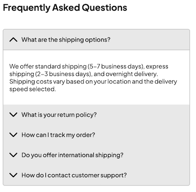
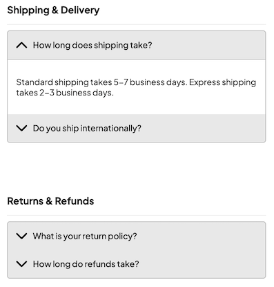

import { Alert, Text, Box } from '@nimbus-ds/components';

# FAQs (Frequently Asked Questions)

An FAQ section is a great way to provide quick answers to common customer questions. In this example, we'll create an expandable FAQ component using the Accordion component from NubeSDK.

## Overview

This example demonstrates:

- Basic FAQ implementation with Accordion
- Categorized FAQs
- Searchable FAQ section
- Styled FAQ with custom theming

## Basic FAQ Implementation

A simple FAQ section using the Accordion component:



```tsx title="src/components/FAQ.tsx"
import { Accordion, Text, Box } from "@tiendanube/nube-sdk-jsx";
import { styled } from "@tiendanube/nube-sdk-ui";

type FAQItem = {
  question: string;
  answer: string;
};

type FAQProps = {
  items: FAQItem[];
  title?: string;
};

const FAQContainer = styled(Box)`
  width: 100%;
  padding: 16px;
`;

const FAQTitle = styled(Text)`
  margin-bottom: 16px;
`;

export function FAQ({ items, title = "Frequently Asked Questions" }: FAQProps) {
  return (
    <FAQContainer direction="col" gap={16}>
      <FAQTitle modifiers={["bold"]} heading={2}>
        {title}
      </FAQTitle>
      <Accordion.Root>
        {items.map((item, index) => (
          <Accordion.Item key={index} value={`faq-${index}`}>
            <Accordion.Header showIcon>{item.question}</Accordion.Header>
            <Accordion.Content>
              <Text>{item.answer}</Text>
            </Accordion.Content>
          </Accordion.Item>
        ))}
      </Accordion.Root>
    </FAQContainer>
  );
}
```

## Usage Example

Here's how to use the FAQ component in your application:

```tsx title="src/main.tsx"
import type { NubeSDK } from "@tiendanube/nube-sdk-types";
import { FAQ } from "./components/FAQ";

const faqItems = [
  {
    question: "What are the shipping options?",
    answer:
      "We offer standard shipping (5-7 business days), express shipping (2-3 business days), and overnight delivery. Shipping costs vary based on your location and the delivery speed selected.",
  },
  {
    question: "What is your return policy?",
    answer:
      "We accept returns within 30 days of purchase. Items must be unused and in their original packaging. To initiate a return, please contact our customer service team.",
  },
  {
    question: "How can I track my order?",
    answer:
      "Once your order ships, you will receive an email with a tracking number. You can use this number on our website or the carrier's website to track your package.",
  },
  {
    question: "Do you offer international shipping?",
    answer:
      "Yes, we ship to most countries worldwide. International shipping times and costs vary by destination. Please check the shipping calculator at checkout for specific rates.",
  },
  {
    question: "How do I contact customer support?",
    answer:
      "You can reach our customer support team via email at support@example.com, by phone at 1-800-123-4567, or through the live chat on our website. We're available Monday-Friday, 9am-6pm EST.",
  },
];

export function App(nube: NubeSDK) {
  nube.send("ui:slot:set", () => ({
    ui: {
      slots: {
        after_line_items: <FAQ items={faqItems} />,
      },
    },
  }));
}
```

## Categorized FAQs

For stores with many questions, organize FAQs by category:



```tsx title="src/components/CategorizedFAQ.tsx"
import { Accordion, Text, Box, Fragment } from "@tiendanube/nube-sdk-jsx";
import { styled } from "@tiendanube/nube-sdk-ui";

type FAQItem = {
  question: string;
  answer: string;
};

type FAQCategory = {
  name: string;
  icon?: string;
  items: FAQItem[];
};

type CategorizedFAQProps = {
  categories: FAQCategory[];
  title?: string;
};

const CategoryTitle = styled(Text)`
  padding: 12px 0;
  border-bottom: 1px solid #eee;
  margin-bottom: 8px;
`;

const CategorySection = styled(Box)`
  margin-bottom: 24px;
`;

export function CategorizedFAQ({
  categories,
  title = "Help Center",
}: CategorizedFAQProps) {
  return (
    <Box direction="col" gap={24} style={{ padding: "16px" }}>
      <Text modifiers={["bold"]} heading={1}>
        {title}
      </Text>

      <Fragment>
        {categories.map((category, categoryIndex) => (
          <CategorySection key={categoryIndex} direction="col">
            <CategoryTitle modifiers={["bold"]} heading={3}>
              {category.icon ? `${category.icon} ` : ""}
              {category.name}
            </CategoryTitle>

            <Accordion.Root>
              {category.items.map((item, itemIndex) => (
                <Accordion.Item
                  key={itemIndex}
                  value={`cat-${categoryIndex}-faq-${itemIndex}`}
                >
                  <Accordion.Header showIcon>{item.question}</Accordion.Header>
                  <Accordion.Content>
                    <Text>{item.answer}</Text>
                  </Accordion.Content>
                </Accordion.Item>
              ))}
            </Accordion.Root>
          </CategorySection>
        ))}
      </Fragment>
    </Box>
  );
}
```

### Usage with Categories

```tsx title="src/main.tsx"
import type { NubeSDK } from "@tiendanube/nube-sdk-types";
import { CategorizedFAQ } from "./components/CategorizedFAQ";

const faqCategories = [
  {
    name: "Shipping & Delivery",
    items: [
      {
        question: "How long does shipping take?",
        answer:
          "Standard shipping takes 5-7 business days. Express shipping takes 2-3 business days.",
      },
      {
        question: "Do you ship internationally?",
        answer: "Yes, we ship to over 100 countries worldwide.",
      },
    ],
  },
  {
    name: "Returns & Refunds",
    items: [
      {
        question: "What is your return policy?",
        answer:
          "We offer a 30-day return policy for unused items in original packaging.",
      },
      {
        question: "How long do refunds take?",
        answer:
          "Refunds are processed within 5-10 business days after we receive your return.",
      },
    ],
  },
  {
    name: "Payment & Security",
    items: [
      {
        question: "What payment methods do you accept?",
        answer: "We accept all major credit cards, PayPal, and bank transfers.",
      },
      {
        question: "Is my payment information secure?",
        answer: "Yes, all transactions are encrypted using SSL technology.",
      },
    ],
  },
];

export function App(nube: NubeSDK) {
  nube.send("ui:slot:set", () => ({
    ui: {
      slots: {
        after_line_items: <CategorizedFAQ categories={faqCategories} />,
      },
    },
  }));
}
```

## Best Practices

1. **Keep answers concise**: Provide clear, helpful answers without unnecessary details
2. **Use categories**: For large FAQ sections, organize questions by topic
3. **Prioritize common questions**: Put the most frequently asked questions at the top
4. **Update regularly**: Review and update FAQs based on customer feedback
5. **Use appropriate slots**: Place FAQs where customers are most likely to need them

## Related Components

- [Accordion](../components/accordion) - The collapsible component used for FAQs
- [Text](../components/text) - For question and answer content
- [Box](../components/box) - For layout and styling
