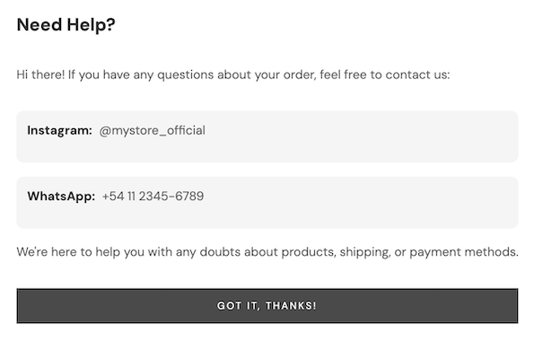

import { Alert, Text, Box } from '@nimbus-ds/components';

# Modal Popup

Display modal dialogs to show important information, help content, or interactive forms. This pattern uses the `modal_content` slot to render content in a modal overlay.

## Overview

This example demonstrates how to:

- Create a floating trigger button
- Open and close modals programmatically
- Display dynamic content based on state
- Style modal content with custom components

---

## Help Modal

A help modal with a floating button trigger. Perfect for displaying contact information, FAQs, or support details.



```tsx title="src/components/HelpModal.tsx"
import { Box, Button, Text, Fragment } from "@tiendanube/nube-sdk-jsx";
import type { NubeSDK, NubeSDKState, UISlot } from "@tiendanube/nube-sdk-types";
import { styled } from "@tiendanube/nube-sdk-ui";

interface ContactInfo {
  label: string;
  value: string;
}

interface HelpModalConfig {
  title?: string;
  description?: string | ((state: NubeSDKState) => string);
  contacts: ContactInfo[];
  footerText?: string;
  closeButtonText?: string;
  triggerButtonText?: string;
  slot?: UISlot;
}

// Styled components for the modal content
const ModalContainer = styled(Box)`
  padding: 24px;
  display: flex;
  flex-direction: column;
  gap: 16px;
  background: #ffffff;
  border-radius: 12px;
`;

const ModalTitle = styled(Text)`
  font-size: 20px;
  font-weight: bold;
  color: #333;
`;

const ModalDescription = styled(Text)`
  font-size: 14px;
  color: #666;
  line-height: 1.5;
`;

const ContactItem = styled(Box)`
  display: flex;
  flex-direction: row;
  gap: 8px;
  padding: 12px;
  background-color: #f5f5f5;
  border-radius: 8px;
`;

const ContactLabel = styled(Text)`
  font-weight: bold;
  color: #333;
`;

const ContactValue = styled(Text)`
  color: #666;
`;

// Styled button for the corner widget
const HelpButton = styled(Button)`
  background-color: #4a90d9;
  border-radius: 28px;
  min-width: 56px;
  max-width: 56px;
  min-height: 56px;
  max-height: 56px;
  box-shadow: 0 4px 12px rgba(0, 0, 0, 0.15);
  font-size: 28px;
  font-weight: bold;
  margin-right: 16px;
  margin-bottom: 16px;
`;

// Helper function to close the modal
function closeModal(nube: NubeSDK) {
  nube.clearSlot("modal_content");
}

// Helper function to open the modal
function openHelpModal(nube: NubeSDK, config: HelpModalConfig) {
  const {
    title = "Need Help?",
    description,
    contacts,
    footerText,
    closeButtonText = "Got it, thanks!",
  } = config;

  nube.render("modal_content", (state) => {
    const descriptionText =
      typeof description === "function" ? description(state) : description;

    return (
      <ModalContainer>
        <ModalTitle>{title}</ModalTitle>
        {descriptionText ? (
          <ModalDescription>{descriptionText}</ModalDescription>
        ) : (
          <Fragment />
        )}
        <Fragment>
          {contacts.map((contact, index) => (
            <ContactItem key={index}>
              <ContactLabel>{contact.label}:</ContactLabel>
              <ContactValue>{contact.value}</ContactValue>
            </ContactItem>
          ))}
        </Fragment>
        {footerText ? (
          <ModalDescription>{footerText}</ModalDescription>
        ) : (
          <Fragment />
        )}
        <Button variant="primary" onClick={() => closeModal(nube)}>
          {closeButtonText}
        </Button>
      </ModalContainer>
    );
  });
}

// Main function to set up the help modal with trigger button
export function setupHelpModal(nube: NubeSDK, config: HelpModalConfig) {
  const { triggerButtonText = "?", slot = "corner_bottom_right" } = config;

  nube.render(
    slot,
    <HelpButton variant="primary" onClick={() => openHelpModal(nube, config)}>
      {triggerButtonText}
    </HelpButton>
  );
}

// Export utilities for advanced usage
export { openHelpModal, closeModal };
export type { HelpModalConfig, ContactInfo };
```

### Usage

```tsx title="src/main.tsx"
import type { NubeSDK } from "@tiendanube/nube-sdk-types";
import { setupHelpModal } from "./components/HelpModal";

export function App(nube: NubeSDK) {
  // Set up the help modal with contact information
  setupHelpModal(nube, {
    title: "Need Help?",
    description: (state) =>
      `Hi ${
        state.customer?.contact?.name || "there"
      }! If you have any questions about your order, feel free to contact us:`,
    contacts: [
      { label: "Instagram", value: "@mystore_official" },
      { label: "WhatsApp", value: "+54 11 2345-6789" },
    ],
    footerText:
      "We're here to help you with any doubts about products, shipping, or payment methods.",
    closeButtonText: "Got it, thanks!",
    slot: "corner_bottom_right",
  });
}
```

### Configuration Options

| Property            | Type                            | Default                 | Description                                 |
| ------------------- | ------------------------------- | ----------------------- | ------------------------------------------- |
| `title`             | `string`                        | `"Need Help?"`          | Modal title                                 |
| `description`       | `string \| ((state) => string)` | -                       | Static text or function that receives state |
| `contacts`          | `ContactInfo[]`                 | -                       | Array of contact items to display           |
| `footerText`        | `string`                        | -                       | Optional footer text                        |
| `closeButtonText`   | `string`                        | `"Got it, thanks!"`     | Close button label                          |
| `triggerButtonText` | `string`                        | `"?"`                   | Floating button text                        |
| `slot`              | `UISlot`                        | `"corner_bottom_right"` | Slot for the trigger button                 |

### Dynamic Description

The `description` property can be a function that receives the current state, allowing you to personalize the message:

```tsx
description: (state) => {
  const name = state.customer?.contact?.name;
  const itemCount = state.cart?.items?.length ?? 0;

  if (name) {
    return `Hi ${name}! You have ${itemCount} items in your cart. Need help?`;
  }
  return "Have questions? We're here to help!";
};
```

---

## Best Practices

1. **Keep modals focused**: Display only essential information to avoid overwhelming users
2. **Provide clear actions**: Always include a visible close button
3. **Use appropriate triggers**: Place trigger buttons where users can easily find them
4. **Consider mobile**: Ensure modal content is readable on smaller screens
5. **Personalize when possible**: Use state data to create personalized messages

## Related Components

- [Box](../components/box) - For layout and styling
- [Button](../components/button) - For triggers and actions
- [Text](../components/text) - For modal content
- [Fragment](../components/fragment) - For conditional rendering
