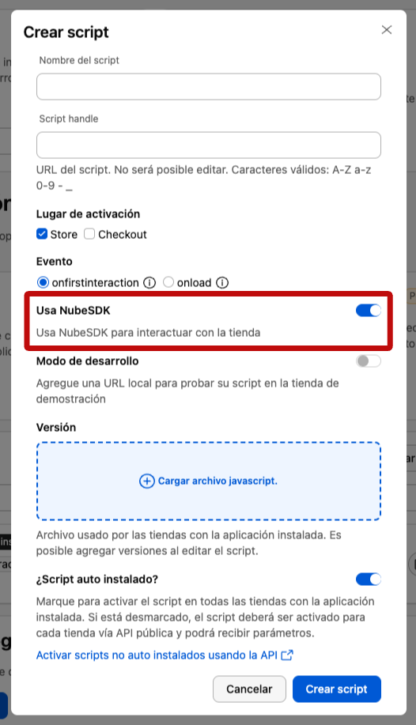
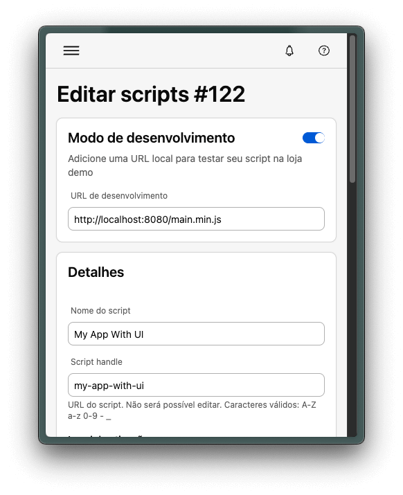

import AppTypes from '@site/src/components/AppTypes';
import PkgTabs from '@site/src/components/PkgTabs';

## Scaffolding Your First Nube App

These commands download and run the `create-nube-app` CLI, which will guide you through the process of setting up your project.

:::info
Compatibility Note

Nube SDK requires Node.js version 16+. Please upgrade if your package manager warns about it.
:::

<PkgTabs>
  <PkgTabs.Item value="npm" command="npm create nube-app@latest" />
  <PkgTabs.Item value="Yarn" command="yarn create nube-app" />
  <PkgTabs.Item value="pnpm" command="pnpm create nube-app" />
  <PkgTabs.Item value="Bun" command="bun create nube-app" />
</PkgTabs>

:::tip
If you're unable to use the CLI, see [Manual Project Setup](./manual-setup) for advanced configuration instructions.
:::

## Adding script to your application

Adding the script to your application has the same process that with any other script, the only difference is that you have to enable the `Uses Nube SDK` flag in the script creation screen, otherwise it will loaded as a classic script and it will fail to work as expected.

:::info
If the scripts will be inserted **into an existing app**, please send the app_id to [api@tiendanube.com](mailto:api@tiendanube.com) / [api@nuvemshop.com.br](mailto:api@nuvemshop.com.br) for enablement. Otherwise, you will need to **create a new app**.
:::



**Important!**

Before adding your script, make sure to run the build process using:

<PkgTabs>
  <PkgTabs.Item value="npm" command="npm run build" />
  <PkgTabs.Item value="Yarn" command="yarn build" />
  <PkgTabs.Item value="pnpm" command="pnpm run build" />
  <PkgTabs.Item value="Bun" command="bun run build" />
</PkgTabs>

## Enabling development mode

Applications created using the `create-nube-app` CLI tool are already preconfigured for development mode.
By running the following command:

<PkgTabs>
  <PkgTabs.Item value="npm" command="npm run dev" />
  <PkgTabs.Item value="Yarn" command="yarn dev" />
  <PkgTabs.Item value="pnpm" command="pnpm run dev" />
  <PkgTabs.Item value="Bun" command="bun run dev" />
</PkgTabs>

A local development server will start on port `8080`.

To use development mode, you must first enable it and register a valid development URL in the Partner Portal, under your scripts's configuration settings.

:::info
After making changes in the Partner Portal, there might be a cache delay before the updates are reflected. Please allow some time for the changes to take effect.
:::



After starting development mode, developers can confirm that the environment is correctly configured by opening the browser console and executing the following command:

```typescript
nubeSDK.getState().apps;
```

If development mode is active, an object similar to the following will be returned:

```JSON
{
  "1028": {
    "id": "1028",
    "script": "http://localhost:8080/main.min.js",
    "registered": true
  }
}
```

Ensure that the script attribute of your app contains the URL localhost. This confirms that the environment is properly set up for development.

## NubeSDK Assistant

The NubeSDK Assistant is a specialized Gemini-powered tool designed to help developers create and build apps using the NubeSDK. This assistant provides:

- Expert guidance on NubeSDK implementation
- Code examples and best practices
- Troubleshooting support
- Step-by-step assistance in app development

You can access the NubeSDK Assistant at: [NubeSDK Assistant](https://gemini.google.com/gem/2cdd8c07de85?usp=sharing)

## Next Steps

- Learn more about [Script Structure](./script-structure)
