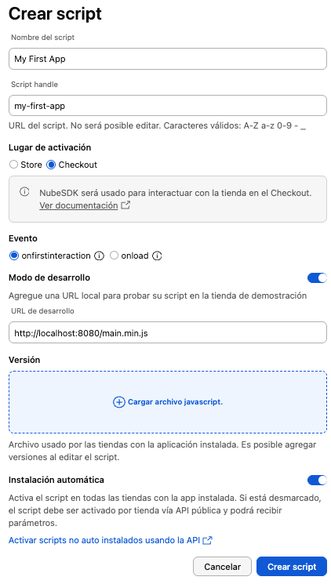

import PkgTabs from '@site/src/components/PkgTabs';
import ProgressTracker from '@site/src/components/ProgressTracker';
import GettingStartedPath from '@site/src/components/GettingStartedPath';

# Getting Started

Choose your path: build a new NubeSDK app from scratch, or migrate an existing app. Then follow the steps below.

<GettingStartedPath>

<ProgressTracker id="nube-sdk-getting-started" title="Your progress">

<ProgressTracker.Step
id="prerequisites"
number={1}
title="Check prerequisites"
checkpoint="You have Node.js 16+ and a package manager installed.">

Before you begin, make sure you have the required tools installed.

**Required:**

- **Node.js 16+** — [Download Node.js](https://nodejs.org/) if you don't have it
- **npm, Yarn, pnpm, or Bun** — A package manager (npm comes with Node.js)
- **Partner Portal account** — You'll need access to the [Partner Portal](https://partners.nuvemshop.com.br/) to register your app

**Recommended:**

- **Git** — For version control ([Download Git](https://git-scm.com/))
- [**NubeSDK DevTools**](https://chromewebstore.google.com/detail/nubesdk-devtools/gjkdjmkmlkinhlnccbdaolniefgnfehg) — Chrome extension for debugging NubeSDK apps

To verify your setup, run:

```bash
node -v
npm -v
```

</ProgressTracker.Step>

<ProgressTracker.Step
id="create-project"
number={2}
title="Create your project"
checkpoint="You have a project folder with package.json and src/.">

Set up a new NubeSDK project using the CLI:

<PkgTabs>
  <PkgTabs.Item value="npm" command="npm create nube-app@latest" />
  <PkgTabs.Item value="Yarn" command="yarn create nube-app" />
  <PkgTabs.Item value="pnpm" command="pnpm create nube-app" />
  <PkgTabs.Item value="Bun" command="bun create nube-app" />
</PkgTabs>

The CLI will ask for a **project name** and a **template**. Choose the template that best fits your needs:

| Template | Best for | UI approach | Packages included |
|----------|----------|-------------|-------------------|
| **Minimal** | Apps that don't render UI (analytics, cart validation, tracking) | No UI — events only | `nube-sdk-types` |
| **Minimal with UI** | Apps that render UI using function calls | `column()`, `text()`, `button()` | `nube-sdk-types` + `nube-sdk-ui` |
| **Minimal with UI in JSX** | Apps that render UI using JSX/TSX syntax | `<Column>`, `<Text>`, `<Button>` | `nube-sdk-types` + `nube-sdk-ui` + `nube-sdk-jsx` |

:::tip Recommended
If you're building an app with a user interface, we recommend **Minimal with UI in JSX** — it provides the most familiar developer experience with JSX syntax and styled components.
:::

:::tip
If you're unable to use the CLI, see [Manual Project Setup](./manual-setup) for advanced configuration instructions.
:::

</ProgressTracker.Step>

<ProgressTracker.Step
id="understand-project"
number={3}
title="Understand your project"
checkpoint="You understand the project structure and the App entry point.">

### Project structure

After scaffolding, your project looks like this (shown for the JSX template):

```
my-nube-app/
├── src/
│   ├── main.tsx              ← App entry point
│   └── components/
│       └── Logo.tsx          ← Example component
├── package.json              ← Dependencies and scripts
├── tsconfig.json             ← TypeScript configuration
├── tsup.config.js            ← Build tool (tsup)
├── biome.json                ← Linter and formatter (Biome)
└── vitest.config.ts          ← Test runner (Vitest)
```

### The App entry point

Every NubeSDK app exports an `App` function from `src/main.ts` (or `src/main.tsx`). This is the function the platform calls when your app loads:

```typescript
import type { NubeSDK } from "@tiendanube/nube-sdk-types";

export function App(nube: NubeSDK) {
  // Your app logic goes here
}
```

The `nube` object is your entire API surface:

| Method | Purpose |
|--------|---------|
| `nube.on(event, listener)` | Listen to store events (cart changes, page loads, etc.) |
| `nube.off(event, listener)` | Stop listening to an event |
| `nube.send(event, modifier)` | Dispatch events (validate cart, update config, etc.) |
| `nube.getState()` | Read the current store state (cart, customer, shipping, etc.) |
| `nube.render(slot, component)` | Render UI into a predefined position on the page |
| `nube.clearSlot(slot)` | Remove UI from a slot |
| `nube.getBrowserAPIs()` | Access async localStorage, sessionStorage, navigation |

### How NubeSDK apps work

:::info Key concept
NubeSDK apps run inside a **Web Worker**, isolated from the main page. This means:

- **No access** to `document`, `window`, `querySelector`, or any DOM API
- **No access** to libraries like jQuery, React, or Vue
- All UI is **declarative** — you describe what to render, the platform renders it
- All communication happens through **events**, not DOM listeners

This architecture ensures apps can't interfere with each other or with the store.
:::

### Available scripts

Your project comes with these commands out of the box:

| Script | Purpose |
|--------|---------|
| `dev` | Start a local dev server with hot-reload on port 8080 |
| `build` | Create a production-ready minified bundle in `dist/` |
| `test` | Run tests with Vitest |
| `test:watch` | Run tests in watch mode |
| `test:coverage` | Run tests with code coverage |
| `lint` | Check code style with Biome |
| `format` | Auto-fix code style issues |

</ProgressTracker.Step>

<ProgressTracker.Step
id="partner-portal"
number={4}
title="Set up the Partner Portal"
checkpoint="Your app is created, installed on your test store, with 'Uses NubeSDK' enabled and development mode active.">

Before you can test your app on a real store, you need to configure it in the Partner Portal. This involves creating your app, adding a script, and enabling development mode.

### 1. Create or configure your app

Go to the [Partner Portal](https://partners.nuvemshop.com.br/) and create a new application, or use an existing one.

### 2. Enable the Scripts permission

In your app's **Basic data** page, scroll down to the **Permissions** section, expand **Scripts**, and activate the permission. This is required before you can add any script to your app.

### 3. Create your script

On your app's dashboard, scroll down to the **Scripts** section and click **Create script**. In the script creation form:

1. Fill in the script details
2. Enable the **Uses Nube SDK** flag
3. Enable **development mode** and set the development URL to: `http://localhost:8080/main.min.js`



:::warning Important
On the **Storefront**, NubeSDK is currently supported only on stores using the **Patagonia** theme.
On the **Checkout** page, it works with any theme.
:::

:::info
After making changes in the Partner Portal, there might be a **cache delay** before the updates are reflected. Please allow some time for the changes to take effect.
:::

### 4. Install the app on your test store

Your app won't load on a store until it's installed there. If you don't have a test store yet, create a demo store from the Partner Portal first.

There are two ways to install:

**From the Partner Portal** — On your app's dashboard, in the **Connect with the API** section, select your test store and click **Install application**.

**From the store admin** — Navigate directly to `https://{your-store}.mitiendanube.com/admin/apps/{app-id}/authorize` and accept the terms and conditions.

:::tip
Every time you create a new app in the Partner Portal, you need to install it on the stores where you want it to run — including your own test store.
:::

</ProgressTracker.Step>

<ProgressTracker.Step
id="local-development"
number={5}
title="Start developing"
checkpoint="You can see your app running on your test store.">

With the Partner Portal configured, start your local development server:

<PkgTabs>
  <PkgTabs.Item value="npm" command="npm run dev" />
  <PkgTabs.Item value="Yarn" command="yarn dev" />
  <PkgTabs.Item value="pnpm" command="pnpm run dev" />
  <PkgTabs.Item value="Bun" command="bun run dev" />
</PkgTabs>

This starts two processes concurrently: **tsup** watches your source files and rebuilds on every change, and a **static server** serves the bundle at `http://localhost:8080`.

### Verify the connection

Open your test store in the browser, open the console, and run:

```javascript
nubeSDK.getState().apps;
```

If everything is configured correctly, you'll see your app with a localhost URL:

```json
{
  "1028": {
    "id": "1028",
    "script": "http://localhost:8080/main.min.js",
    "registered": true
  }
}
```

:::tip Troubleshooting
**App not showing up?** Double-check that:
- The app is **installed on your test store**
- Development mode is enabled in the Partner Portal
- The development URL matches exactly: `http://localhost:8080/main.min.js`
- Your dev server is running (`npm run dev`)
- You've waited for the Partner Portal cache to refresh
:::

### Debug with DevTools

If you installed the [NubeSDK DevTools](https://chromewebstore.google.com/detail/nubesdk-devtools/gjkdjmkmlkinhlnccbdaolniefgnfehg) extension, open Chrome DevTools (`F12`) and navigate to the **NubeSDK** tab to:

- See registered apps and their status
- Inspect rendered components and their slots
- Monitor events flowing between your app and the store
- Track storage operations (localStorage / sessionStorage)
- View the full SDK state tree

For more details, see the [DevTools guide](./devtools).

</ProgressTracker.Step>

<ProgressTracker.Step
id="first-feature"
number={6}
title="Write your first feature"
checkpoint="Your app renders a greeting and reacts to cart changes.">

Let's build a small feature that demonstrates the three core NubeSDK operations: **rendering UI**, **listening to events**, and **reading state**.

Replace the contents of your `src/main.tsx` with:

```tsx
import { Box, Text } from "@tiendanube/nube-sdk-jsx";
import type { NubeSDK } from "@tiendanube/nube-sdk-types";
import { styled } from "@tiendanube/nube-sdk-ui";

const Banner = styled(Box)`
  padding: 16px;
  background-color: #f0f7ff;
  border-radius: 8px;
  margin: 12px 0;
`;

function renderBanner(nube: NubeSDK) {
  nube.render("before_main_content", (state) => (
    <Banner>
      <Text heading={3}>
        Welcome to {state.store?.name ?? "our store"}!
      </Text>
      <Text color="#666">
        Your cart has {String(state.cart?.items?.length ?? 0)} item(s)
      </Text>
    </Banner>
  ));
}

export function App(nube: NubeSDK) {
  renderBanner(nube);

  nube.on("cart:update", () => {
    renderBanner(nube);
  });

  const { store } = nube.getState();
  console.log("App loaded on store:", store?.name);
}
```

Save the file — if your dev server is running, the bundle rebuilds automatically and you'll see the banner appear on your test store.

### What just happened?

| Line | What it does |
|------|-------------|
| `styled(Box)` | Creates a styled component with CSS applied via template literals |
| `renderBanner(nube)` | Extracts the render logic into a reusable function that can be called on init and on updates |
| `nube.render("before_main_content", fn)` | Renders UI into the `before_main_content` [slot](./slots/overview) — the function receives the current state |
| `String(state.cart?.items?.length ?? 0)` | Converts the item count to a string for safe rendering inside JSX |
| `nube.on("cart:update", () => renderBanner(nube))` | Listens to cart changes and re-renders the banner with updated data |
| `nube.getState()` | Returns a read-only snapshot of the current store state |

### Core concepts at a glance

| Concept | What it does | Learn more |
|---------|-------------|------------|
| **Slots** | Predefined positions on the page where your UI appears | [UI Slots](./slots/overview) |
| **Events** | Messages between your app and the store (`cart:update`, `checkout:ready`, etc.) | [Events](./events/overview) |
| **State** | Read-only snapshot of store data (cart, customer, shipping, etc.) | [State](./state/overview) |
| **Components** | Declarative UI building blocks (`Box`, `Text`, `Button`, `Field`, etc.) | [Components](./components/overview) |
| **Styling** | `styled()`, `StyleSheet.create()`, and theme tokens | [Styling](./styling) |
| **Browser APIs** | Async localStorage, sessionStorage, navigation, iframe messaging | [Browser APIs](./browser-apis) |

</ProgressTracker.Step>

<ProgressTracker.Step
id="build-test"
number={7}
title="Build and test"
checkpoint="Tests pass and the dist/ folder contains your minified bundle.">

### Run tests

Your project includes [Vitest](https://vitest.dev/) with a sample test file. Run the test suite:

<PkgTabs>
  <PkgTabs.Item value="npm" command="npm test" />
  <PkgTabs.Item value="Yarn" command="yarn test" />
  <PkgTabs.Item value="pnpm" command="pnpm test" />
  <PkgTabs.Item value="Bun" command="bun test" />
</PkgTabs>

Use `test:watch` during development to re-run tests automatically on file changes.

### Lint your code

Check for style and quality issues with [Biome](https://biomejs.dev/):

<PkgTabs>
  <PkgTabs.Item value="npm" command="npm run lint" />
  <PkgTabs.Item value="Yarn" command="yarn lint" />
  <PkgTabs.Item value="pnpm" command="pnpm run lint" />
  <PkgTabs.Item value="Bun" command="bun run lint" />
</PkgTabs>

To auto-fix formatting issues, run `format` instead of `lint`.

### Create a production build

When you're ready to deploy, generate an optimized bundle:

<PkgTabs>
  <PkgTabs.Item value="npm" command="npm run build" />
  <PkgTabs.Item value="Yarn" command="yarn build" />
  <PkgTabs.Item value="pnpm" command="pnpm run build" />
  <PkgTabs.Item value="Bun" command="bun run build" />
</PkgTabs>

This generates a minified `.min.js` file in the `dist/` folder, ready for deployment.

</ProgressTracker.Step>

<ProgressTracker.Step
id="deploy"
number={8}
title="Deploy to production"
checkpoint="Your production bundle is uploaded and live on all stores with the app installed.">

Now that your app is built and tested, it's time to make it available to real stores.

### 1. Upload your production bundle

In the **Partner Portal**, go to your script settings and find the **Version** section. Upload your `dist/main.min.js` file there. The file will be automatically hosted on Tiendanube's CDN.

### 2. Disable development mode

Once the script version is uploaded, disable **development mode** in the script settings so stores load the production bundle from the CDN instead of localhost.

:::tip
You can keep development mode enabled on a separate test store for ongoing development while your production stores use the uploaded script.
:::

</ProgressTracker.Step>

<ProgressTracker.Step
id="next-steps"
number={9}
title="Explore next steps"
checkpoint="You've reviewed the available resources and know where to go next.">

Congratulations! You've built, tested, and deployed your first NubeSDK app. Here's where to go from here:

### Core concepts

- [Script Structure](./script-structure) — Deep dive into the App entry point, events, and configuration
- [State](./state/overview) — The full state tree: cart, customer, shipping, payment, and more
- [Events](./events/overview) — All listenable and sendable events

### Building UI

- [Components](./components/overview) — Full component reference (Box, Text, Button, Field, Select, Accordion, etc.)
- [UI Slots](./slots/overview) — All available positions where your UI can appear (checkout and storefront)
- [Styling](./styling) — `styled()`, `StyleSheet.create()`, theme tokens, media queries, keyframes

### Advanced

- [Browser APIs](./browser-apis) — Async localStorage, sessionStorage, navigation, iframe messaging
- [DevTools](./devtools) — Inspect apps, components, events, storage, and state
- [Examples](./examples/overview) — Complete working patterns: carousel, banner, FAQ, modal, and more

### Need help?

The **NubeSDK Assistant** is a Gemini-powered tool that can help with implementation, code examples, and troubleshooting.

[Open NubeSDK Assistant →](https://gemini.google.com/gem/2cdd8c07de85?usp=sharing)

</ProgressTracker.Step>

</ProgressTracker>

</GettingStartedPath>
