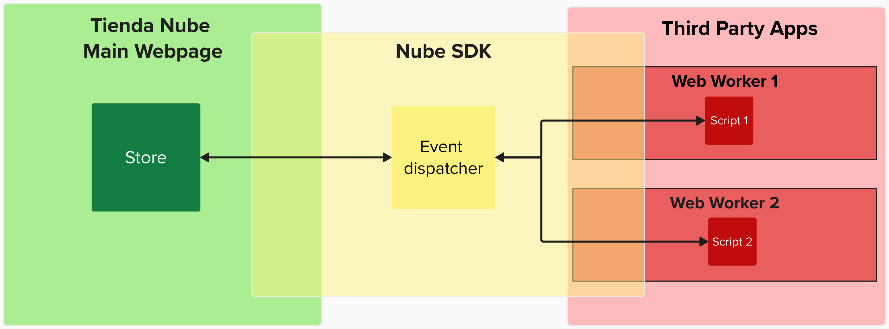

import { Alert, Text, Box } from '@nimbus-ds/components';
import AppTypes from '@site/src/components/AppTypes';

# Overview

NubeSDK is the new SDK used to develop applications in a safe and secure environment. These applications are hosted inside [WebWorkers](https://developer.mozilla.org/en-US/docs/Web/API/Web_Workers_API/Using_web_workers) in the browser, which guarantees that two applications can't interfere with each other, providing a more secure and stable development experience.

Communication between the main page and the scripts is handled 100% through events, with events like `cart_updated` being dispatched by the main page to inform that the cart changed, and the scripts dispatching events like `cart:validate` to report if they consider the contents of the cart to be valid or not.

## Next Steps

- Learn more about [Getting Started](./getting-started)
