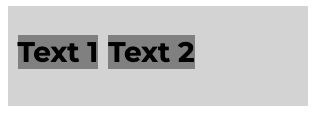
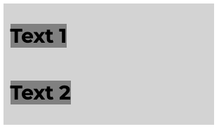
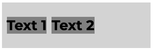
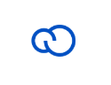

import { Alert, Text, Box } from '@nimbus-ds/components';
import AppTypes from '@site/src/components/AppTypes';

:::warning
This SDK is a Work In Progress! All features are subject to change.
:::

We support multiple UI components, some of which support nesting, to allow the construction of rich user interfaces.
The UI components are assigned to slots by sending the [ui:slot:set](./events#uislotset) event

## `box`

Box container, supports multiple sizes, styling and alignment options.
It's used mostly to embed other components that don't have their own layout options (fields, texts, images, etc..)



```typescript title="Example"
    const myBox = {
        type: "box",
        width: 300,
        height: 100,
        background: "lightgray",
        padding: 10,
        gap: 10,
        children: [
            {
                type: "txt",
                heading: 1, 
                children: "Text 1",
                background: "gray"
            },
            {
                type: "txt",
                heading: 1, 
                children: "Text 2",
                background: "gray"
            },                        
        ]
    }
```

## `col`

Column container, layouts children in a column, supports multiple sizes, styling and alignment options.



```typescript title="Example"
    const myColumn = {
        type: "col",
        width: 300,
        height: "100%",
        background: "lightgray",
        padding: 10,
        gap: 10,
        children: [
            {
                type: "txt",
                heading: 1, 
                children: "Text 1",
                background: "gray"
            },
            {
                type: "txt",
                heading: 1, 
                children: "Text 2",
                background: "gray"
            },                        
        ]
    }
```

## `row`

Row container, layouts children in a row, supports multiple sizes, styling and alignment options.



```typescript title="Example"
    const myRow = {
        type: "row",
        width: 300,
        height: "100%",
        background: "lightgray",
        padding: 10,
        gap: 10,
        children: [
            {
                type: "txt",
                heading: 1, 
                children: "Text 1",
                background: "gray"
            },
            {
                type: "txt",
                heading: 1, 
                children: "Text 2",
                background: "gray"
            },                        
        ]
    }
```

## `txt`

Text component, support multiple styles.
It needs to be embedded inside a box to control anything related to layout.


```typescript title="Example"
    const myText = {
        type: "box",
        width: 300,
        height: "100%",
        padding: 10,
        background: "lightgray",
        children: {
            type: "txt",
            heading: 1,
            children: "Hello World"
        }
    }
```


## `field`

Text input field, supports multiple styles and change events / focus events.
It needs to be embedded inside a box to control anything related to layout.


```typescript title="Example"

    const myField = {
        type: "box",
        width: 400,
        height: "100%",
        padding: 10,
        background: "lightgray",
        children: {
            type: "field",
            id: "name",
            label: "Name",
            onChange: (e) => console.log(e.value),
            onFocus: (e) => console.log("focus gained"),
            onBlur: (e) => console.log("focus lost"),
        }
    }

```

## `img`

Displays an image.
It needs to be embedded inside a box to control anything related to layout.



```typescript title="Example"

    const myImage = {
        type: "img",
        src: "https://app-insti-cdn.nuvemshop.com.br/site/dist/images/widgets/closing-cta/image-3.webp",
        width: 100,
        height: 100,
    }

```
