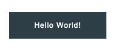

import { Alert, Text, Box } from '@nimbus-ds/components';
import AppTypes from '@site/src/components/AppTypes';

:::warning
This SDK is a Work In Progress! All features are subject to change.
:::

We support multiple UI components built in JSX, some of which support nesting, to enable the creation of rich user interfaces. The UI components are assigned to [slots](./ui-slots) by sending the [ui:slot:set](./events#uislotset) event.

## `Box`

Box container, supports multiple sizes, styling and alignment options.
It's used mostly to embed other components that don't have their own layout options (fields, texts, images, etc..)


```typescript title="Example"
import type { NubeSDK } from "@tiendanube/nube-sdk-types";
import { Box, Txt } from "@tiendanube/nube-sdk-jsx";

function MyComponent() {
  return (
    <Box width={100} height={200}>
      <Txt>Hello!!</Txt>
    </Box>
  );
}

export function App(nube: NubeSDK) {
  nube.send("ui:slot:set", () => ({
    ui: {
      slots: {
        after_line_items: <MyComponent />,
      },
    },
  }));
}
```

## `Checkbox`

Checkbox allows the user to select one or more items from a set. Checkboxes can be used to turn an option on or off.

```typescript title="Example"
import type { NubeSDK } from "@tiendanube/nube-sdk-types";
import { Box, Checkbox } from "@tiendanube/nube-sdk-jsx";

function MyComponent() {
  return (
    <Box>
      <Checkbox
        id="my-checkbox"
        label="Checkbox"
        name="checkbox"
        onChange={(e) => {
          console.log(`User name: ${e.value}`);
        }}
      />
    </Box>
  );
}

export function App(nube: NubeSDK) {
  nube.send("ui:slot:set", () => ({
    ui: {
      slots: {
        after_line_items: <MyComponent />,
      },
    },
  }));
}
```

## `Column`

Column container, layouts children in a column, supports multiple sizes, styling and alignment options.


```typescript title="Example"
import { Column, Text } from "@tiendanube/nube-sdk-jsx";

function MyComponent() {
  return (
    <Column width={100} height={200}>
      <Text>Hello 1</Text>
      <Text>Hello 2</Text>
    </Column>
  );
}
```

## `Row`

Row container, layouts children in a row, supports multiple sizes, styling and alignment options.


```typescript title="Example"
import { Row, Txt } from "@tiendanube/nube-sdk-jsx";

function MyComponent() {
  return (
    <Row width={100} height={200}>
      <Txt>Hello!!</Txt>
    </Row>
  );
}
```

## `Text`
Text component supports multiple styles.
It needs to be embedded inside a box to control anything related to layout.


```typescript title="Example"
import { Box, Text } from "@tiendanube/nube-sdk-jsx";

function MyComponent() {
  return (
    <Box>
      <Text color="red" background="blue">Hello!!</Text>
    </Box>
  );
}
```

## `Button`

Button supports multiple styles and click event.
It should be embedded inside a container to control layout.



**Button Props**

| Prop      | Type                | Default     | Description                                                      |
| --------- | ------------------- | ----------- | ---------------------------------------------------------------- |
| `id`      | `string`            | —           | Unique identifier for the Button.                                |
| `children`| `string`            | —           | Text displayed on the Button.                                    |
| `onClick` | `(event) => void`   | —           | Function called when the Button is clicked.                      |
| `variant` | `string`            | `"primary"` | Defines the style variation of the Button (e.g., primary, secondary). |
| `disabled`| `boolean`           | `false`     | Disables the Button when `true`.                                 |

```typescript title="Example"
import { Button } from "@tiendanube/nube-sdk-jsx";

export function Component() {
  return (
    <Button
      onClick={() => {
        console.log("Button clicked!");
      }}
      variant="primary"
    >
      Hello World!
    </Button>
  );
}
```


## `Field`

Text input field, supports multiple styles and change events / focus events.
It needs to be embedded inside a box to control anything related to layout.

**Properties**

| Property | Type                           | Required | Description                                                        |
| -------- | ------------------------------ | -------- | -------------------------------------------------------------------|
| name     | string                         | Yes      | The name of the field, used to identify it in forms.               |
| label    | string                         | Yes      | The label text displayed above the field.                          |
| value    | string                         | No       | The current value of the field input.                              |
| autoFocus| boolean                        | No       | Whether the field should automatically receive focus when mounted. |
| onChange | NubeComponentFieldEventHandler | No       | Function called when the field value changes.                      |
| onBlur   | NubeComponentFieldEventHandler | No       | Function called when the field loses focus.                        |
| onFocus  | NubeComponentFieldEventHandler | No       | Function called when the field receives focus.                     |


```typescript title="Example"
import { Box, Field } from "@tiendanube/nube-sdk-jsx";

function MyComponent() {
  return (
    <Box>
      <Field
        id="myField"
        label="Field"
        value="value"
        name="field"
        onChange={(e) => {
          console.log(`value: ${e.value}`);
        }}
      />
    </Box>
  );
}
```

## `Textarea`

Multi-line text input for extended content.

**Properties**

| Property  | Type                              | Required | Description                                                            |
| --------- | --------------------------------- | -------- | -----------------------------------------------------------------------|
| name      | string                            | Yes      | The name of the textarea, used to identify it in forms.                |
| label     | string                            | Yes      | The label text displayed above the textarea.                           |
| value     | string                            | No       | The current value of the textarea.                                     |
| maxLength | number                            | No       | The maximum number of characters allowed in the textarea.              |
| rows      | number                            | No       | The number of visible text lines in the textarea.                      |
| autoFocus | boolean                           | No       | Whether the textarea should automatically receive focus when mounted.  |
| onChange  | NubeComponentTextareaEventHandler | No       | Function called when the textarea value changes.                       |
| onBlur    | NubeComponentTextareaEventHandler | No       | Function called when the textarea loses focus.                         |
| onFocus   | NubeComponentTextareaEventHandler | No       | Function called when the textarea receives focus.                      |

```typescript title="Example"
import { Box, Textarea } from "@tiendanube/nube-sdk-jsx";

function MyComponent() {
  return (
    <Box>
      <Textarea
        id="my-textarea"
        maxLength={300}
        row={3}
        label="Textarea"
        name="txtarea"
        onChange={(e) => {
          console.log(`value: ${e.value}`);
        }}
      />
    </Box>
  );
}
```

## `Image`

Displays an image.
It needs to be embedded inside a box to control anything related to layout.


```typescript title="Example"
import { Col, Image } from "@tiendanube/nube-sdk-jsx";

function MyComponent() {
  return (
    <Col width={100} height={200}>
      <Image
        src="https://app-insti-cdn.nuvemshop.com.br/site/dist/images/widgets/closing-cta/image-3.webp"
        alt="Nuvemshop Logo"
      />
    </Col>
  );
}
```

Optionally, the `Img` component can receive alternative sources loaded by media query.

```typescript title="Example"
export function Logo() {
  return (
    <Image
      src="https://hostname/default.png"
      alt="Hello"
      sources={[
        {
          src: "https://hostname/desktop.png",
          media: "(min-width: 769px)",
        },
        {
          src: "https://hostname/mobile.png",
          media: "(max-width: 768px)",
        },
      ]}
    />
  );
}
```
