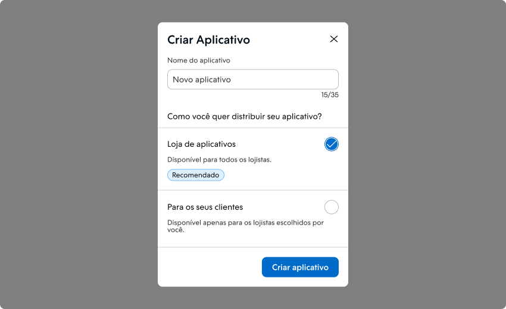
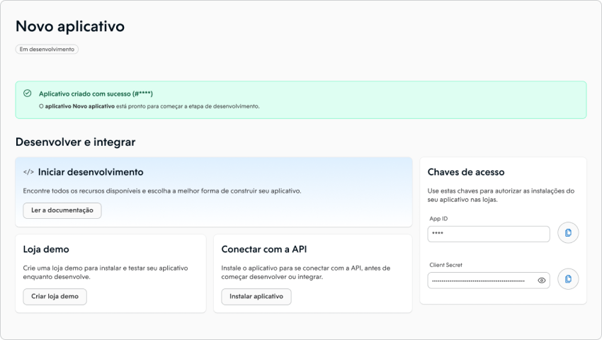
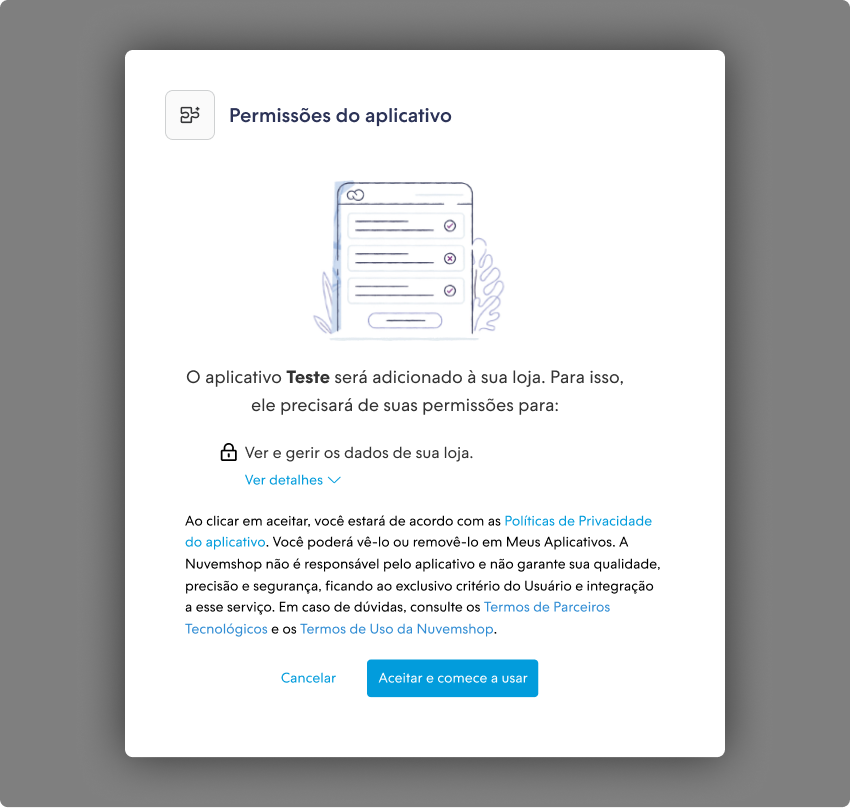
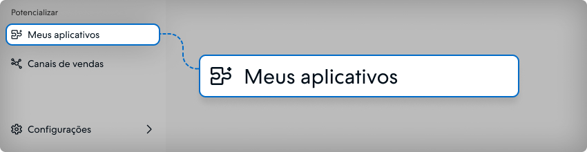
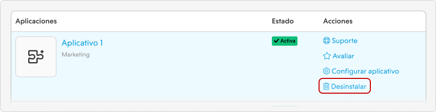
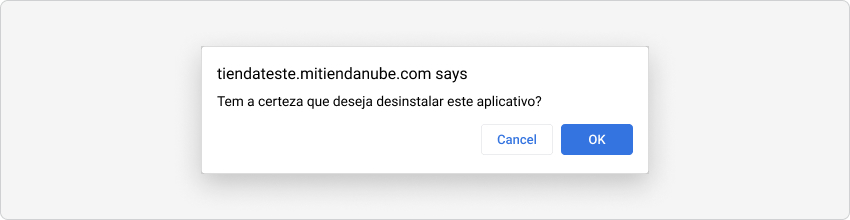
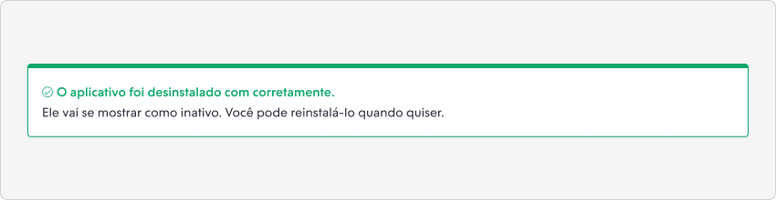

import { Alert, Text, Box } from '@nimbus-ds/components';
import AppTypes from '@site/src/components/AppTypes';

# Visão geral

## Prazo de adoção do NubeSDK

<Alert appearance="warning" title="📅 30 de agosto de 2026 — uso do NubeSDK passa a ser obrigatório para novas instalações">
   <Text>A partir de <Text as="span" fontWeight="bold">30 de agosto de 2026</Text>, apps que não estejam desenvolvidas usando o <Text as="span" fontWeight="bold">NubeSDK</Text> e não estejam na <Text as="span" fontWeight="bold">whitelist</Text> não poderão receber novas instalações. Lojas que já têm o app instalado <Text as="span" fontWeight="bold">não serão afetadas</Text>. Estamos levando progressivamente todas as lojas para o modelo com SDK.</Text>
    
   <Text>👉 <Text as="span" fontWeight="bold">Quer validar seu app antes do prazo?</Text> Entre em contato para que adicionemos a tag na sua loja de teste e você possa validar seu app no novo modelo.</Text>
    
   <Text>Se ainda não migrou, comece pelo <a href="./nube-sdk/migration-guide"><Text as="span" fontWeight="bold">Guia de migração para o NubeSDK</Text></a>.</Text>
</Alert>

 

**O que muda e o que não muda:**

- ✅ **30 de agosto de 2026** — novas instalações ficam **bloqueadas** para apps sem SDK que não estejam na whitelist.
- ✅ **30 de outubro de 2026** — início da **deprecação e desinstalação progressiva**, com recomendação de app alternativo aos lojistas.
- ✅ Lojas com o app já instalado **continuam funcionando normalmente** após 30/08/2026 (até a etapa de deprecação).
- ✅ O **processo de homologação em si não muda** — apenas é adicionada a verificação de uso do SDK. Veja a [visão geral da Homologação](../homologation/overview.md) e os [Requisitos de Homologação](../homologation/requirements.md#4-uso-do-nubesdk).

 

Nesta seção, forneceremos um guia passo a passo para que você possa criar um aplicativo e integrar ele na plataforma Nuvemshop. Antes de iniciar o desenvolvimento do seu aplicativo, é necessário criar uma conta no Portal de Parceiros da Nuvemshop. Saiba como criar o seu cadastro no 📝 Guia: [detalhes do programa de Parceiros Tecnológicos da Nuvemshop](https://atendimento.nuvemshop.com.br/pt_BR/parceiros-tecnologicos/como-fazer-um-aplicativo-para-a-loja-de-aplicativos-nuvemshop).

## Criando um aplicativo na Nuvemshop

Através da nossas ferramentas, você consegue criar um aplicativo para ser disponibilizado na 📱 [Loja de Aplicativos Nuvemshop](https://www.nuvemshop.com.br/loja-aplicativos-nuvem).

Dessa forma, os lojistas possuem visibilidade da ferramenta e podem instalá-la em suas lojas virtuais, trazendo mais reconhecimento ao seu serviço.

1. Acesse o 👉 [Portal de Parceiros](https://partners.nuvemshop.com.br) e faça o login em sua conta utilizando suas credenciais de acesso.

2. Após o login, você será redirecionado para o painel de parceiros.

3. Dentro do painel, clique em **"Criar aplicativo"** para continuar.

4. Uma nova tela será exibida, onde você deve inserir o nome do seu aplicativo e selecionar como deseja disponibilizá-lo.

   

   Temos duas opções de disponibilização para o seu aplicativo:

   - **Loja de Aplicativos**: Se você deseja que o aplicativo esteja disponível em nossa loja oficial, escolha esta opção. Após o processo de homologação ser concluído, o aplicativo estará disponível na loja, permitindo que qualquer lojista o instale, teste ou compre.

   - **Para Seus Clientes**: Com esta opção, não é necessário passar pelo processo de homologação. No entanto, o seu aplicativo ficará disponível apenas para os lojistas que você selecionar.

5. Ao clicar em **"Criar aplicativo"**, direcionaremos você para a página dedicada ao seu aplicativo.

   

   A página do seu aplicativo é dividida em 3 seções:

   - **Desenvolver e Testar**: Nesta seção, você encontra as informações necessárias para desenvolver e testar seu aplicativo antes de disponibilizar para os lojistas de sua preferência, ou antes, de solicitar homologação.

   - **Editar aplicativo**: Na seção de edição do aplicativo, você pode personalizar e ajustar as configurações do seu aplicativo. Ex.: Adicionar recursos, definir preferências e fazer as alterações necessárias para tornar o seu aplicativo ainda mais atrativo e funcional.

   - **Métricas de Acompanhamento**: Esta seção é dedicada ao acompanhamento do desempenho do seu aplicativo. Aqui você encontrará dados e estatísticas relevantes. Utilize essas métricas para otimizar e melhorar constantemente a experiência do seu aplicativo.

Agora que você criou o seu aplicativo, é hora de avançarmos para a etapa de desenvolvimento e testes. Chegou a hora de colocar a mão na massa de vez! Vamos explorar o processo de desenvolvimento e garantir que você esteja preparado para criar o seu aplicativo para a Nuvemshop.

## Desenvolvendo e Testando seu Aplicativo

Nesta seção, forneceremos todas as informações essenciais para autenticar o seu aplicativo com a API da Nuvemshop, aproveitar os nossos serviços, realizar ajustes e testar a funcionalidade do aplicativo em uma loja demo antes de torná-lo disponível. Prepare-se para mergulhar no desenvolvimento e assegurar um aplicativo de qualidade para nossos lojistas.

### Loja demo

Para prosseguir com a instalação do seu aplicativo e realizar o processo de autenticação, é necessário ter uma loja de teste. Caso você ainda não possua uma loja de teste, clicar em **"Criar loja demo"** para criar a sua primeira loja de teste.

Essa loja demo permitirá que você faça testes de funcionamento do aplicativo em um ambiente controlado antes de disponibilizá-lo para os clientes.

<Alert appearance="primary" title="📌 Observação">
   Lembrando que essa loja é apenas para teste e possui algumas limitações.
</Alert>

 

### Chaves de acesso do seu aplicativo

As chaves de acesso são essenciais para iniciar o processo de autenticação do seu aplicativo com nossa API.
Essas chaves proporcionam a autorização necessária para que seu aplicativo se comunique com nossos serviços e obtenha os dados e recursos essenciais para seu funcionamento adequado.

### Instalando seu aplicativo

Caso você tenha uma loja demo, clique no botão **Instalar aplicativo**. Você será redirecionado para o login da sua loja demo. Utilize as mesmas credenciais que você usou para entrar no Portal de Parceiros.

Se você não tiver uma loja demo, [clique aqui](https://partners.nuvemshop.com.br/stores/create?type=demo) para criar uma nova.

<Alert  title="💡 Dica">
   <Text>Caso queira instalar o seu aplicativo em outra loja, adicione <Text as="span" fontWeight="bold">/admin/apps/:app-id/authorize</Text> no final da URL. Lembre-se de substituir o <Text as="span" fontWeight="bold">:app-id</Text> pelo ID do seu aplicativo.</Text>
</Alert>

 

Ao entrar no Administrador da sua loja demo, você vai precisar confirmar a instalação, clicando em **Aceitar e começar a usar**.

### Desinstalando um aplicativo

Neste tutorial, explicamos como **desinstalar um aplicativo** no seu painel administrador Nuvemshop.

<Alert title="💡 Dica">
   Neste tutorial, usamos o Melhor Envio como exemplo. Porém, você pode fazer o mesmo procedimento em qualquer aplicativo que aparece nessa página, seja de frete, pagamentos, marketing, canais de venda, dropshipping, gestão etc.
</Alert>

1. Acessar o painel administrador Nuvemshop.

2. No menu lateral, localizar na seção Potencializar e clicar em **"Meus aplicativos"**.

   

3. Ao carregar a página, você deve procurar pela ferramenta que deseja desativar e, ao lado direito, clicar em **"Desinstalar"**.

   

4. Logo em seguida, abrirá **um pop-up perguntando se deseja prosseguir** com a desinstalação do aplicativo, basta clicar em **"OK"**.

   

5. Ao ser desinstalado, aparecerá uma mensagem de confirmação no topo da página.

   

O aplicativo foi desinstalado com sucesso. Caso queira **reativá-lo em sua loja**, basta procurá-lo na mesma página e clicar em **"Instalar"**.

## Autenticando seu aplicativo

Um passo fundamental é autenticar seu aplicativo para acessar a [Nuvemshop API](../developer-tools/nuvemshop-api.md). Se você estiver utilizando um dos nossos [templates](../developer-tools/templates.md), o processo de autenticação estará pronto para uso, incluindo a conexão com a API de produtos da Nuvemshop. Isso automatiza significativamente o processo; siga o guia de configuração no repositório do template escolhido e você estará a caminho do desenvolvimento.

Por outro lado, se você optar por não usar nossos templates, você pode acessar este [guia](./authentication.md) para uma integração manual. Nossa meta é facilitar o desenvolvimento do seu aplicativo, independentemente do caminho que você escolher.

## Escolhendo o tipo do seu aplicativo

Após criar seu aplicativo e estar pronto para começar o desenvolvimento, é fundamental compreender os dois tipos de aplicativos que podem ser desenvolvidos em nossa plataforma: Incorporado ao administrador e Externo. Essas opções oferecem flexibilidade e vantagens únicas para atender às necessidades específicas dos merchants. Vamos explorar esses tipos em detalhes para que você possa tomar a melhor decisão para seu aplicativo.

<AppTypes />

## Editando as permissões do seu aplicativo

Ao criar o seu aplicativo, a permissão **"Products"** será escolhida como padrão. Entretanto, ao longo do desenvolvimento, pode ser necessário obter [acesso a outras permissões](../developer-tools/nuvemshop-api.md#permissões-e-escopos) para o seu aplicativo. Todas as permissões que o parceiro adicionar ou editar exigirão que o aplicativo seja reinstalado. Para isso, ele deve selecionar as permissões em **"Dados Básicos"** no portal, salvar as mudanças, ir à loja onde o aplicativo está instalado, clicar em **"Desinstalar"** (veja como desistalar um [aplicativo](./overview.md#desinstalando-um-aplicativo)) e, em seguida, em **"Instalar"**. Dessa forma, um novo access token será gerado e o processo de integração a Nuvemshop Api pode ser iniciado novamente, incluindo as permissões atualizadas.

## Tratamento de erros no seu aplicativo

O tratamento adequado de erros é fundamental e obrigatório para garantir que seus aplicativos sejam confiáveis e proporcionem uma excelente experiência aos usuários. Para facilitar esse processo, o pacote [Nexo](../developer-tools/nexo.md) oferece um componente chamado `ErrorBoundary`.

Os ErrorBoundaries são componentes que interceptam erros de JavaScript em qualquer parte da sua árvore de componentes, oferecendo uma UI de fallback. Isso significa que uma interface auxiliar é exibida quando ocorre um erro na sua árvore de componentes. A UI de fallback está integrada ao painel de administração dos lojistas e é ativada por meio de uma [ação](../developer-tools/nexo.md#action_log_error) interna do `Nexo`, que é chamada automaticamente pelo `ErrorBoundary`.

Para configurar o `ErrorBoundary` em seu aplicativo, consulte nosso tutorial detalhado no [link](../developer-tools/nexo.md#tratamento-de-erros).

Lembrando que o uso do `ErrorBoundary` em seu aplicativo é obrigatório para publicá-lo em nossa loja de aplicativos.

---

## Próximos passos

- Saiba mais sobre [Aplicativos Integrados ao Administrador](./native.md)
- Saiba mais sobre [Aplicativos Standalone](./standalone.md)
