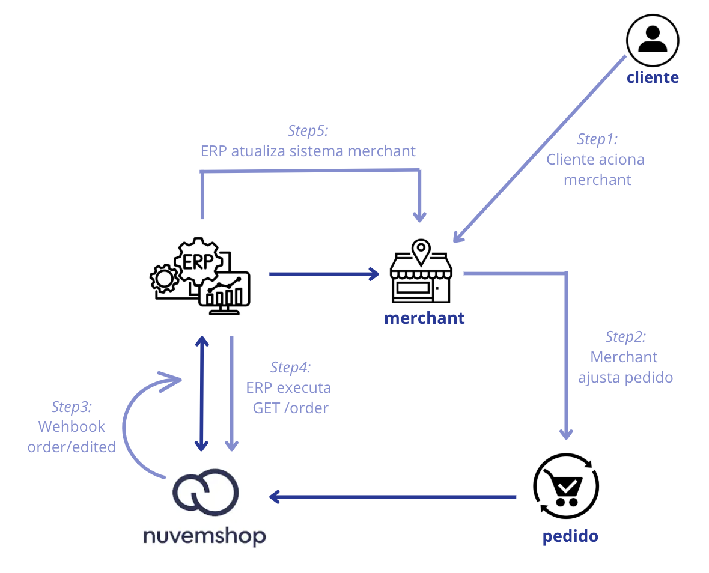
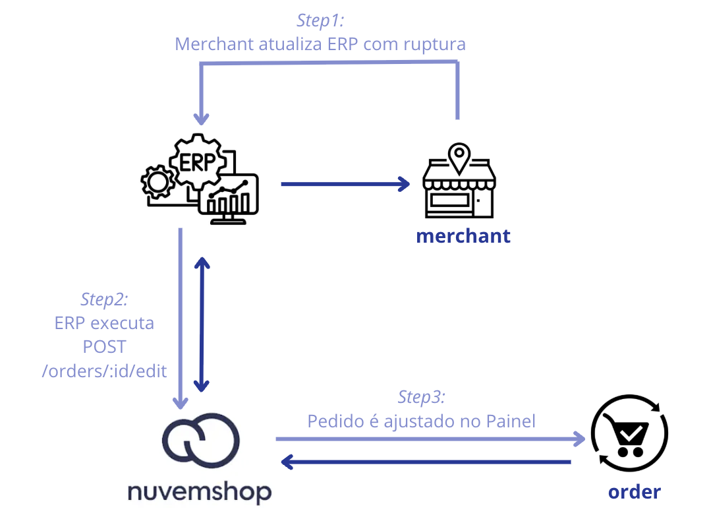

**🔹Guia ao parceiro - EditOrders**

Este documento tem como objetivo orientar e auxiliar os merchants e seus parceiros no fluxo de **EditOrders** disponível pela Nuvemshop para cenários em que haja a necessidade de alterações em pedidos.   
Neste processo, é fundamental assegurar a **consistência**, **atualização contínua** e o **mapeamento** preciso das mudanças, sendo essencialmente relevante para merchants que utilizam a integração entre um ERP e a Nuvemshop.

📌**Importante:** Ao se gerar uma mudança no nível do pedido dos produtos, a Nuvemshop volta a cotar o frete, o que faz com que seus valores mudem. Com isso, é importante também que as aplicações de envio que oferecem serviços pré-pagos, Fulfillment services ou coleta, escutem este webhook, porque ele altera informações relevantes para a gestão delas.

⚠️ **Atenção:** este processo de edição de pedido só pode ocorrer quando o pedido ainda não tiver sido embalado (O *status* da *Fulfillment order* está como `UNPACKED`).   
É importante notar que os pedidos packed podem se tornar unpacked novamente a partir do administrador da loja, enquanto um pedido dispatched já não permite voltar para unpacked.

A Nuvemshop se comunica sobre qualquer mudança na informação do pedido através de [webhooks](https://tiendanube.github.io/api-documentation/resources/webhook), o que garante uma rápida sincronização de dados. Com isso, em todas as mudanças, a Nuvemshop envia o webhook `order/edited`, sendo que essas mudanças também disparam o *webhook* `order/updated`.

- **Gestão de produtos em FFO:**   
  - Agora será possível adicionar ou remover produtos de um FFO existente. Esta ação ativará um novo cálculo dos custos de envio.  
- **Restrição de exclusão de FFO:**   
  - Para manter a integridade do pedido, não será possível excluir um FFO que contenha produtos.  
- **Gestão de descontos:**   
  - Desenvolvemos a capacidade de adicionar ou remover descontos nos pedidos.  
- **Avisos de mudança de destino:**   
  - Notificamos as modificações feitas no pedido sobre os dados de destino.  
- **Mudança no método de pagamento:** Nos pedidos (*órdenes*) que não estiverem pagos, bem como naqueles em que o pagamento foi rejeitado, os consumidores podem modificar o método de pagamento.

**◀️Possíveis status de pedidos na Nuvemshop:**

FulfillmentOrderStatus

* `UNPACKED`: Estado inicial do pedido, o mesmo não foi iniciado.  
* `PACKED`: O pedido foi embalado, onde o mesmo se encontra pronto para envio.  
* `DISPATCHED`: O pedido foi enviado.  
* `READY_FOR_PICKUP`: O pedido estava pronto para ser retirado.  
* `DELIVERED`: O pedido foi totalmente cumprido e entregue.

**◀️Simulações** 

Foram simulados dois cenários nos quais a atualização dos dados do pedido pode ser requerida, conforme detalhado abaixo.   
Ressalta-se que tais alterações somente poderão ser efetuadas se o pedido ainda não tiver sido atualizado para o status embalado (`UNPACKED`).

1- \[Nuvemshop como agente principal de edição\]

Considere o seguinte cenário: um cliente entra em contato com o merchant, informando um equívoco na geração do pedido e solicitando uma alteração, por exemplo, na numeração.   
Assim, o merchant acessa o Painel administrativo da Nuvemshop para realizar a alteração necessária solicitada pelo cliente.  
Sendo assim, essa alteração de informação ocorre na Nuvemshop. 

Porém, o merchant possui integração com um ERP e como esta alteração ocorreu no sistema da Nuvemshop, o ERP precisará sofrer alteração para adequação aos novos dados.  
Para isso, ocorrendo a alteração no sistema da Nuvemshop, a própria Nuvemshop irá disparar um [webhook](https://tiendanube.github.io/api-documentation/next/resources/webhook).  
Com isso, sendo a Nuvemshop o principal agente nesta alteração, informará que ocorreu uma alteração.

Ponto de atenção: quando ocorre esta ação, a Nuvemshop dispara o webhook que notifica que foi alterado o pedido.   
Desta forma, cabe a necessidade que o ERP esteja lendo esta comunicação do webhook, para assim realizar uma nova consulta do pedido (através do GET/orders).   
Com a nova consulta realizada, identificará os dados alterados e deverá realizar o update de informação dentro do pedido no ERP, para garantir assim a consistência de informação entre sistemas.

Assim, o merchant poder seguir com o empacotamento e envio do pedido.

📌 Como ocorre a notificação da Nuvemshop via API de webhook merchant/ERP acompanhar?

2- \[ERP como agente principal de edição\]

Supondo um cenário onde o merchant possui um único inventário, considerando vendas físicas e online, ao separar os produtos do pedido realizado via Nuvemshop, ele identifica que houve uma interrupção de venda (ou seja, um pedido foi gerado sem *estoque* disponível). 

Entende-se que não será possível cumprir com o envio do produto faltante, por isso será necessário que tal produto seja retirado do pedido e que o cliente seja notificado de que não o receberá.

Neste caso, o merchant realiza o ajuste através do ERP e o ERP deverá atualizar o pedido para adaptá-lo à Nuvemshop por meio de uma requisição via API (usando [**POST /orders/{id}/edit**](https://tiendanube.github.io/api-documentation/next/resources/order#post-ordersidedit)). 

Vale ressaltar que um pedido da FForder não pode ficar sem produtos.

É importante reforçar que não será possível deixar uma FForder sem produtos. Dessa forma, os dados que precisam ser alterados no Painel da Nuvemshop são efetivamente ajustados, para continuar garantindo toda a sincronização da informação do pedido.

📌 Como ocorre a notificação do ERP via API para Nuvemshop atualizar no painel e ao cliente?

