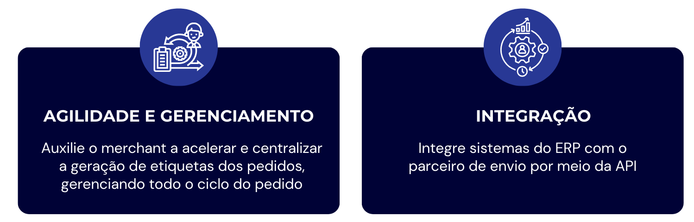
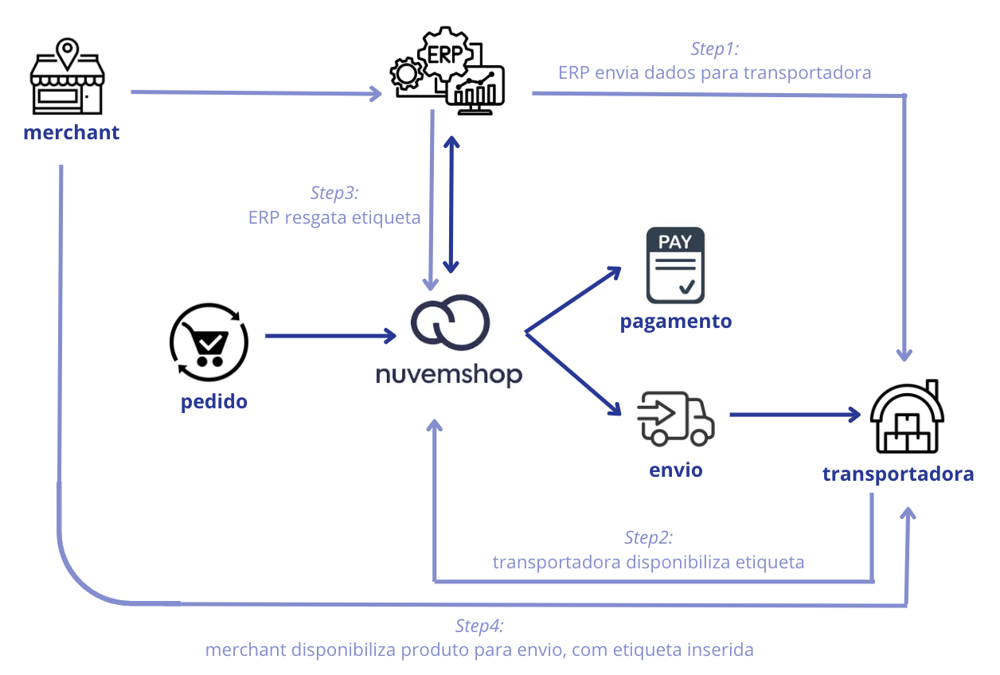
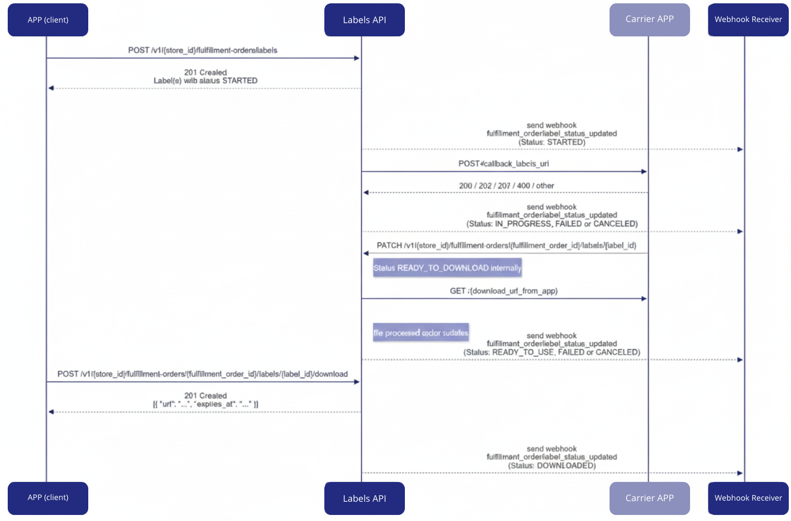

**🔹Guia ao parceiro \- Label**

A **[API de etiquetas](https://tiendanube.github.io/api-documentation/next/resources/fulfillment-order#labels-api)** permite a **criação assíncrona**, o **acompanhamento do status** e o **download** controlado **de etiquetas** de envio para pedidos.  
Isso permite que, ao invés do merchant precisar gerar etiquetas diretamente na transportadora, a utilização da API possibilita a coordenação da solicitação de etiquetas entre a API de Etiquetas e aplicativos de terceiros (transportadoras).  
Assim que as etiquetas são solicitadas, elas são processadas pelo parceiro de envio e disponibilizadas para download por URLs seguras, gerenciadas pela Nuvemshop.

Esta API oferece:

* Gerenciamento completo do ciclo de vida da etiqueta (criação, processamento, download, falha/cancelamento)  
* Histórico de status detalhado para auditoria e tratamento de erros  
* Suporte a webhook para rastrear atualizações de etiquetas  
* Integração com aplicativos de envio por meio de `callback_labels_url`

**◀️Possíveis status de etiquetas:**

* `STARTED`: Solicitação iniciada, aguardando processamento pelo parceiro.  
* `IN PROGRESS`: O parceiro recebeu a solicitação e está processando a etiqueta.  
* `READY TO DOWNLOAD`: A etiqueta foi gerada pela transportadora e está pronta para o download interno pela API de Etiquetas.  
* `READY TO USE`: A etiqueta já foi baixada internamente e está disponível para uso.  
* `DOWNLOADED`: A etiqueta foi baixada pela API de Etiquetas.  
* `FAILED`: O processamento falhou.  
* `CANCELED`: A etiqueta foi cancelada.

⚠️Todas as atualizações de status de etiqueta são notificadas pelo webhook `fulfillment_order/label_status_updated`  
No entanto, o status intermediário `READY_TO_DOWNLOAD` é apenas interno e não é notificado por webhook. Esse status é usado durante o processamento interno e somente após uma validação bem-sucedida ou falha, o próximo webhook é enviado com o status final.

**◀️Requisição para a Transportadora:** `callback_labels_url`  
Quando uma etiqueta é criada, um evento interno é acionado.   
Este evento é processado por um serviço em segundo plano que agrupa as ordens de cumprimento por transportadora e envia uma requisição para o aplicativo da transportadora usando o `callback_labels_url` configurado.

**⚠️Informações importantes:** 

* Existe um limitador de 50 orders (pedidos) por requisição.  
* Se espera receber do carrier em um lapso de 5 segundos uma resposta sobre o pedido (aceito, parcialmente aceito, falhou). Após este tempo, se considera timeout. Há então uma sequência de 3 novas tentativas com um intervalo de 2 segundos entre cada tentativa;  
* Referente ao tempo que um carrier tem para devolver a etiqueta, uma vez que foi respondido com a aceitação de geração de etiqueta, espera-se que as mesmas listas sejam geradas e baixadas em 1 hora;  
* Existem determinados [formatos de etiqueta](https://tiendanube.github.io/api-documentation/next/resources/fulfillment-order#fulfillmentorderlabeldocumentformattype), como em PDF e ZPL.

**⚠️[Regras de fluxo de trabalho de status](https://tiendanube.github.io/api-documentation/next/resources/fulfillment-order#labels-api):**

* **Fluxo Esperado:** STARTED → IN\_PROGRESS → \[FAILED | CANCELED | READY\_TO\_USE\] → DOWNLOADED  
* **Restrição de status final:** Etiquetas em status final (FAILED, CANCELED, READY\_TO\_USE, DOWNLOADED) não pode aceitar mais atualizações de status  
* **Exceção cancelamento:** CANCELED status pode ser aplicado em qualquer ponto do fluxo de trabalho, exceto quando o rótulo estiver em READY\_TO\_DOWNLOAD (internal processing)  
* **Sem fluxo reverso:** As atualizações de status não podem retroceder para status anteriores ou pular status intermediários  
* **Tempo limite automático:** Etiquetas que permanecem em status STARTED ou IN\_PROGRESS por mais de 30 minutos será automaticamente marcado como FAILED

**◀️Simulações**  
   
Um pedido pode possuir diversos produtos do merchant.  
Com isso, um merchant que trabalha com multi-CD, poderá/terá múltiplas formas de envio.   
Os produtos poderão ser agrupados em um único lugar e despachado ou ter envios separados por Centros de Distribuições.  
Em um contexto em que os envios são separados, cada transportadora disponibiliza sua própria etiqueta de despacho e cabe ao merchant acessar cada um destas empresas para de fato emitir e assim inserir no pedido.

Pensando em agilidade e centralização ao merchant, se faz importante que a própria transportadora possa disponibilizar a sua etiqueta ao ERP que o merchant utiliza e assim em um único lugar ele poderá exportar estas etiquetas de cada transportadora do qual é vinculado.

Pensando nisso, a Nuvemshop disponibiliza uma **API** em que esta **comunicação de informações** e disponibilização para **download** possa ocorrer, de forma **segura** e com o uso de **webhooks** para melhores integrações entre sistemas.

📌 Como funciona tecnicamente o fluxo de emissão de etiquetas?  
Através de nossa documentação disposta no [Portal Dev,](https://tiendanube.github.io/api-documentation/next/resources/fulfillment-order#labels-api) disponibilizamos detalhes técnicos e seu respectivo fluxo de requisições e retornos para o completo funcionamento de emissão de etiquetas, junto a comunicação entre Nuvemshop e seus parceiros.

