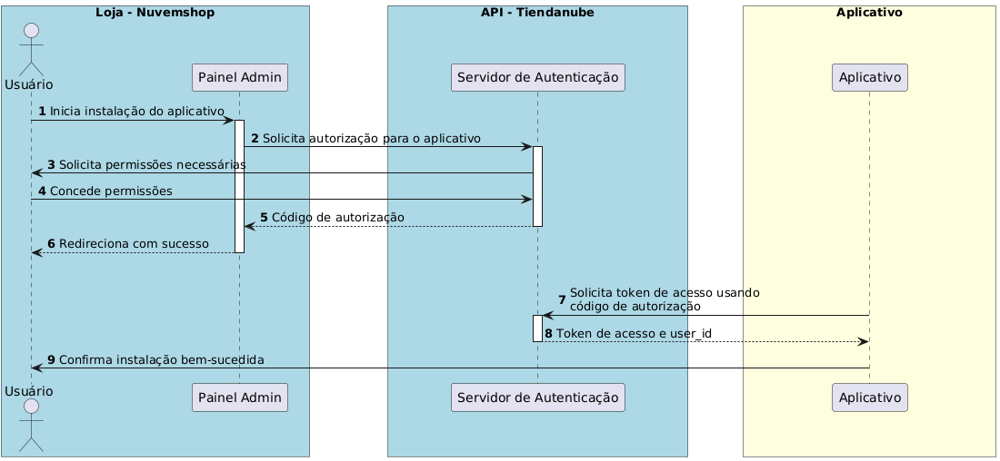

# Autenticação

A autenticação na API da Nuvemshop utiliza uma implementação restrita do OAuth 2.0, especificamente o fluxo de "Código de Autorização". Esse processo permite que aplicativos obtenham tokens de acesso que não expiram, permanecendo válidos até serem renovados ou até que o usuário desinstale o aplicativo.


[Link para criação do aplicativo](https://partners.nuvemshop.com.br/)

**Fluxo de Autorização:**

- **Início da Instalação**: O usuário, a partir do painel administrativo da Nuvemshop, clica para instalar o aplicativo ou acessa diretamente uma URL específica para autorização.
- **Solicitação de Permissões**: O usuário é redirecionado para uma página onde deve autorizar os escopos que o aplicativo solicita. Se já tiver autorizado anteriormente, este passo é pulado.
- **Redirecionamento com Código de Autorização**: Após a autorização, o usuário é redirecionado para a URL de redirecionamento do aplicativo com um código de autorização que expira em 5 minutos.
- **Troca pelo Token de Acesso**: O aplicativo utiliza suas credenciais e o código de autorização para obter um token de acesso através de uma requisição POST para um endpoint específico.

**Exemplo de Requisição para Obter o Token de Acesso:**

```bash
curl -d '{
"client_id": "123",
"client_secret": "abcdef",
"grant_type": "authorization_code",
"code": "xyz"
}' \
-H 'Content-Type: application/json' \
-X POST "https://www.nuvemshop.com/apps/authorize/token"

```

Juntamente com o token de acesso, é fornecido um **user_id**, que corresponde ao **ID da loja**.

Este **user_id** é essencial para fazer requisições à API e pode ser utilizado para autenticar usuários do aplicativo em seu site.
