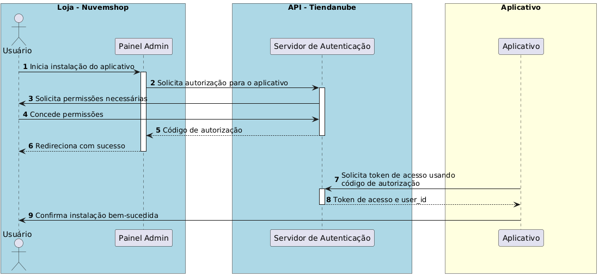
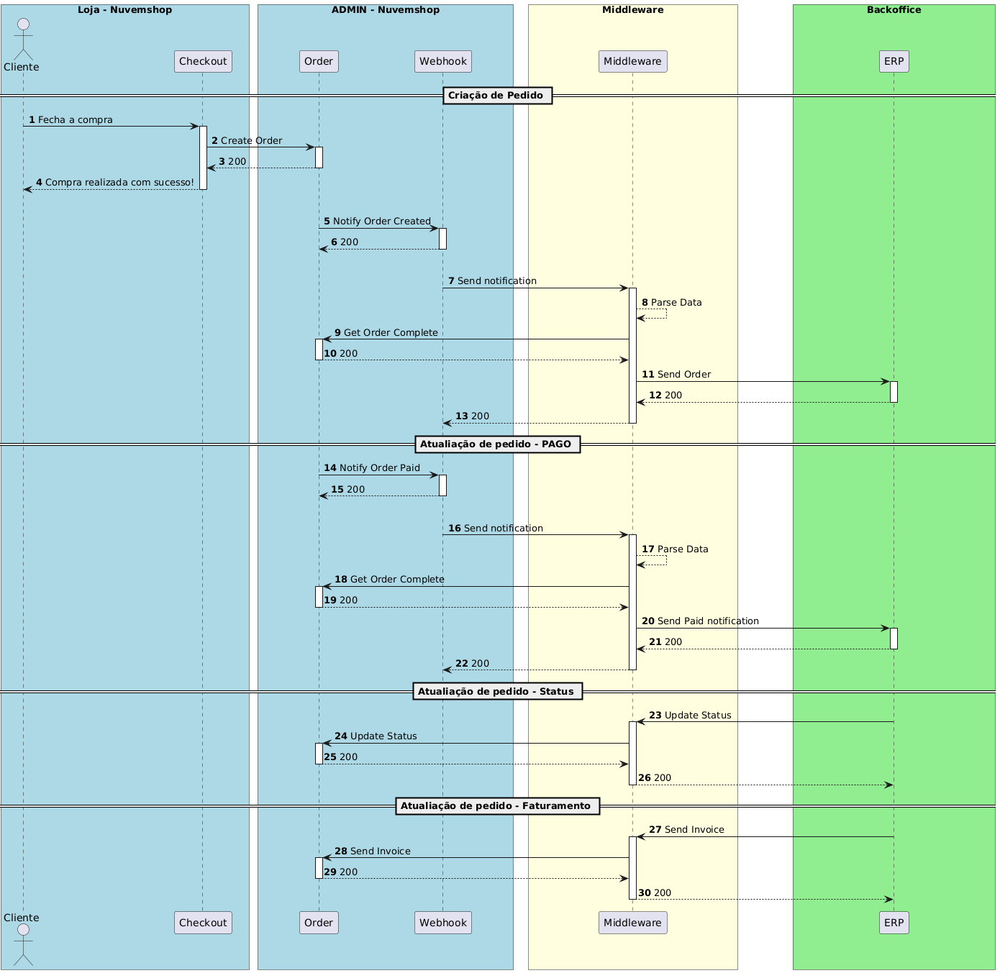

# Integration Guide 

Neste guia, iremos abordar a forma prática para integrar seu sistema ERP ou PIM com a plataforma Nuvemshop. Aqui, você encontrará instruções para sincronizar informações críticas como pedidos, produtos e estoques, garantindo eficiência e automação nas operações de back office.

Este guia abrange:

- **Gerenciamento de produtos e variações**: Cadastro, atualização e controle de estoque.
- **Sincronização de pedidos**: Processamento automatizado com uso de webhooks.
- **Gestão de estoques e faturas**: Controle eficiente de níveis de estoque e emissão de invoices.

Incluímos exemplos em cURL com cabeçalhos e detalhes dos endpoints para facilitar sua implementação. 
Ideal para empresas que buscam integração rápida e confiável, este guia ajuda a otimizar processos e melhorar a operação do seu e-commerce.

# Resumo do guia

**1. Criação de Aplicação**
- Processo para criar o perfil de um parceiro na Nuvemshop e conectar a aplicação com a plataforma.

Links úteis:

- [Como criar uma aplicação na Nuvemshop](https://ayuda.tiendanube.com/es_AR/socios-tecnologicos/como-creo-una-aplicacion-para-tiendanube)
- [Documentação para desenvolvedores](https://dev.nuvemshop.com.br/en/docs/applications/overview)


**2. Instalação e Onboarding**
- Guia para criar uma experiência de instalação eficiente para apps públicas no appstore.
- Foco na concessão de permissões e vinculação entre lojas e ERPs.

Links úteis:

[Guia de Instalação](https://tiendanube.github.io/api-documentation/guides/installation)

[Autenticação](https://tiendanube.github.io/api-documentation/authentication)


**3. Estoques e Depósitos (Locations)**

- Gerenciamento de estoques distribuídos em diferentes depósitos.

- Recursos por plano:
    - Freemium/Plano A: 1 depósito
    - Plano B: 2 depósitos
    - Plano C: 3 depósitos
    - Enterprise: ilimitado

Links úteis:

 [Multi-Inventory](https://tiendanube.github.io/api-documentation/multi-inventory-guides)
 [API Locations](https://tiendanube.github.io/api-documentation/authentication)

 **4. Produtos e Variações**
- Gerenciamento de produtos, categorias e variações, permitindo sincronização completa entre Nuvemshop e o ERP.

- Fluxo básico:
    - Sincronizar produtos/categorias criados.
    - Atualizar estoque, preço e atributos.
    - Criar variações com SKU, nome e estoque inicial.

Links úteis:
 [Produtos](https://tiendanube.github.io/api-documentation/resources/product)
 [Variações](https://tiendanube.github.io/api-documentation/resources/product-variant)
 [Imagens de Produtos](https://tiendanube.github.io/api-documentation/resources/product-image)
 [Categorias](https://tiendanube.github.io/api-documentation/resources/category)

**5. Pedidos**
- Captura e tratamento de pedidos para controle de estoque, faturamento e logística.
- Funcionalidades principais:
    - Sincronizar pedidos existentes e novos.
    - Atualizar status de pagamento e envio.
    - Gerar notas fiscais e reintegrar estoque em cancelamentos.

Links úteis:
 [Pedidos](https://tiendanube.github.io/api-documentation/resources/order)
 [Webhooks de Pedidos](https://tiendanube.github.io/api-documentation/resources/webhook)

**6. Clientes**
- Sincronização de informações de clientes entre Nuvemshop e o sistema de gestão.
- Funcionalidades:
    - Capturar lista de clientes já existentes.
    - Criar e atualizar registros de clientes no ERP e na Nuvemshop.

Links úteis:
 [Clientes](https://tiendanube.github.io/api-documentation/resources/client)

**7. Recursos Adicionais**
- Práticas recomendadas:
    - [JSON e Limites de Taxa](https://tiendanube.github.io/api-documentation/intro#just-json)
    - [Paginação](https://tiendanube.github.io/api-documentation/intro#pagination)
    - [Postman Collection](https://tiendanube.github.io/api-documentation/utils/postman-collections)

**8. Checklist de Homologação**
- Checklist detalhado para homologação de aplicativos no appstore:
    - Checklist de Homologação


# Autenticação

A autenticação na API da Nuvemshop utiliza uma implementação restrita do OAuth 2.0, especificamente o fluxo de "Código de Autorização". Esse processo permite que aplicativos obtenham tokens de acesso que não expiram, permanecendo válidos até serem renovados ou até que o usuário desinstale o aplicativo.


[Link para criação do aplicativo](https://partners.nuvemshop.com.br/)

**Fluxo de Autorização:**

- **Início da Instalação**: O usuário, a partir do painel administrativo da Nuvemshop, clica para instalar o aplicativo ou acessa diretamente uma URL específica para autorização.
- **Solicitação de Permissões**: O usuário é redirecionado para uma página onde deve autorizar os escopos que o aplicativo solicita. Se já tiver autorizado anteriormente, este passo é pulado.
- **Redirecionamento com Código de Autorização**: Após a autorização, o usuário é redirecionado para a URL de redirecionamento do aplicativo com um código de autorização que expira em 5 minutos.
- **Troca pelo Token de Acesso**: O aplicativo utiliza suas credenciais e o código de autorização para obter um token de acesso através de uma requisição POST para um endpoint específico.

**Exemplo de Requisição para Obter o Token de Acesso:**

```bash
curl -d '{
"client_id": "123",
"client_secret": "abcdef",
"grant_type": "authorization_code",
"code": "xyz"
}' \
-H 'Content-Type: application/json' \
-X POST "https://www.nuvemshop.com/apps/authorize/token"

```

Juntamente com o token de acesso, é fornecido um **user_id**, que corresponde ao **ID da loja**.

Este **user_id** é essencial para fazer requisições à API e pode ser utilizado para autenticar usuários do aplicativo em seu site.

# Rate Limit - Controle de Uso da API

Atualmente, utilizamos o algoritmo Leaky Bucket para limitar o uso da API. 

Por padrão, o bucket tem capacidade para **40 requisições**, com uma taxa de vazão (leaky rate) de 2 requisições por segundo.

Isso significa que você pode fazer até **2 requisições por segundo** em pacotes de até **40 requisições**, sem receber o erro **429 (Too Many Requests)**.

Para monitorar o consumo da API, disponibilizamos os seguintes cabeçalhos:

- **x-rate-limit-limit**: Total de requisições permitidas em um dado período (equivalente ao tamanho do bucket).
- **x-rate-limit-remaining**: Número de requisições restantes para preencher o bucket.
- **x-rate-limit-reset**: Tempo restante, em milissegundos, para o bucket ser completamente esvaziado.

**Observação importante**: O limite de uso da API é aplicado individualmente para cada loja e aplicativo.

**Para lojas nos planos Next ou Evolution (planos superiores), o limite de taxa é multiplicado por 10, permitindo maior capacidade de requisições.**

# Filtros Gerais e Paginação

Requisições que retornam múltiplos itens **não possuem paginação habilitada por padrão**. 

Para navegar pelos resultados, é necessário usar o parâmetro **page** para especificar páginas adicionais.

Além disso, você pode personalizar o tamanho de cada página utilizando o parâmetro **per_page**, que aceita valores de até **200 itens por página**.

A numeração das páginas começa em 1. Se o parâmetro page for omitido, a requisição retornará a primeira página por padrão.

**Informações úteis:**

- **Contagem total de resultados**: O cabeçalho **x-total-count** indica a quantidade total de itens disponíveis.

```bash
x-total-count: 156
```

**Links para navegação**: O cabeçalho Link fornece os URLs para as páginas seguinte e anterior, facilitando a implementação de paginação.

Esse mecanismo permite obter os resultados de forma organizada e eficiente, mesmo em grandes conjuntos de dados.

# Estoque
A API de Estoques da Nuvemshop permite o gerenciamento de localizações e níveis de estoque em diferentes pontos de venda.

Com ela, é possível criar, atualizar e consultar estoques em locais específicos, como lojas físicas ou armazéns. 

A API também oferece a priorização de locais para definir a ordem de atendimento de pedidos, permitindo uma gestão eficiente e integrada dos inventários.

#Criar um Novo Estoque

Para criar um novo estoque, utilize o endpoint [POST /locations](https://tiendanube.github.io/api-documentation/resources/location).

Requisição:

```bash
curl -X POST https://api.nuvemshop.com/v1/{{store_id}}/locations \
-H 'Authentication: bearer {{app_token}}' \
-H 'User-Agent: Your App Name ({{app_id}})' \
-H 'Content-Type: application/json' \
-d '{
  "name": {
    "es_AR": "Nombre del stock",
    "pt_BR": "Nome do estoque",
    "en_US": "Stock name"
  },
  "address": {
    "zipcode": "12910802",
    "street": "Rua Exemplo",
    "number": "123",
    "floor": "1º Andar",
    "locality": "Bairro Exemplo",
    "city": "São Paulo",
    "province": {
      "code": "SP",
      "name": "São Paulo"
    },
    "region": {
      "code": "SE",
      "name": "Sudeste"
    },
    "country": {
      "code": "BR",
      "name": "Brasil"
    },
    "reference": "Ponto de referência",
    "between_streets": "Entre a Rua A e Rua B"
  },
  "is_default": false,
  "allows_pickup": true,
  "priority": 1
}'
```

**Atualizar um Estoque Existente**

Para atualizar um estoque existente, utilize o endpoint [PUT /locations/{id}](https://tiendanube.github.io/api-documentation/resources/location#put-locationsid), substituindo {id} pelo ID do estoque.

Requisição:

```bash
curl -X PUT https://api.nuvemshop.com/v1/{{store_id}}/locations/{id} \
-H 'Authentication: bearer {{app_token}}' \
-H 'User-Agent: Your App Name ({{app_id}})' \
-H 'Content-Type: application/json' \
-d '{
  "name": {
    "es_AR": "Nombre actualizado del stock",
    "pt_BR": "Nome atualizado do estoque",
    "en_US": "Updated stock name"
  },
  "address": {
    "zipcode": "12910802",
    "street": "Rua Atualizada",
    "number": "456",
    "floor": "2º Andar",
    "locality": "Bairro Atualizado",
    "city": "Rio de Janeiro",
    "province": {
      "code": "RJ",
      "name": "Rio de Janeiro"
    },
    "region": {
      "code": "SE",
      "name": "Sudeste"
    },
    "country": {
      "code": "BR",
      "name": "Brasil"
    },
    "reference": "Novo ponto de referência",
    "between_streets": "Entre a Rua X e Rua Y"
  },
  "is_default": false,
  "allows_pickup": false,
  "priority": 2
}'
```

**Listar Todos os Estoques**

Para listar todos os estoques cadastrados, utilize o endpoint [GET /locations](https://tiendanube.github.io/api-documentation/resources/location#get-locations).

```bash
curl -X GET https://api.nuvemshop.com/v1/{{store_id}}/locations \
-H 'Authentication: bearer {{app_token}}' \
-H 'User-Agent: Your App Name ({{app_id}})' \
-H 'Content-Type: application/json'
```

**Alterar Prioridades dos Estoques**

Para definir as prioridades dos estoques, utilize o endpoint [PATCH /locations/priorities](https://tiendanube.github.io/api-documentation/resources/location#patch-locationspriorities)

A priorização do estoque terá um impacto direto na cotação de frete da loja. 
Isso ocorre porque os estoques priorizados serão levados em consideração no momento de montar o pacote de envio. 
Dessa forma, os produtos selecionados com base nessa priorização definirão a origem do envio, influenciando diretamente os custos de transporte, prazos de entrega e a experiência final do cliente.

Requisição:

```bash
curl -X PATCH https://api.nuvemshop.com/v1/{{store_id}}/locations/priorities \
-H 'Authentication: bearer {{app_token}}' \
-H 'User-Agent: Your App Name ({{app_id}})' \
-H 'Content-Type: application/json' \
-d '[
  {
    "id": "01HTMFDH09VC6E2Q8KGTGP44D3",
    "priority": 0
  },
  {
    "id": "01HTMFFHWXRC8TRS40M43XGQFB",
    "priority": 1
  },
  {
    "id": "01HTMFG5VYQ8X5QW8FQ9Z7W3E1",
    "priority": 2
  }
]'
```

**Definir um Estoque como Padrão**

Para definir um estoque específico como padrão, utilize o endpoint [PATCH /locations/{id}/chosen-as-default](https://tiendanube.github.io/api-documentation/resources/location#patch-locationsidchosen-as-default), substituindo **{id}** pelo ID do estoque.


Requisição:

```bash
curl -X PATCH https://api.nuvemshop.com/v1/{{store_id}}/locations/{id}/chosen-as-default \
-H 'Authentication: bearer {{app_token}}' \
-H 'User-Agent: Your App Name ({{app_id}})' \
-H 'Content-Type: application/json'
```

# Catálogo

API de Catálogo da Nuvemshop permite a gestão completa dos produtos de uma loja. 

Com ela, é possível criar, atualizar, listar e excluir produtos, além de gerenciar suas variações, preços, estoques, imagens e customizações. 

A API oferece recursos avançados, como a adição de atributos personalizados e o controle detalhado de cada aspecto do produto, permitindo uma integração robusta com sistemas de ERP, PIM ou outras ferramentas de gestão.

É importante destacar que esses campos são utilizados quando a loja tem a intenção de ser multilíngue. 
Caso contrário, basta enviar o campo Name com o valor correspondente, como por exemplo: **"name":"nome"**.


# Categoria

**Criação de uma Categoria**

Para criar uma nova categoria, faça uma requisição [POST para o endpoint /categories](https://tiendanube.github.io/api-documentation/resources/category#post-categories).

Certifique-se de incluir os seguintes cabeçalhos:
- Authentication: bearer {{app_token}}
- User-Agent: Your App Name ({{app_id}})
Exemplo em curl:


```bash
curl -X POST https://api.nuvemshop.com/v1/categories \
-H "Content-Type: application/json" \
-H "Authentication: bearer {{app_token}}" \
-H "User-Agent: Your App Name ({{app_id}})" \
-d '{
  "name": {
    "pt": "Eletrônicos",
    "en": "Electronics",
    "es": "Electrónica"
  },
  "description": {
    "pt": "Categoria de produtos eletrônicos",
    "en": "Category of electronic products",
    "es": "Categoría de productos electrónicos"
  },
  "handle": {
    "pt": "eletronicos",
    "en": "electronics",
    "es": "electronica"
  },
  "parent": null,
 "google_shopping_category": "Clothing & Accessories > Jewelry",
	 "seo_title": "Categoría de productos electrónicos",
	 "seo_description": "Categoría de productos electrónicos"
  
}'
```

**Criação de uma Subcategoria**

O processo para criar uma subcategoria é semelhante ao da criação de uma categoria.

Você deve especificar o [ID da categoria pai no campo parent](https://tiendanube.github.io/api-documentation/resources/category#post-categories-2).

Exemplo em curl:

```bash
curl -X POST https://api.nuvemshop.com/v1/categories \
-H "Content-Type: application/json" \
-H "Authentication: bearer {{app_token}}" \
-H "User-Agent: Your App Name ({{app_id}})" \
-d '{
  "name": {
    "pt": "Smartphones",
    "en": "Smartphones",
    "es": "Smartphones"
  },
  "description": {
    "pt": "Subcategoria de smartphones",
    "en": "Smartphones subcategory",
    "es": "Subcategoría de smartphones"
  },
  "handle": {
    "pt": "smartphones",
    "en": "smartphones",
    "es": "smartphones"
  },
  "parent": 12345
}'
```

**Atualização de uma Categoria ou Subcategoria**

Para atualizar uma categoria ou subcategoria existente, faça uma requisição [PUT para o endpoint /categories/{id}](https://tiendanube.github.io/api-documentation/resources/category#put-categoriesid), onde **{id}** é o ID da categoria que deseja atualizar.

Exemplo em curl:


```bash
curl -X PUT https://api.nuvemshop.com/v1/categories/12345 \
-H "Content-Type: application/json" \
-H "Authentication: bearer {{app_token}}" \
-H "User-Agent: Your App Name ({{app_id}})" \
-d '{
  "name": {
    "pt": "Eletrônicos e Gadgets",
    "en": "Electronics and Gadgets",
    "es": "Electrónica y Gadgets"
  },
  "description": {
    "pt": "Categoria atualizada de produtos eletrônicos e gadgets",
    "en": "Updated category of electronic products and gadgets",
    "es": "Categoría actualizada de productos electrónicos y gadgets"
  }
}'
```

# Gestão de Produtos

A API da Nuvemshop oferece endpoints completos para gerenciar produtos, incluindo criação, atualização, e enriquecimento de dados, além de gerenciamento de variantes. 

Os produtos podem ser classificados em dois tipos principais: **produtos sem variação** e **produtos com variação**.
A distinção entre esses dois tipos afeta a forma como os dados do produto são gerenciados e apresentados na plataforma.

**Produtos Sem Variação**

Esses são produtos simples, que não possuem opções adicionais para o cliente escolher. 

**Exemplos incluem:**
- Um livro com um único título e idioma.
- Um pôster com tamanho e design fixos.

**Características:**

- **SKU:** Cada produto é identificado por um código SKU, gerado do lado do ERP/PIM.
- **Gerenciamento direto de estoque:** O controle de estoque, preço e outros atributos é feito diretamente no nível do produto.

**Produtos com Variação**
Esses produtos oferecem opções para os clientes, como tamanho, cor ou material.

Cada combinação de opções é chamada de variante, e essas variantes compartilham o mesmo produto base.

**Como funcionam os atributos e valores?**

Os produtos com variação utilizam os conceitos de **attributes** (atributos) e **values** (valores):

- **Atributos (attributes):** Representam as opções disponíveis para o produto. Exemplos:
    - Tamanho
    - Cor
    - Material

- **Valores (values):** São as escolhas dentro de cada atributo. Exemplos:
    - Para o atributo "Tamanho": P, M, G.
    - Para o atributo "Cor": Azul, Vermelho, Preto.
    - Cada variante é formada por uma combinação específica de valores para os atributos do produto.


**Criação de Produtos**

Use este endpoint para criar um novo produto na loja.

[Requisição de exemplo:](https://tiendanube.github.io/api-documentation/resources/product)

```bash
curl -X POST https://api.nuvemshop.com/v1/{{store_id}}/products \
-H 'Authentication: bearer {{app_token}}' \
-H 'User-Agent: Your App Name ({{app_id}})' \
-H 'Content-Type: application/json' \
-d '{
  "name": "Camiseta básica",
  "description": "Camiseta 100% algodão",
  "price": 49.99,
  "sku": "CAM-001",
  "stock": 0,
  "inventory_levels": [
 	{
		"location_id": "01GQ2ZHK064BQRHGDB7CCV0Y6N",
		"stock": 5
}
  ],
  "categories": [12345],
  "images": [] // Enviar as imagens utilizando a API de enriquecimento
}'
```

**Listagem de Produtos**

Liste todos os produtos cadastrados na loja.

[Requisição de exemplo:](https://tiendanube.github.io/api-documentation/resources/product#get-products-1)

```bash
curl -X GET https://api.nuvemshop.com/v1/{{store_id}}/products \
-H 'Authentication: bearer {{app_token}}' \
-H 'User-Agent: Your App Name ({{app_id}})' \
-H 'Content-Type: application/json'
```

**Atualização de Produtos**

Use este endpoint para atualizar as informações de um produto existente.

[Requisição de exemplo:](https://tiendanube.github.io/api-documentation/resources/product#put-productsid)

```bash
curl -X PUT https://api.nuvemshop.com/v1/{{store_id}}/products/98765 \
-H 'Authentication: bearer {{app_token}}' \
-H 'User-Agent: Your App Name ({{app_id}})' \
-H 'Content-Type: application/json' \
-d '{
  "price": 54.99,
  "stock": 150
}'
```

**Atualização de Variações**

Permite alterar informações específicas de uma **variante de produto (SKU)**.

[Requisição de exemplo:](https://tiendanube.github.io/api-documentation/resources/product-variant#get-productsproduct_idvariantsid)


```bash
curl -X PUT https://api.nuvemshop.com/v1/{{store_id}}/products/98765/variants/12345 \
-H 'Authentication: bearer {{app_token}}' \
-H 'User-Agent: Your App Name ({{app_id}})' \
-H 'Content-Type: application/json' \
-d '{
  "id": 144,
  "image_id": null,
  "promotional_price": "19.00",
  "created_at": "2013-01-03T09:11:51-03:00",
  "depth": null,
  "height": null,
  "values": [
    {
      "en": "X-Large"
    }
  ],
  "price": "25.00",
  "product_id": 1234,
  "stock_management": true,
  "stock": 5,
  "sku": "BSG1234D",
  "mpn": null,
  "age_group": null,
  "gender": null,
  "updated_at": "2013-06-01T09:15:11-03:00",
  "weight": "2.75",
  "width": null,
  "cost": "10.99"
}
'
```

**Enriquecimento de Produto**

Para enriquecer as informações de um produto, inclua campos como imagens, descrições mais detalhadas ou informações adicionais.

[Requisição de exemplo para adicionar uma imagem:](https://tiendanube.github.io/api-documentation/resources/product-image)

```bash
curl -X POST https://api.nuvemshop.com/v1/{{store_id}}/products/98765/images \
-H 'Authentication: bearer {{app_token}}' \
-H 'User-Agent: Your App Name ({{app_id}})' \
-H 'Content-Type: application/json' \
-d '{
  "src": "https://example.com/image2.jpg"
}'
```

**Exclusão de Produtos**

Permite excluir um produto da loja.

[Requisição de exemplo:](https://tiendanube.github.io/api-documentation/resources/product#delete-productsid)


```bash
curl -X DELETE https://api.nuvemshop.com/v1/{{store_id}}/products/98765 \
-H 'Authentication: bearer {{app_token}}' \
-H 'User-Agent: Your App Name ({{app_id}})' \
-H 'Content-Type: application/json'
```

**Cadastrar uma Variação de Produto**

As variações de produto na Nuvemshop representam diferentes versões de um mesmo item, diferenciadas por atributos como tamanho, cor ou material. 


[Requisição de exemplo:](https://tiendanube.github.io/api-documentation/resources/product-variant#post-productsproduct_idvariants)

```bash
curl -X POST "https://api.nuvemshop.com/v1/{store_id}/products/{product_id}/variants" \
-H "Content-Type: application/json" \
-H "Authentication: Bearer {{app_token}}" \
-H "User-Agent: Your App Name ({{app_id}})" \
-d '{
  "price": 120.50,
  "stock": 20,
  "sku": "SKU-123",
  "attributes": [
    {
      "name": "Tamanho",
      "value": "M"
    },
    {
      "name": "Cor",
      "value": "Azul"
    }
  ]
}'
```

**Atualizar uma Variação de Produto**

URL: /products/{product_id}/variants/{variant_id}

[Requisição de exemplo:](https://tiendanube.github.io/api-documentation/resources/product-variant#put-productsproduct_idvariantsid)

```bash
curl -X PUT "https://api.nuvemshop.com/v1/{store_id}/products/{product_id}/variants/{variant_id}" \
-H "Content-Type: application/json" \
-H "Authentication: Bearer {{app_token}}" \
-H "User-Agent: Your App Name ({{app_id}})" \
-d '{
  "id": 144,
  "image_id": null,
  "promotional_price": "19.00",
  "created_at": "2013-01-03T09:11:51-03:00",
  "depth": null,
  "height": null,
  "values": [
    {
      "en": "X-Large"
    }
  ],
  "price": "25.00",
  "product_id": 1234,
  "stock_management": true,
  "stock": 5,
  "sku": "BSG1234D",
  "mpn": null,
  "age_group": null,
  "gender": null,
  "updated_at": "2013-06-01T09:15:11-03:00",
  "weight": "2.75",
  "width": null,
  "cost": "10.99"
}'
```

**Listar Variações de Produto**

URL: products/{product_id}/variants

[Requisição de exemplo:](https://tiendanube.github.io/api-documentation/resources/product-variant#put-productsproduct_idvariantsid)

```bash
curl -X GET "https://api.nuvemshop.com/v1/{store_id}/products/{product_id}/variants" \
-H "Authentication: Bearer {{app_token}}" \
-H "User-Agent: Your App Name ({{app_id}})"
```

**Buscar Detalhes de uma Variação Específica**
URL: products/{product_id}/variants/{variant_id}

[Requisição de exemplo:](https://tiendanube.github.io/api-documentation/resources/product-variant#get-productsproduct_idvariantsid)

```bash
curl -X GET "https://api.nuvemshop.com/v1/{store_id}/products/{product_id}/variants/{variant_id}" \
-H "Authentication: Bearer {{app_token}}" \
-H "User-Agent: Your App Name ({{app_id}})"
```

**Deletar uma Variação de Produto**

URL: /products/variants/custom-fields/{{custom-field_id}}

Requisição de exemplo:

```bash
curl -X DELETE "https://api.nuvemshop.com/v1/{store_id}/products/variants/custom-fields/{{custom-field_id}}" \
-H "Authentication: Bearer {{app_token}}" \
-H "User-Agent: Your App Name ({{app_id}})"
```


# Gestão de Produtos com Campos Personalizados em Variantes

A API da Nuvemshop/Nuvemshop fornece endpoints para gerenciar campos personalizados associados às variantes de produtos.

Esses campos permitem adicionar informações adicionais a cada variante, enriquecendo os dados do produto com propriedades específicas, podendo também ser usados como filtros.

Abaixo, detalhamos as operações disponíveis para trabalhar com os Custom Fields.


**Listar Campos Personalizados de uma Variante**

Retorna todos os campos personalizados associados a uma variante específica de produto.

[GET /products/variants/custom-fields](https://tiendanube.github.io/api-documentation/resources/products/variants/custom-fields#get-productsvariantsidcustom-fields)

```bash
curl -X GET https://api.nuvemshop.com/v1/{{store_id}}/products/variants/custom-fields \
-H 'Authentication: bearer {{app_token}}' \
-H 'User-Agent: Your App Name ({{app_id}})' \
-H 'Content-Type: application/json'
```

**Criar um Campo Personalizado**

Permite adicionar um novo campo personalizado a uma variante de produto.

POST /products/variants/custom-fields

```bash
curl -X POST https://api.nuvemshop.com/v1/{{store_id}}/products/variants/custom-fields \
-H 'Authentication: bearer {{app_token}}' \
-H 'User-Agent: Your App Name ({{app_id}})' \
-H 'Content-Type: application/json' \
-d '{
    "name": "Production status",
    "description": "Possible product production status",
    "value_type": "text_list",
    "read_only": false,
    "values": [
        "Started",
        "In Production",
        "Finished"
    ]
}'
```

**Atualizar um Campo Personalizado**

Atualiza o valor de um campo personalizado existente.

PUT /products/variants/custom-fields/{{custom-field_id}}

```bash
curl -X PUT https://api.nuvemshop.com/v1/{{store_id}}/products/variants/custom-fields/{{custom-field_id}} \
-H 'Authentication: bearer {{app_token}}' \
-H 'User-Agent: Your App Name ({{app_id}})' \
-H 'Content-Type: application/json' \
-d '{
  "value": "poliéster"
}'
```

**Excluir um Campo Personalizado**

Remove um campo personalizado de uma variante.

DELETE /products/{product_id}/variants/{variant_id}/custom_fields/{custom_field_id}

```bash
curl -X DELETE https://api.nuvemshop.com/v1/{{store_id}}/products/variants/custom-fields/{custom_field_id}./variants/{{variant_id}}/custom_fields/{{custom_field_id}} \
-H 'Authentication: bearer {{app_token}}' \
-H 'User-Agent: Your App Name ({{app_id}})' \
-H 'Content-Type: application/json'
```

**Resumo das Operações**

- **Listar Campos Personalizados:** Utilize GET /products/variants/custom-fields para visualizar todos os campos de uma variante.
- **Criar Campos Personalizados:** Adicione novos campos com POST /products/variants/custom-fields.
- **Atualizar Campos Personalizados:** Modifique valores existentes com PUT /products/variants/custom-fields/{custom_field_id}.
- **Excluir Campos Personalizados:** Remova campos que não são mais necessários com DELETE /products/variants/custom-fields/{custom_field_id}.


# Gestão de Pedidos

A API da Nuvemshop oferece diversos endpoints para gerenciar pedidos. Esses recursos permitem criar, consultar, atualizar e processar pedidos, proporcionando controle total sobre o ciclo de vida de um pedido em sua loja virtual.

**A gestão dos pedidos devem ser feitas majoritariamente por webhooks.**

Os webhooks são usados para notificar sua aplicação em tempo real sobre eventos relacionados à gestão de pedidos, como a criação, atualização ou cancelamento de pedidos. Através deles, é possível automatizar processos ao receber notificações quando eventos ocorrem na loja.

No cenário detalhado a seguir, o Middleware é uma solução cuja responsabilidade de desenvolvimento é da equipe de desenvolvimento contratada. Isso significa que cabe à equipe do cliente projetar, implementar e gerenciar o Middleware, garantindo que ele atenda às necessidades específicas do sistema e esteja devidamente integrado aos demais componentes da solução.
Identificação dos pedidos

**Na Nuvemshop, existem dois identificadores de pedido:**

**NUMBER** – Exibido para os clientes em um formato amigável, porém não é aceito como identificador para integrações.
**ID do pedido** – Um identificador interno composto por 10 dígitos, utilizado oficialmente pela plataforma.

Para fins de integração, o mais adequado é utilizar o **ID do pedido interno**, pois ele garante maior precisão na comunicação entre sistemas e evita possíveis conflitos ou erros que poderiam ocorrer ao tentar usar o NUMBER, que, apesar de ser fixo, não é suportado para esse fim.




**Criar um Webhook para Pedidos**

Registra um novo webhook para eventos relacionados aos pedidos.

[POST /webhooks](https://tiendanube.github.io/api-documentation/resources/webhook#post-webhooks)

```bash
curl -X POST https://api.nuvemshop.com/v1/{{store_id}}/webhooks \
-H 'Authentication: bearer {{app_token}}' \
-H 'User-Agent: Your App Name ({{app_id}})' \
-H 'Content-Type: application/json' \
-d '{
  "event": "order/created",
  "url": "https://seusistema.com.br/webhooks/orders",
  "headers": {
    "Custom-Header": "Valor"
  }
}'
```

**Listar Webhooks Configurados**

Retorna uma lista de todos os webhooks registrados na loja.

[GET /webhooks](https://tiendanube.github.io/api-documentation/resources/webhook#get-webhooks)

```bash
curl -X GET https://api.nuvemshop.com/v1/{{store_id}}/webhooks \
-H 'Authentication: bearer {{app_token}}' \
-H 'User-Agent: Your App Name ({{app_id}})' \
-H 'Content-Type: application/json'
```

**Atualizar um Webhook**

Atualiza a URL ou cabeçalhos de um webhook existente.

[PUT /webhooks/{webhook_id}](https://tiendanube.github.io/api-documentation/resources/webhook#put-webhooksid)

```bash
curl -X PUT https://api.nuvemshop.com/v1/{{store_id}}/webhooks/{{webhook_id}} \
-H 'Authentication: bearer {{app_token}}' \
-H 'User-Agent: Your App Name ({{app_id}})' \
-H 'Content-Type: application/json' \
-d '{
  "url": "https://seusistema.com.br/novourl/orders"
}'

```

**Deletar um Webhook**

Remove um webhook previamente configurado.

[DELETE /webhooks/{webhook_id}](https://tiendanube.github.io/api-documentation/resources/webhook#delete-webhooksid)

```bash
curl -X DELETE https://api.nuvemshop.com/v1/{{store_id}}/webhooks/{{webhook_id}} \
-H 'Authentication: bearer {{app_token}}' \
-H 'User-Agent: Your App Name ({{app_id}})' \
-H 'Content-Type: application/json'
```

**Processar Notificações Recebidas**

Quando um evento configurado ocorre, sua aplicação receberá um POST com os seguintes dados:

Exemplo de Payload de Notificação:

```bash
{
  "store_id": 5665778,
  "event": "order/created",
  "id": 1639882221
}
```

**Certifique-se de:**

**Validar a Requisição:** Verifique se o payload corresponde ao esperado e foi enviado pela Nuvemshop.

Processar o Evento: Execute ações, como criar ou atualizar dados em seu sistema.

Responder com Status 200: Retorne um 200 OK para confirmar o recebimento.

**Resumo da Gestão de Pedidos com Webhooks**

- **Registrar Webhooks:** Use POST /webhooks para criar notificações para eventos de pedidos.
- **Listar Configurações:** Utilize GET /webhooks para visualizar os webhooks existentes.
- **Manter Webhooks:** Atualize (PUT) ou delete (DELETE) conforme necessário.
- **Processar Eventos:** Receba e processe notificações para gerenciar pedidos automaticamente.

Essa abordagem garante uma integração ágil e em tempo real para a gestão de pedidos

# Gestão dos Pedidos

A API de Pedidos da Nuvemshop permite gerenciar todas as transações realizadas na loja, oferecendo recursos para consulta, atualização e acompanhamento de pedidos.

Com ela, é possível acessar detalhes como status do pagamento, itens comprados, dados do cliente e rastreamento.

A API também facilita integrações com sistemas de ERP e logística, garantindo uma gestão eficiente e centralizada dos pedidos.

**Listar Pedidos**

Retorna uma lista de pedidos realizados na loja. Os resultados podem ser filtrados por vários parâmetros, como data de criação, status, entre outros.

[GET /orders](https://tiendanube.github.io/api-documentation/resources/order#get-orders-1)

```bash
curl -X GET https://api.nuvemshop.com/v1/{{store_id}}/orders \
-H 'Authentication: bearer {{app_token}}' \
-H 'User-Agent: Your App Name ({{app_id}})' \
-H 'Content-Type: application/json'
```

**Parâmetros Opcionais:**

- **page:** Número da página.
- **per_page:** Quantidade de itens por página.
- **status:** Filtra pelo status do pedido (e.g., open, closed, cancelled).
- **created_at_min:** Data mínima de criação (formato ISO 8601).
- **created_at_max:** Data máxima de criação (formato ISO 8601).

**Consultar Detalhes de um Pedido**

Retorna informações detalhadas sobre um pedido específico, incluindo itens, métodos de envio, pagamentos, entre outros.

[GET /orders/{order_id}](https://tiendanube.github.io/api-documentation/resources/order#get-ordersid)

```bash
curl -X GET https://api.nuvemshop.com/v1/{{store_id}}/orders/{{order_id}} \
-H 'Authentication: bearer {{app_token}}' \
-H 'User-Agent: Your App Name ({{app_id}})' \
-H 'Content-Type: application/json'
```

**Atualizar um Pedido**

Permite atualizar informações de um pedido existente, como o status ou dados do cliente.
**Os valores possíveis são "open", ”paid”, "closed" ou "cancelled"**

[PUT /orders/{order_id}](https://tiendanube.github.io/api-documentation/resources/order#put-ordersid)

```bash
curl -X PUT https://api.nuvemshop.com/v1/{{store_id}}/orders/{{order_id}} \
-H 'Authentication: bearer {{app_token}}' \
-H 'User-Agent: Your App Name ({{app_id}})' \
-H 'Content-Type: application/json' \
-d '{
    "owner_note": "Need to gift wrap this order",
    "status": "paid"
}'
```

**Cancelar um Pedido**

Cancela um pedido específico.

[DELETE /orders/{order_id}](https://tiendanube.github.io/api-documentation/resources/order#post-ordersidcancel)


```bash
curl --location 'https://api.nuvemshop.com.br/v1/{{store_id}}/orders/{{order_id}}/cancel' \
-H 'Authentication: bearer {{app_token}}' \
-H 'User-Agent: Your App Name ({{app_id}})' \
-H 'Content-Type: application/json'
```

**Resumo da Gestão de Pedidos**

- **Listagem de Pedidos:** Utilize GET /orders para obter uma visão geral.
- **Consulta de Detalhes:** Use GET /orders/{order_id} para informações detalhadas.
- **Criação de Pedidos:** Realize com POST /orders.
- **Atualização de Pedidos:** Atualize dados com PUT /orders/{order_id}.
- **Cancelamento de Pedidos:** Exclua com DELETE /orders/{order_id}.

Essa API oferece flexibilidade para integrar e gerenciar pedidos de forma eficiente em sistemas externos.


**Fulfillment Order**

O Fulfillment Order na Nuvemshop é um recurso que permite gerenciar envios de pedidos quando há múltiplas origens (locations). 

Ele separa um pedido em diferentes "ordens de atendimento" (fulfillment orders), cada uma representando um envio específico com seus produtos, custos e métodos de entrega.

**O que podemos fazer com ele?**

- Consultar ordens de atendimento associadas a um pedido.
- Atualizar informações sobre o processamento do envio.
- Marcar um pedido como enviado quando ele for despachado.
- Gerenciar múltiplos depósitos (locations) para definir a origem dos produtos.


**Listar Fulfillment Orders**

**GET** /v1/{store_id}/orders/{order_id}/fulfillment-orders

Retorna todas as ordens de atendimento da loja.


**Buscar Fulfillment Order específica**

**GET** /v1/{store_id}/orders/{order_id}/fulfillment-orders/{fulfillment_order_id}


**Retorna os detalhes de uma ordem de atendimento específica.**

Criar um evento
**POST** /v1/{store_id}/orders/{order_id}/fulfillment-orders/{fulfillment_order_id}/tracking-events

```bash
{
   "status": "dispatched",
   "description": "The package was dispatched",
   "address": "St. Paul 123, São Paulo - Brazil 02910802",
   "geolocation": {
      "longitude": 73.856077,
      "latitude": 40.848447
   },
   "happened_at": "2022-11-24T10:20:19+00:00",                  
   "estimated_delivery_at": "2022-11-24T10:20:19+00:00"                  
}
```


**Atualizar um evento Fulfillment Order**

**PUT** /v1/{store_id}/orders/{order_id}/fulfillment-orders/{fulfillment_order_id}/tracking-events/{fulfillment_order_tracking_event_id}

```bash
{
   "status": "in_transit",
   "description": "The package was sent to cd address.",
   "address": "St. Paul 123, São Paulo - Brazil 02910802",
   "geolocation": {
      "longitude": 73.856077,
      "latitude": 40.848447
   },
   "happened_at": "2022-11-24T10:20:19+00:00",                  
   "estimated_delivery_at": "2022-11-24T10:20:19+00:00"                  
}
```

**Deletar um evento**

**DELETE** /v1/{store_id}/orders/{order_id}/fulfillment-orders/{fulfillment_order_id}/tracking-events/{fulfillment_order_tracking_event_id}


# Gestão de Faturamento (Invoices) de Pedidos na Nuvemshop

A API da Nuvemshop permite criar e gerenciar faturas (invoices) para pedidos de forma programática.

Abaixo estão as principais ações relacionadas à criação e gestão de faturas, conforme a documentação oficial.

**Criar uma Fatura**

Cria uma fatura para um pedido específico. As faturas são documentos fiscais associados a um pedido.

[POST /metafields](https://tiendanube.github.io/api-documentation/resources/order#create-an-invoice)

```bash
curl -X POST /metafields \
-H 'Authentication: bearer {{app_token}}' \
-H 'User-Agent: Your App Name ({{app_id}})' \
-H 'Content-Type: application/json' \
-d '{
  "namespace": "nfe",
  "key": "list",
  "value": "[{\"key\": \"55555555555555555555555555555\", \"link\": \"http://nfe.com.br/nsaasb\", \"fulfillment_order_id\": \"01FHZXHK8PTP9FVK99Z66GXASS\"}]",
  "description": "Lista de NFes",
  "owner_resource": "Order",
  "owner_id": 12345678
}'
```

**Notas sobre Faturas**

1. Requisitos Fiscais:
    - A implementação de faturas pode variar dependendo das exigências fiscais do país da loja.
    - A access_key é importante em países que utilizam sistemas fiscais integrados.

2. URL da Fatura:
    - A URL fornece um link direto para o cliente visualizar ou baixar a fatura.
   
3. Relação com o Pedido:
    - Cada fatura está associada a um pedido específico identificado pelo order_id.

4. Erros Comuns
    - 401 Unauthorized:
        - Certifique-se de usar o token correto no cabeçalho Authentication.
    - 404 Not Found:
        - O order_id informado não foi encontrado. Verifique se o pedido existe.
    - 422 Unprocessable Entity:
        - Os dados enviados (por exemplo, access_key ou url) podem estar em um formato inválido ou incompleto.

**Exemplo Completo de Processo de Gestão de Fatura**
1. Criar a Fatura:
    - Gere uma fatura usando os dados do pedido.

2. Associar ao Pedido:
    - Use o endpoint para associar a fatura ao pedido correspondente.
3. Enviar para o Cliente:
    - Use a URL da fatura para enviar ao cliente por e-mail ou exibir no painel da loja.

Com essa abordagem, a gestão de faturas na Nuvemshop é realizada de forma centralizada e integrada com o pedido, garantindo conformidade fiscal e experiência otimizada para o cliente.

