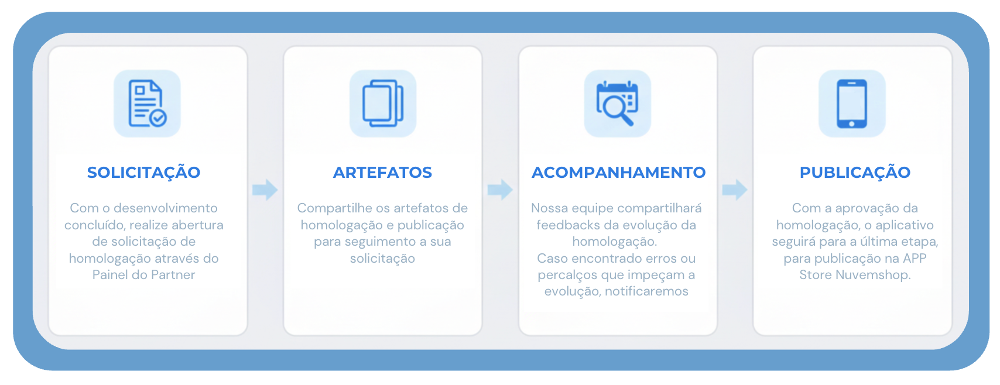
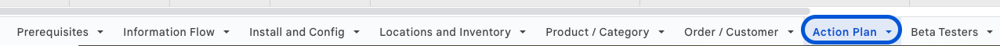

## Processo de Homologação de Apps - Nuvemshop

### O que é uma homologação de app?

A homologação é o processo de **validação e certificação** de um aplicativo dentro do ecossistema Nuvemshop.

Esse processo assegura que o app atende aos critérios técnicos e funcionais esperados, garantindo uma integração eficiente e segura.

Dependendo do tipo de aplicativo desenvolvido, a homologação poderá caminhar de formas diferentes, sendo:

Aplicativos do tipo **ERP**, **Payments** e **Shipping**, dos quais lidam com dados sensíveis e possui uma complexidade maior, passarão por uma validação mais complementar. Nesses casos, nossa equipe enviará um roteiro de guia de funcionalidades e usabilidade que deverão ser demonstradas e assim, validarmos o aplicativo com base na checklist definida.

Para demais tipos de aplicativos, como de marketing, ferramentas, etcs, possuem uma complexidade menor por não possuirem transações de dados sensíveis. Neste caso, nossa equipe conseguirá instalar o aplicativo em lojas internas e realizar testes e validações diretamente no aplicativo.

### Visibilidade e Próximos Passos

 

:::warning Importante
Caso sejam encontradas divergências, dificuldades ou algo que impossibilite nossa equipe de prosseguir com a homologação, entraremos em contato dentro de sua solicitação.
:::

 

### Processo de homologação

- Assim que enviado todos os artefatos, a equipe realizará a análise dos insumos e os testes necessários.
- Caso todos os critérios sejam atendidos, o app seguirá para a etapa de publicação, e você receberá maiores informações para acompanhamento.
- Caso sejam identificadas pendências nos testes realizados com base no artefato enviado, forneceremos uma devolutiva listando cada ponto a ser ajustado.
- Após a realização dos ajustes, o parceiro deve retornar pelo mesmo local com as evidências, para que possamos revalidar os cenários.
- Esse ciclo se repetirá até que todos os ajustes necessários sejam concluídos, assegurando a qualidade do app antes da publicação.

### Processo de homologação para os tipos ERP, Payments e Shipping

- Através da sua solicitação de homologação, nossa equipe enviará um roteiro de guia para que gravem um vídeo demonstrando as etapas solicitadas.
- Com estas demonstrações em mãos, validaremos todos os pontos da *checklist*, garantindo um processo mais robusto e completo.
- Se a checklist for validada e não houver ajustes a serem realizados, o app seguirá para a etapa de publicação na App Store.
- Caso sejam necessários ajustes, eles serão registrados na checklist e poderão ser acessados pelo parceiro na aba ‘Action Plan’.
- Após a implementação dos ajustes, deverá ser enviado nova demonstração como evidência para validarmos os pontos pendentes.
- Esse processo será repetido até que todos os pontos tenham sido concluídos, permitindo que o app siga para publicação na App Store.

\*Checklist = documento contendo os escopos e processos obrigatórios, que serão utilizados como guia no momento da homologação.

APPs que não possuam fluxo com dados sensíveis permite que sejam realizados testes e validações internas (uma vez que não contam com transações de dados reais de merchants), do qual a equipe técnica analisará os artefatos enviados e realizará testes no aplicativo.

O retorno desta análise, assim como qualquer comunicação que possa vir a ser necessária, se dará diretamente dentro do pedido aberto.

Para isso, é de extrema importância seguir os fluxos indicados abaixo, a fim de garantir uma homologação ágil, coerente e dentro dos padrões Nuvemshop.

**Sendo as etapas:**

1. **Abertura de solicitação:** com o desenvolvimento concluído, realize abertura de solicitação de homologação
2. **Artefatos:** Compartilhe os artefatos de homologação e publicação
3. **Acompanhamento:** Nossa equipe compartilhará feedbacks da evolução da homologação. Fique atento, caso nossa equipe encontre erros ou percalços que impeçam a evolução, notificaremos.
4. **Publicação:** com a aprovação da homologação, o aplicativo seguirá para a última etapa, para publicação na APP Store.

## 1. Fluxo de Pedido de Homologação

Para garantir um processo eficiente e organizado, siga o fluxo abaixo para a homologação assíncrona do seu aplicativo na plataforma:

### 1.1. Solicitação de Homologação

- Acesse a página do app no seu painel de parceiros.
- Clique em "Solicitar homologação".
- A plataforma enviará uma comunicação informando os próximos passos.

### 1.2. Envio de Artefatos

- Após receber o retorno da nossa equipe, você deverá enviar os artefatos conforme os [requisitos obrigatórios](https://dev.nuvemshop.com.br/docs/homologation/requirements)
- Certifique-se de incluir todos os elementos necessários para uma avaliação completa.

### 1.3. Validação dos Artefatos

- O **time de homologação** revisará cada item enviado.
- Será realizada a **reprodução da instalação e configuração** do aplicativo, garantindo que a experiência dos lojistas seja fluida e intuitiva.
- O processo seguirá as **boas práticas de usabilidade da API**, garantindo aderência aos padrões esperados.

### 1.4. Retorno da Homologação

- O parceiro deverá **aguardar o prazo estipulado** (informado no primeiro contato da nossa equipe) para receber o retorno pelo mesmo canal de comunicação.
- Se todos os testes forem validados com sucesso, o app seguirá para a **fase de publicação**.
- Caso sejam identificadas **pendências, limitações de acesso ou bugs, o time de homologação enviará um relatório detalhado** com os ajustes necessários.
- O parceiro deverá realizar as correções e retornar com as evidências de que os problemas foram resolvidos.
- Após essa etapa, o app seguirá para a **publicação na App Store**.

Já para aplicativos ERP, Payments e Shipping, dos quais lidam com dados sensíveis e possuem uma complexidade maior, passarão por uma etapa de validação a mais, com demonstrações complementares.

## 2. Validação Inicial

- O **time de homologação** fará as validações iniciais dos artefatos enviados.
- Será realizada a **reprodução da instalação e configuração** do aplicativo, assegurando que a experiência dos lojistas seja intuitiva e alinhada às boas práticas da API.

## 3. Etapa Demonstrativa de Fluxos

- Será compartilhado pelo time de homologação um roteiro, que seguirá com um guia descritivo de etapas (passo-a-passo) que necessitam ser demonstradas em maior detalhamento.
- Isso assegurará que sejam exibidos todos os processos, integrações e efetividades dos fluxos.
- Compartilhado as demonstrações indicadas no roteiro, nossa equipe passará **por cada item da checklist** utilizada para o desenvolvimento do app.
- Garantiremos que todos os pontos foram corretamente implementados e funcionam conforme esperado.

## 4. Registro de Ajustes (Se Necessário)

- Caso sejam identificadas pendências na checklist, elas serão registradas na aba "Action Plan" da checklist.
- Através desta checklist, deverá acompanhar os pontos que precisam ser corrigidos.

## 5. Nova validação e Publicação

- Após realizar as correções necessárias, compartilhar novo vídeo demonstrativo das etapas ajustadas para **nova validação** com o time de homologação.
- O processo será repetido até que todos os ajustes tenham sido concluídos.
- Quando todos os itens forem validados com sucesso, o app seguirá para **publicação na App Store**.

### Checklist do Processo de Homologação

A **checklist** será usada como um **guia para o processo de homologação** de apps do tipo:

<ul>
    <li><a href="https://docs.google.com/spreadsheets/d/1Pf-6Bbr8ebQGNoqkMuyK5DylP66n8FLInYbbJVRyb5Y/edit?usp=sharing" target="_blank">ERP</a></li>
    <li><a href="https://docs.google.com/spreadsheets/d/14K4y3GTYL-NDhHQOP1XTe-Clsh-UcFC6aevyVq59CoY/edit?usp=sharing" target="_blank">Payments</a></li>
    <li><a href="https://docs.google.com/spreadsheets/d/1dgKY2Ze9ZB4bqIXDuGiJzdVCCNEZgtO7BodrunRGowI/edit?usp=sharing" target="_blank">Shipping</a></li>
</ul>

Compartilhamos adiantadamente esta checklist para que a equipe esteja preparada para as etapas que serão validadas e tenham assim o conhecimento de possíveis itens obrigatórios que poderão impactar a aprovação do aplicativo.

Vale reforçar que esta etapa de roteiro e validação dos itens da checklist garantirão:

- Conformidade com as regras da plataforma;
- Testes funcionais e de integração via API;
- Experiência do usuário e usabilidade;
- Segurança e desempenho.
