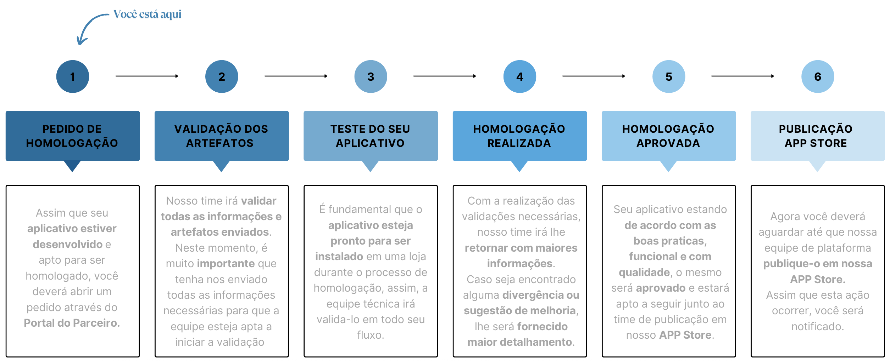

# Processo de Homologação de Apps - Nuvemshop

**O que é uma homologação de app?**

A homologação é o processo de **validação e certificação** de um aplicativo dentro do ecossistema Nuvemshop. 
 Esse processo assegura que o app atende aos critérios técnicos e funcionais esperados, garantindo uma integração eficiente e segura. 
Dependendo do tipo de aplicativo desenvolvido, a homologação poderá caminhar de formas diferentes, sendo:

* **Homologação Assíncrona:** Neste processo, deverá ser enviado todos os artefatos para análise e nossa equipe realizará testes para validação.
* **Homologação Síncrona:** Este cenário se aplica a aplicativos que lidam com dados sensíveis, como ERP, pagamentos e logística, nos quais é necessário realizar a validação de forma conjunta. Nesses casos, nossa equipe agendará uma reunião com o solicitante da homologação para acompanhar e validar o aplicativo com base na checklist definida..

**Visibilidade e Próximos Passos**

 
<Alert appearance="warning" title="Importante"> Caso sejam encontradas divergências, dificuldades ou algo que impossibilite nossa equipe de prosseguir com a homologação, entraremos em contato dentro de sua solicitação.
</Alert>
 

**Homologação assíncrona**

* Em homologações assíncronas, assim que enviado todos os artefatos, a equipe realizará a análise dos insumos e os testes necessários.
* Caso todos os critérios sejam atendidos, o app seguirá para a etapa de publicação, e você receberá maiores informações para acompanhamento.
* Caso sejam identificadas pendências nos testes realizados com base no artefato enviado, forneceremos uma devolutiva listando cada ponto a ser ajustado.
* Após a realização dos ajustes, o parceiro deve retornar pelo mesmo local com as evidências, para que possamos revalidar os cenários.
* Esse ciclo se repetirá até que todos os ajustes necessários sejam concluídos, assegurando a qualidade do app antes da publicação.

**Homologação síncrona**

* Através da sua solicitação de homologação, nossa equipe estará disponível para suporte e esclarecimento de dúvidas a qualquer momento e principalmente antes da realização da reunião.
* Durante a reunião de homologação, validaremos todos os pontos da checklist*, garantindo um processo mais robusto e completo.
* Se a checklist for validada e não houver ajustes ao final da reunião, o app seguirá para a etapa de publicação na App Store.
* Caso sejam necessários ajustes, eles serão registrados na checklist e poderão ser acessados pelo parceiro na aba Action Plan.
* Após a implementação dos ajustes, uma nova reunião será agendada para validar os pontos pendentes da reunião anterior.
* Esse processo será repetido até que todos os pontos tenham sido concluídos, permitindo que o app siga para publicação na App Store.

<Alert appearance="warning" title="Atenção"> Nestes casos de homologações síncronas, será disponibilizado um link para que agende a reunião.
</Alert>
 

 *Checklist = documento contendo os escopos e processos obrigatórios, que serão utilizados como guia no momento da homologação.*