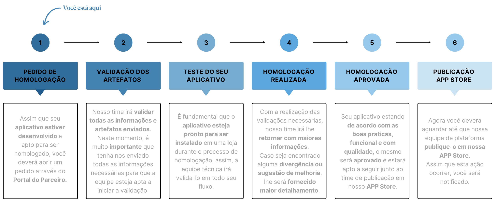

## Processo de Homologação de Apps - Nuvemshop

### 💡 O que é uma homologação de app?

A homologação é o processo de **validação e certificação** de um aplicativo dentro do ecossistema Nuvemshop.

Esse processo assegura que o app atende aos critérios técnicos e funcionais esperados, garantindo uma integração eficiente e segura.

Dependendo do tipo de aplicativo desenvolvido, a homologação poderá caminhar de formas diferentes, sendo:

Aplicativos do tipo **ERP**, **Payments** e **Shipping**, dos quais lidam com dados sensíveis e possui uma complexidade maior, passarão por uma validação mais complementar. Nesses casos, nossa equipe enviará um roteiro de guia de funcionalidades e usabilidade que deverão ser demonstradas e assim, validarmos o aplicativo com base na checklist definida.

Para demais tipos de aplicativos, como de marketing, ferramentas, etcs, possuem uma complexidade menor por não possuirem transações de dados sensíveis. Neste caso, nossa equipe conseguirá instalar o aplicativo em lojas internas e realizar testes e validações diretamente no aplicativo.

### 💡 Visibilidade e Próximos Passos

 

:::warning Importante
Caso sejam encontradas divergências, dificuldades ou algo que impossibilite nossa equipe de prosseguir com a homologação, entraremos em contato dentro de sua solicitação.
:::

 

### 💡 Processo de homologação

- Assim que enviado todos os artefatos, a equipe realizará a análise dos insumos e os testes necessários.
- Caso todos os critérios sejam atendidos, o app seguirá para a etapa de publicação, e você receberá maiores informações para acompanhamento.
- Caso sejam identificadas pendências nos testes realizados com base no artefato enviado, forneceremos uma devolutiva listando cada ponto a ser ajustado.
- Após a realização dos ajustes, o parceiro deve retornar pelo mesmo local com as evidências, para que possamos revalidar os cenários.
- Esse ciclo se repetirá até que todos os ajustes necessários sejam concluídos, assegurando a qualidade do app antes da publicação.

### 💡 Processo de homologação para os tipos ERP, Payments e Shipping

- Através da sua solicitação de homologação, nossa equipe enviará um roteiro de guia para que gravem um vídeo demonstrando as etapas solicitadas.
- Com estas demonstrações em mãos, validaremos todos os pontos da *checklist*, garantindo um processo mais robusto e completo.
- Se a checklist for validada e não houver ajustes a serem realizados, o app seguirá para a etapa de publicação na App Store.
- Caso sejam necessários ajustes, eles serão registrados na checklist e poderão ser acessados pelo parceiro na aba ‘Action Plan’.
- Após a implementação dos ajustes, deverá ser enviado nova demonstração como evidência para validarmos os pontos pendentes.
- Esse processo será repetido até que todos os pontos tenham sido concluídos, permitindo que o app siga para publicação na App Store.

:::info Checklist 
Documento contendo os escopos e processos obrigatórios, que serão utilizados como guia no momento da homologação.
:::
