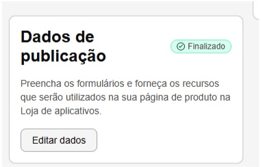
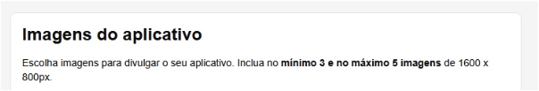
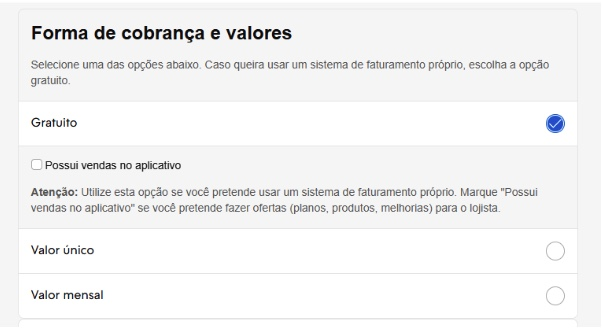
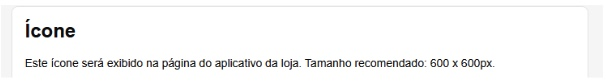

# Guia de Publicação do App

## Visão geral

Nesta seção, forneceremos um guia passo a passo para que você possa publicar o seu aplicativo na Loja de Aplicativos da Nuvemshop. Depois de homologar o aplicativo, é necessário preencher campos obrigatórios no Portal de Parceiros da Nuvemshop, na seção “Dados de Publicação”. Saiba como publicar o seu aplicativo através do Portal de Parceiros:

### Publicando um aplicativo na Nuvemshop

Através da seção “Dados de Publicação”, você consegue publicar o seu aplicativo para ser disponibilizado na [Loja de Aplicativos Nuvemshop](https://www.nuvemshop.com.br/loja-aplicativos-nuvem).

- Dentro do painel, clique em "Dados de publicação" e “Editar dados” para continuar.

  

- Certifique-se que todos os campos **“URLs e contato”** e **“Handle do aplicativo”** estão devidamente preenchidos.

## Requisitos obrigatórios

### Imagens do aplicativo

Faça o download das imagens de divulgação do aplicativo em “Imagens do aplicativo”, que só serão aprovadas se estiverem na dimensão solicitada correta de 1600 x 800px. Essas imagens devem ser imagens que mostrem as telas do aplicativo e que divulguem as suas principais funcionalidades despertando o interesse do lojista em instalá-lo. Por enquanto, as mesmas imagens são compartilhadas em todos os idiomas, portanto, se o seu aplicativo for publicado em todos os países o texto das imagens deve estar tanto em português como em espanhol.

### Forma de cobrança

- Em **“Idiomas da loja de aplicativos”** selecione o país em que o aplicativo será publicado para preencher em seguida todos os campos solicitados.  
- Selecione em **“Forma de cobrança”** o tipo de cobrança que será usado:

**Gratuito** (billing próprio do parceiro com opção ou não de ter “Vendas no aplicativo”)  
**Valor único** (billing Nuvemshop, valor único)  
**Valor mensal** (billing Nuvemshop, valor mensal)

### Descrição do perfil do aplicativo

Em **“Informações”** preencha os campos de descrição do aplicativo.  
Esta é a parte mais importante! As informações presentes nos **campos de descrição “curta” e “longa”** serão a vitrine do seu aplicativo na Loja de Aplicativos, o que os lojistas verão e os incentivará a instalá-lo.  

A Nuvemshop criou um guia para a sua descrição ter o **máximo de palavras chaves possível** garantindo um bom retorno ao campo de busca da Loja de Aplicativos quando o lojista buscar por alguma funcionalidade ou necessidade que o seu aplicativo resolve. Use exatamente esta estrutura:  

**Descrição do perfil do aplicativo:**  Modelo de Descrição Completa de Aplicativo - Nuvemshop  
**Nome do app:** Aplicativo “X”  
**Campo descrição curta:** [Insira uma descrição que resume a função do seu app com até 64 caracteres (com espaços)].  
Exemplo: Fretes mais baratos com as melhores transportadoras do país.

### Campo descrição completa

**Introdução:**  
Deixe clara a proposta de valor do seu aplicativo e seu diferencial no mercado. Dessa forma, o lojista terá interesse em continuar a leitura.  
**Exemplo:**  
“O Aplicativo X é a solução para empreendedores digitais que precisam de fretes mais baratos e flexíveis em sua loja virtual. Tenha integração completa com os Correios e as principais transportadoras do país sem precisar de contrato. Conte ainda com funcionalidades exclusivas como cotação de frete, geração de etiquetas e agendamento de coleta.”  
Se tiver, você pode inserir um vídeo breve apresentando o app. Uma mídia audiovisual enriquece sua página e incentiva o usuário a permanecer mais tempo na página.

**O que é o Aplicativo X?**  
[Vá direto ao ponto, explique o que o seu app faz e o impacto/facilidade que ele traz para o lojista.]  
**Exemplo:**  
“Aplicativo X é um app desenvolvido pela [nome da empresa] para facilitar a integração da sua loja virtual Nuvemshop com diversas transportadoras brasileiras. Você só precisa instalar o aplicativo para ter acesso a inúmeras opções de frete e encontrar soluções mais ágeis e baratas para enviar seus produtos.”

**Como funciona o Aplicativo X?**  
[Seja direto e utilize bullet points para facilitar a leitura e entendimento.]  
Exemplo: “O Aplicativo X conecta sua loja virtual a transportadoras em todo o território nacional, com cobertura para mais de 3 mil municípios.  
Você tem a opção de agendar coletas e também configurar a logística reversa.  
As encomendas permitidas devem ter dimensão de até 80cm X 80cm X 80cm e peso de até 30 kg. Consulte a área de cobertura neste link.”

**Quais são as funcionalidades do Aplicativo X?**  
[Seja direto e utilize bullet points para facilitar a leitura e o entendimento].  
Exemplo: “O Aplicativo X oferece as seguintes funcionalidades:  
Busca de transportadoras de acordo com o perfil de produtos e de entrega;  
Integração direta com tabelas de fretes;  
Criação de promoções de frete mais barato e frete grátis;  
Geração de etiquetas;  
Envio automático de e-mails de postagem e entrega;  
Rastreamento de encomendas online.”

**Vantagens de instalar o Aplicativo de X**  
[Seja direto e utilize bullet points para facilitar a leitura e o entendimento].  
Exemplo: “Você tem as seguintes vantagens ao instalar o Aplicativo X na sua Nuvemshop:  
Fretes mais baratos e competitivos;  
Centralização de toda a atividade logística em um único app;  
Rastreamento de encomendas em todas as etapas do envio;  
Maior cobertura do Brasil para operadores logísticos;  
Cálculo de frete simplificado na sua loja virtual.”

**Planos e Preços para lojistas Nuvemshop**  
[Se possível, detalhe os planos e preços, além de ofertas específicas para clientes Nuvemshop].  
Exemplo: “Você pode experimentar o Aplicativo X grátis por 30 dias e escolher entre os seguintes planos:  
Essencial por R$ 59/mês;  
Controle por R$ 99/mês;  
Completo por R$ 199/mês.  
Veja mais detalhes sobre planos e preços neste link.”

**Como integrar o Aplicativo X com a Nuvemshop?**  
[Apresente um resumo do passo a passo para instalar o aplicativo.]  
Exemplo: “Para integrar o Aplicativo X à sua loja Nuvemshop, é só seguir os passos abaixo:  
Clique em “Instalar Aplicativo”;  
Aceite as permissões do aplicativo;  
Crie uma conta no Aplicativo X;  
Valide o código no seu painel Nuvemshop;  
Pronto! Você já pode usar o Aplicativo X para conseguir fretes mais baratos.”  
Se tiver dúvidas, confira o passo a passo de como instalar o Aplicativo X. (Link)

### Suporte ao lojista  
[Informe todos os canais de suporte, assim como SLA de resposta e horário de atendimento].  
Exemplo: “Se tiver dúvidas, entre em contato nos seguintes canais de atendimento:  
- Pelo e-mail suporte@app.com.br — tempo médio de resposta de 24 horas;  
- Chat online pelo site — de segunda a sexta das 9h às 18h e aos sábados das 9h às 15h;  
- WhatsApp no número xx-xxxx-xxxx — de segunda a sexta das 9h às 18h e aos sábados das 9h às 15h;  
- Telefone xx-xxxx-xxxx — atendimento 24 horas.”

### Boas práticas  
Siga exatamente a estrutura do Guia de descrição do aplicativo acima. Você também tem a opção de usar o Agente de IA da Nuvemshop “Gerador de Descrição do Aplicativo na Loja de Aplicativos Nuvemshop” para te ajudar a criar essa descrição completa de uma forma fácil e rápida.

- Acesse o agente ChatGPT “[Tiendanube Appstore Description Generator](https://chatgpt.com/g/g-684a0c4e5ee8819199c155f69f465e4e-tiendanube-appstore-description-generator), clicando no link para iniciar a geração interativa da descrição longa.  
- **Defina as fontes de informação:** insira a URL do site oficial do seu app, links de artigos ou tutoriais do Help Center e/ou faça upload de um documento (PDF ou DOCX) com o overview das funcionalidades, garantindo a cobertura de todos os blocos do guia (objetivo, benefícios, funcionalidades etc.).  
**Especifique as regiões de publicação e particularidades:** informe os países onde o app estará disponível e detalhe eventuais diferenças de recursos por região (por exemplo, módulo fiscal ativo apenas no Chile), para que o agente adapte o conteúdo adequadamente.  
**Aguarde a geração dos blocos de HTML otimizados para SEO e embed:** o agente entregará, diretamente no chat, um bloco de código HTML para cada país definido, precedido pelo comentário `<!-- Descripción [country] -->`. Esses blocos estarão prontos para serem incorporados na página de aplicativo já existente, respeitando a hierarquia de títulos e evitando conflitos de elementos, adaptados ao idioma local, como português para Brasil ou voseo para Argentina.  
**Publique no painel de integração da Nuvemshop:** copie cada bloco de HTML retornado e cole-o no campo de descrição correspondente a cada país no editor de integração; em seguida, salve e publique as alterações.

### Ícone do aplicativo

Faça o download do ícone do aplicativo em **“Ícone”**, que só será aprovado se estiver na dimensão solicitada correta de 600 x 600px. Essa imagem deve ser o principal logotipo do seu aplicativo.

---

### FAQs

É obrigatório disponibilizar para o time da Nuvemshop a cópia do documento de FAQs (links abaixo) com as perguntas mais frequentes (FAQs) sobre o seu aplicativo. Preste atenção em especial aos contatos de suporte (nível 1, nível 2, técnico e comercial) e à disponibilidade de contas teste. As perguntas do documento de FAQs devem variar de acordo com a categoria do seu aplicativo. A Nuvemshop criou um modelo para cada categoria para uso padrão:

**FAQs ERP**  
[Copie o documento](https://docs.google.com/document/d/132lUrxGcUTn0UaUcUnahFOaT8OtsF7vA3kpgdE932JM/edit?tab=t.0) e compartilhe-o conosco por e-mail preenchido com todas as respostas solicitadas.

**1. Gerais**  
1.1. Qual o tipo de aplicativo de gestão? Para que serve o aplicativo?  
1.2. Qual(is) o(s) principal(is) problema(s) do lojista que o aplicativo resolve e como?  
1.3. Qual o perfil de lojista recomendado para esse aplicativo? Existem requisitos específicos de perfil de negócio?  
1.4. Onde funciona o aplicativo? (cidades, estados, regiões, países)  
1.5. Quem desenvolveu o aplicativo? Quais são os principais canais de suporte, quais dias/horários de atendimento e SLA?

**POC Level 1:** Informar qual o ponto de contato para suporte nível 1, para consultas dos clientes e do time de Suporte da Nuvemshop  
- Canal de contato de suporte geral para responder dúvidas do serviço ou integração.  
- Dias e horários de atendimento  
- SLA

**POC Level 2:** Informar qual o ponto de contato para suporte nível 2, para consultas do time de Suporte da Nuvemshop  
- Canal de contato de suporte geral para responder dúvidas do serviço ou integração.  
- Dias e horários de atendimento  
- SLA

**POC Técnico:** Informar qual o ponto de contato para suporte técnico, para consultas do time técnico da Nuvemshop  
- Canal de contato de suporte geral para responder dúvidas do serviço ou integração.  
- Dias e horários de atendimento  
- SLA

**POC Comercial:** Informar qual o ponto de contato para temas comerciais, para consultas do time de Comercial e de Parcerias da Nuvemshop  
- Canal de contato comercial  
- Dias e horários de atendimento  
- SLA

**POC Financeiro:** Informar qual o ponto de contato para temas financeiros, para consultar do time de Financeiro e Parcerias da Nuvemshop  
- Canal de contato comercial  
- Dias e horários de atendimento  
- SLA

1.6. Temos uma conta teste disponível? Quais são as credenciais?

## 2. Planos e Preços

**2.1.** Qual a tabela de preços/precificação do aplicativo? Quais os tipos de planos disponíveis? Quais tarifas são cobradas?  
**2.2.** O aplicativo possui desconto para lojista Nuvemshop? Se sim, qual a porcentagem?  
**2.3.** O aplicativo possui dias de trial? Se sim, quantos?  
**2.4.** O aplicativo possui taxa de setup? Se sim, qual o valor?  
**2.5.** O aplicativo possui precificação diferenciada para o lojista Nuvemshop Next?

---

## 3. Instalação

**3.1.** URL da área de Login  
**3.2.** Possui requisitos prévios para fazer a instalação? Se sim, quais são?  
**3.3.** Como é o processo de instalação e liberação do aplicativo?  
**3.4.** O aplicativo possui seus próprios tutoriais? Se sim, colocar o(s) link(s) aqui.  

**3.5. Tutorial de Instalação Nuvemshop (Crie-o de acordo com os direcionamentos solicitados):**  
**3.5.1.** Como instalar o aplicativo?  
**3.5.2.** Passo a passo detalhado para a instalação do aplicativo na Nuvemshop  
*(Inserir prints das etapas abaixo)*  
``  
``  
``  

**3.5.3.** Direcionamento para o suporte do aplicativo  
*(Qual(is) canal(s) para suporte do aplicativo em caso de dúvidas na instalação?)*  
**3.5.4.** Considerações Gerais

---

## 4. Funcionamento

**4.1.** Quais são os serviços oferecidos (ERP, CRM, POS, etc)?  
**4.2.** É possível emitir Notas Fiscais/Informações de faturamento?  
**4.3.** Como e quando ocorre a sincronização de estoque?  
**4.4.** É possível fazer atualizações/editar os produtos a partir do admin da Nuvem?  
**4.5.** Com qual(is) informação(s) se sincronizam os produtos?  
**4.6.** É possível utilizar o aplicativo em mais de uma loja de uma vez?  
**4.7.** Possui integração com meios de envio? Caso sim, indicar quais são e como se vinculam.  
**4.8.** Possui integração com marketplaces? Caso sim, indicar quais são e como se vinculam.  
**4.9.** Possui reportes de pedidos/envios?  
**4.10.** Funcionalidades adicionais importantes sobre esse meio de pagamento.  

## 5. Informações do Serviço

**5.1.** Quais relatórios podem ser emitidos? 
**5.2.** Possui integração com ferramentas similares? Quais?  
**5.3.** Quais informações podemos exportar via `.csv`?  

**Exemplo:**
- NF-e ↔ NF-e  
- Produtos (principais) ← Produtos  
- Produtos (variações) ← Variação  
- Categorias x Categorias  
- Orders ← Pedidos  
- Preço x Preço  
- Stock x Estoque

## FAQs Meios de Pagamento

[Copie o documento](https://docs.google.com/document/d/1nuBFVAL9JsH1TaNSGBHm2VJdBBi6A50ACv_wcjc5WGI/edit?tab=t.0) e compartilhe-o conosco por e-mail preenchido com todas as respostas solicitadas.

### 1. Gerais

**1.1. Qual o tipo de meio de pagamento? Para que serve o aplicativo?**
- Tipo de plataforma de pagamento?  
- Tipo de Integração?  
- Métodos de pagamento aceitos?  
- Bandeiras aceitas?  
- O lojista pode parcelar sem juros?  
- O lojista pode parcelar com juros?  
- Que tipo de devolução aceita?  
- Possui uma solução Antifraude?  
- Com que tipo de comerciantes você trabalhará nesta integração?
- 1.2. Qual(is) o(s) principal(is) problema(s) do lojista que o aplicativo resolve e como?  
- 1.3. Qual o perfil de lojista recomendado para esse aplicativo? Existem requisitos específicos de perfil de negócio  
- 1.4. Onde funciona o aplicativo? (cidades, estados, regiões, países)  
- 1.5. Quem desenvolveu o aplicativo? Quais são os principais canais de suporte, quais dias/horários de atendimento e SLA?

**POC Level 1:** Informar qual o ponto de contato para suporte nível 1, para consultas dos clientes e do time de Suporte da Nuvemshop  
- Canal de contato de suporte geral para responder dúvidas do serviço ou integração.  
- Dias e horários de atendimento  
- SLA

**POC Level 2:** Informar qual o ponto de contato para suporte nível 2, para consultas do time de Suporte da Nuvemshop  
Canal de contato de suporte geral para responder dúvidas do serviço ou integração.  
Dias e horários de atendimento  
SLA

**POC Técnico:** Informar qual o ponto de contato para suporte técnico, para consultas do time técnico da Nuvemshop  
Canal de contato de suporte geral para responder dúvidas do serviço ou integração.  
Dias e horários de atendimento  
SLA

**POC Comercial:** Informar qual o ponto de contato para temas comerciais, para consultas do time de Comercial e de Parcerias da Nuvemshop  
Canal de contato comercial  
Dias e horários de atendimento  
SLA

**POC Financeiro:** Informar qual o ponto de contato para temas financeiros, para consultar do time de Financeiro e Parcerias da Nuvemshop  
Canal de contato comercial  
Dias e horários de atendimento  
SLA

**1.6.** Temos uma conta teste disponível? Quais são as credenciais?

---

## 2. Planos e Preços

**2.1.** Qual a tabela de preços/precificação do aplicativo? Quais os tipos de planos disponíveis? Quais tarifas são cobradas?  
**2.2.** É possível negociar taxas?  
**2.3.** O aplicativo possui desconto para lojista Nuvemshop? Se sim, qual a porcentagem?  
**2.4.** O aplicativo possui dias de trial? Se sim, quantos?  
**2.5.** O aplicativo possui taxa de setup? Se sim, qual o valor?  
**2.6.** O aplicativo possui precificação diferenciada para o lojista Nuvemshop Next?

---

## 3. Instalação

**3.1.** URL da área de Login  
**3.2.** Possui requisitos prévios para fazer a instalação? Se sim, quais são?  
**3.3.** Como é o processo de instalação e liberação do aplicativo?  
**3.4.** O aplicativo possui seus próprios tutoriais? Se sim, colocar o(s) link(s) aqui.

**3.5. Tutorial de Instalação Nuvemshop (Crie-o de acordo com os direcionamentos solicitados):**  
**3.5.1.** Como instalar o aplicativo?  
**3.5.2.** Passo a passo detalhado para a instalação do aplicativo na Nuvemshop *(Inserir prints das etapas)*  
``  
``  
``

**3.5.3.** Direcionamento para o suporte do aplicativo *(Qual(is) canal(s) para suporte do aplicativo em caso de dúvidas na instalação?)*  
**3.5.4.** Considerações Gerais

## 4. Funcionamento

**4.1.** Como é o processo de compra? *(Visão do consumer)*  
**4.2.** O que acontece quando recebo um pagamento? *(Visão do merchant)*  
**4.3.** Que formas de pagamento oferecem?  
**4.4.** É possível configurar parcelas sem juros? Como?  
**4.5.** É possível configurar parcelas com juros? Como?  
**4.6.** Como fazer uma devolução total ou parcial de um pagamento?  
**4.7.** Funcionalidades adicionais importantes sobre esse meio de pagamento.  
**Considerações** *(se houverem)*

---

## 5. Informações do Serviço

**5.1.** Quais são as comissões x prazos de liquidação disponíveis?  
**5.2.** Onde e quando recebo meus pagamentos?  
**5.3.** Oferece parcelamento sem juros? Se sim, como é configurado?  
**5.4.** Como é o sistema anti-fraude?

# FAQs Meios de Logística

📄 [Copie o documento](https://docs.google.com/document/d/1ZWSWyVp0X3mxOMzbuP8d0_JXFeu1stOebWQ63wvE_34/edit?tab=t.0) e compartilhe-o conosco por e-mail preenchido com todas as respostas solicitadas.

---

## 1. Gerais

**1.1.** Qual o tipo de meio de envio/logística? Para que serve o aplicativo?  
**1.2.** Qual(is) o(s) principal(is) problema(s) do lojista que o aplicativo resolve e como?  
**1.3.** Qual o perfil de lojista recomendado para esse aplicativo? Existem requisitos específicos de perfil de negócio?  
**1.4.** Onde funciona o aplicativo? (cidades, estados, regiões, países)  
**1.5.** Quem desenvolveu o aplicativo? Quais são os principais canais de suporte, quais dias/horários de atendimento e SLA?

---

**POC Level 1:** Informar qual o ponto de contato para suporte nível 1, para consultas dos clientes e do time de Suporte da Nuvemshop  
- Canal de contato de suporte geral para responder dúvidas do serviço ou integração  
- Dias e horários de atendimento  
- SLA

## POCs e Informações Gerais

### POC Level 2  
- Informar qual o ponto de contato para suporte nível 2, para consultas do time de Suporte da Nuvemshop  
- Canal de contato de suporte geral para responder dúvidas do serviço ou integração  
- Dias e horários de atendimento  
- SLA

### POC Técnico  
- Informar qual o ponto de contato para suporte técnico, para consultas do time técnico da Nuvemshop  
- Canal de contato de suporte geral para responder dúvidas do serviço ou integração  
- Dias e horários de atendimento  
- SLA

### POC Comercial  
- Informar qual o ponto de contato para temas comerciais, para consultas do time de Comercial e de Parcerias da Nuvemshop  
- Canal de contato comercial  
- Dias e horários de atendimento  
- SLA

### POC Financeiro  
- Informar qual o ponto de contato para temas financeiros, para consultar do time de Financeiro e Parcerias da Nuvemshop  
- Canal de contato comercial  
- Dias e horários de atendimento  
- SLA

---

## 1.6 Conta Teste  
- Temos uma conta teste disponível? Quais são as credenciais?

---

## 2. Planos e Preços

**2.1.** Qual a tabela de preços/precificação do aplicativo? Quais os tipos de planos disponíveis? Quais tarifas são cobradas?  
**2.2.** O aplicativo possui desconto para lojista Nuvemshop? Se sim, qual a porcentagem?  
**2.3.** O aplicativo possui dias de trial? Se sim, quantos?  
**2.4.** O aplicativo possui taxa de setup? Se sim, qual o valor?  
**2.5.** O aplicativo possui precificação diferenciada para o lojista Nuvemshop Next?

---

## 3. Instalação

**3.1.** URL da área de Login  
**3.2.** Possui requisitos prévios para fazer a instalação? Se sim, quais são?  
**3.3.** Como é o processo de instalação e liberação do aplicativo?  
**3.4.** O aplicativo possui seus próprios tutoriais? Se sim, colocar o(s) link(s) aqui.

### 3.5 Tutorial de Instalação Nuvemshop

**3.5.1.** Como instalar o aplicativo?  
**3.5.2.** Passo a passo detalhado para a instalação do aplicativo na Nuvemshop *(Inserir prints das etapas)*  
**3.5.3.** Direcionamento para o suporte do aplicativo *(Qual(is) canal(s) para suporte do aplicativo em caso de dúvidas na instalação?)*  
**3.5.4.** Considerações Gerais

---

## 4. Funcionamento

**4.1.** Qual é o SLA de Entrega? OTD/Otifef? Índice de extravios e perdas?  
**4.2.** Qual é a abrangência, pontos de origem deste meio de envio? E a abrangência do destino? Quais são entregas próprias e quais são redespacho?  
**4.3.** Como é o processo de compra e de envio?  
**4.4.** Como e quando se notifica o envio ao consumidor?  
**4.5.** Como importar pedidos da Nuvemshop/Tiendanube ao painel da loja?  
**4.6.** É possível importar pedidos do painel para consulta externa (listas ou .csv)?  
**4.7.** É possível cancelar um pedido pelo painel do meio de envio?  
**4.8.** Onde e como gerar as etiquetas de envio?  
**4.9.** Como gerar os códigos de rastreamento?  
**4.10.** Existe algum tipo de mercadoria que esse meio de envio não entrega?  
**4.11.** É possível gerar etiquetas diretamente pelo meio de envio?  
**4.12.** Qual é o tipo de mercadoria que este meio de envio não entrega?  
**4.13.** Funcionalidades adicionais importantes sobre esse meio de envio  
**Considerações** *(se houverem)*

---

## 5. Informações do Serviço

**5.1.** Qual é o peso e dimensão máxima permitido pelo meio de envio?  
**5.2.** Existe um processo de trocas e devoluções (logística reversa)? Se sim, como funciona?  
**5.3.** Possui serviço de coleta? Como funciona?  
**5.4.** O meio de envio oferece seguro para os envios?  
**5.5.** Como são pagos os envios?  
**5.6.** O meio de envio emite etiquetas? É possível cancelá-las depois da emissão?  
**5.7.** Como se paga e carrega a etiqueta?

## FAQs de Marketing e demais categorias

📄 [Copie o documento](https://docs.google.com/document/d/1RMy2SpqRm2k1QVPBjngeMePFWf3RdObvdcg7wACIrjQ/edit?tab=t.0) e compartilhe-o conosco por e-mail preenchido com todas as respostas solicitadas.

---

## 1. Gerais

**1.1.** Qual a categoria do aplicativo? Para que serve o aplicativo?  
**Categorias disponíveis:** Canais de Venda, Marketing, Comunicação, Recursos Extras, Segurança e Confiança, Dropshipping, Outras.

**1.2.** Qual(is) o(s) principal(is) problema(s) do lojista que o aplicativo resolve e como?  
**1.3.** Qual o perfil de lojista recomendado para esse aplicativo? Existem requisitos específicos de perfil de negócio?  
**1.4.** Onde funciona o aplicativo? (cidades, estados, regiões, países)  
**1.5.** Quem desenvolveu o aplicativo? Quais são os principais canais de suporte, quais dias/horários de atendimento e SLA?

---

**POC Level 1:** Informar qual o ponto de contato para suporte nível 1, para consultas dos clientes e do time de Suporte da Nuvemshop  
- Canal de contato de suporte geral para responder dúvidas do serviço ou integração  
- Dias e horários de atendimento  
- SLA

**POC Level 2**  
- Informar qual o ponto de contato para suporte nível 2, para consultas do time de Suporte da Nuvemshop  
- Canal de contato de suporte geral para responder dúvidas do serviço ou integração  
- Dias e horários de atendimento  
- SLA

**POC Técnico**  
- Informar qual o ponto de contato para suporte técnico, para consultas do time técnico da Nuvemshop  
- Canal de contato de suporte geral para responder dúvidas do serviço ou integração  
- Dias e horários de atendimento  
- SLA

**POC Comercial**  
- Informar qual o ponto de contato para temas comerciais, para consultas do time de Comercial e de Parcerias da Nuvemshop  
- Canal de contato comercial  
- Dias e horários de atendimento  
- SLA

**POC Financeiro**  
- Informar qual o ponto de contato para temas financeiros, para consultar do time de Financeiro e Parcerias da Nuvemshop  
- Canal de contato comercial  
- Dias e horários de atendimento  
- SLA

---

**1.6 Conta Teste**  
- Temos uma conta teste disponível? Quais são as credenciais?

---

## 2. Planos e Preços

**2.1.** Qual a tabela de preços/precificação do aplicativo? Quais os tipos de planos disponíveis? Quais tarifas são cobradas?  
**2.2.** O aplicativo possui desconto para lojista Nuvemshop? Se sim, qual a porcentagem?  
**2.3.** O aplicativo possui dias de trial? Se sim, quantos?  
**2.4.** O aplicativo possui taxa de setup? Se sim, qual o valor?  
**2.5.** O aplicativo possui precificação diferenciada para o lojista Nuvemshop Next?

---

## 3. Instalação

**3.1.** URL da área de Login  
**3.2.** Possui requisitos prévios para fazer a instalação? Se sim, quais são?  
**3.3.** Como é o processo de instalação e liberação do aplicativo?  
**3.4.** O aplicativo possui seus próprios tutoriais? Se sim, colocar o(s) link(s) aqui.

### 3.5 Tutorial de Instalação Nuvemshop

**3.5.1.** Como instalar o aplicativo?  
**3.5.2.** Passo a passo detalhado para a instalação do aplicativo na Nuvemshop *(Inserir prints das etapas)*  
**3.5.3.** Direcionamento para o suporte do aplicativo *(Qual(is) canal(s) para suporte do aplicativo em caso de dúvidas na instalação?)*  
**3.5.4.** Considerações Gerais

---

## 4. Funcionamento

**4.1.** Espaço para descrever como a ferramenta funciona, no que diz respeito à configuração e diferentes funcionalidades disponíveis no aplicativo.

## Publicação

Ao concluir as etapas acima, o seu aplicativo está pronto para ser publicado na Loja de Aplicativos.  
Avise ao time Nuvemshop pelo e-mail: **publicacao@nuvemshop.com.br** quando o seu aplicativo estiver pronto. Em caso de dúvidas, entre em contato também pelo e-mail: **publicacao@nuvemshop.com.br**.
