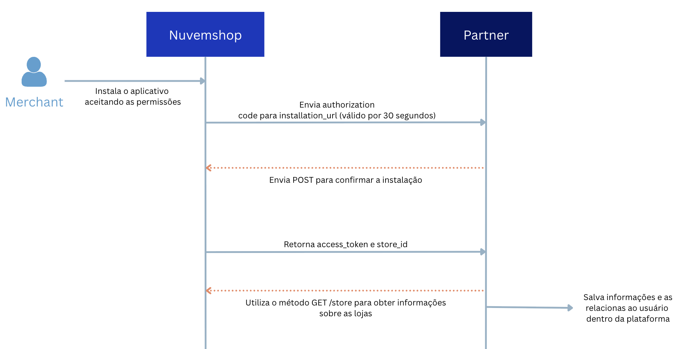

## Requisitos obrigatórios para Homologação do Aplicativo

Para garantir um processo de homologação eficaz, é obrigatório que os parceiros enviem os seguintes itens abaixo para análise da plataforma. Esses elementos são fundamentais para validar o funcionamento do aplicativo e sua conformidade com as diretrizes estabelecidas.

Assim que realizado o pedido de homologação, receberá um contato de nossa equipe solicitando os artefatos, que contemplam os requisitos abaixo:

## 1. Envio do Diagrama de Sequência

O diagrama de sequência deve ilustrar como o aplicativo interage com nossa API e quais ações executa no back-end. O diagrama deve mostrar que ações são disparadas em uma interação com a API da **Nuvemshop**, o que acontece durante a transação e qual o output da mesma.

Ele permite validar os fluxos de autenticação e a interação técnica entre o app e nossa plataforma.

### Objetivos do diagrama de sequência

1.1. **Garantir que os aplicativos façam um uso eficiente dos recursos**, por exemplo:

   - Não realizar GETs contínuos de alguma entidade para verificar se houve alterações, quando o correto seria executar um Webhook.

   - Modificar entidades sem necessidade (caso de uso: aplicativo que modifica constantemente o estoque dos produtos para 0 e logo em seguida altera para outro valor).

1.2. **Buscar oportunidades de melhoria no fluxo de trabalho dos parceiros**:

   - Construir um aplicativo mais robusto e com menos falhas.
   - Melhorar a eficiência do seu aplicativo.
   - Detectar possíveis problemas de segurança.

### Exemplo de fluxo de instalação de um aplicativo:

   

## 2. Envio de Vídeo Demo do Aplicativo

O vídeo de demonstração é um dos pilares fundamentais para a **homologação do seu aplicativo**. Ele cumpre dois papéis críticos no nosso processo de revisão:

2.1. **Critério de Avaliação**: é através dele que nossa equipe valida se os fluxos técnicos e de negócio estão operando conforme os padrões de qualidade exigidos.

2.2. **Guia de Usabilidade**: o vídeo serve como o roteiro oficial para que nosso time teste a jornada do usuário, garantindo que a experiência do merchant seja intuitiva e livre de atritos.

Certifique-se de que o vídeo seja claro e cubra todos os pontos listados abaixo. Vídeos incompletos podem resultar no retorno do processo de homologação.

### O vídeo de demonstração do aplicativo deve incluir os seguintes cenários:

* Instalação do app a partir da Nuvemshop e não pelo painel do app.
    * Para simular esse cenário, utilize a URL: `https://www.tiendanube.com/apps/(app_id)/authorize`.
    * Substitua `(app_id)` pelo ID do seu app, disponível no painel de parceiro.
* Cadastro de um usuário que ainda não possui conta criada.
* Demonstração de login de um usuário já cadastrado.
* Cenários de reinstalação do aplicativo e seu funcionamento após a remoção e nova instalação.
* Simulação de todos os cenários descritos no diagrama de sequência, garantindo que todas as permissões e fluxos estejam bem definidos.
* Fluxo de utilização do app, demonstrando as principais funcionalidades oferecidas.
* Pontos relevantes para avaliação, como interações específicas que sejam essenciais para a homologação.
* Caso seja necessário alguma configuração técnica para utilização do app, é recomendado que esteja especificado e orientado ao merchant como realizar tal ação.

## 3. Atenção às Etapas de Assinatura e Restrições

Caso o aplicativo inclua assinatura de plano, aguarde algum prazo para liberação do cadastro ou qualquer outra etapa que possa impedir a validação imediata do app.  
**Envie uma conta demo já liberada dessas etapas**, permitindo que o time de homologação acesse e valide sem interrupções no fluxo de homologação.

Para garantir a agilidade na sua homologação, informe-nos previamente sobre fluxos que exijam prazos de liberação ou assinaturas de planos, que precisarão que sejam notificados para liberação. 

É essencial que nossa equipe vivencie a **jornada real do merchant** durante o processo de instalação e configuração do aplicativo.

:::warning Importante
O envio correto desses requisitos garantirá um processo de homologação ágil e eficiente, permitindo que seu aplicativo avance para a fase de publicação sem contratempos.
:::

 