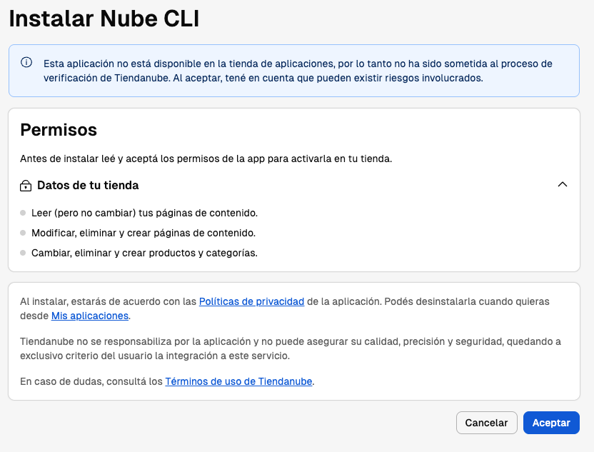
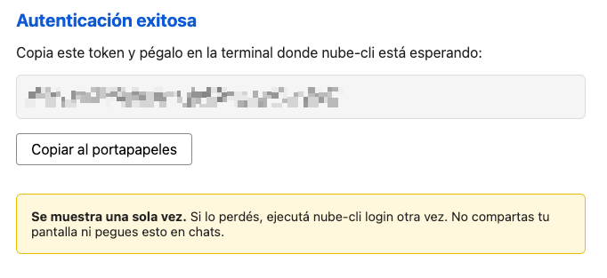

# Public API Workflow

The Public API workflow uses bearer-token authentication and the Tiendanube REST API. You get full file sync (pull, push, watch) plus installation management (create, clone, fork, publish, preview, delete).

:::warning Ipanema theme only
The Public API workflow currently supports only the **Ipanema** theme. If you're working with a different theme, use the [FTP workflow](./ftp-workflow) instead.
:::

## Get an access token

The recommended way to obtain a Public API token is the `theme authorize` command. It opens your default browser so you can sign in and install the CLI on your store:

```bash
tiendanube theme authorize
```

### 1. Authorize the CLI in your store admin

After signing in, your store admin shows an installation screen requesting the permissions Nube CLI needs to manage your theme. Review the permissions and click Accept:



### 2. Copy the access token

Once you accept, the browser displays your Public API access token. Use the Copy to clipboard button to copy it:



:::warning The token is shown only once
Save the token somewhere safe before closing the page. If you lose it, rerun `tiendanube theme authorize` to generate a new one.
:::

You'll also need your **store ID** and **storefront URL** to run `theme setup`. These are available from your store admin — they're not displayed on the token page.

:::tip
`theme authorize` is a browser handoff: the CLI opens the URL and exits, so you don't need to keep a terminal running. Once you have the token (plus your store ID and storefront URL), move on to `theme setup`.
:::

:::info Already have a token?
If you already have a Public API access token, you can skip this step and go straight to `theme setup`.
:::

## Setup

Once you have a token, connect the CLI to your store:

```bash
tiendanube theme setup \
  --token YOUR_ACCESS_TOKEN \
  --store-id YOUR_STORE_ID \
  --store-url https://yourstore.mitiendanube.com
```

This creates a `.nube` configuration file in your working directory and verifies your credentials against the API.

:::warning
The `.nube` file contains your access token. Add it to your `.gitignore`.
:::

### Options

| Option              | Description                                |
| ------------------- | ------------------------------------------ |
| `--token <token>`   | **Required.** Your Public API access token |
| `--store-id <id>`   | **Required.** Your numeric store ID        |
| `--store-url <url>` | **Required.** Your storefront URL          |
| `-y`                | Skip confirmation prompts                  |
| `-v`                | Enable verbose output                      |

### What you need

| Requirement      | Where to get it                                                                    |
| ---------------- | ---------------------------------------------------------------------------------- |
| **Access token** | Run `tiendanube theme authorize` — see [Get an access token](#get-an-access-token) |
| **Store ID**     | Your numeric store identifier — available from your store admin                    |
| **Store URL**    | Your storefront URL (e.g. `https://mystore.mitiendanube.com`)                      |

## Configuration file

The `theme setup` command creates a `.nube` file in your working directory. This file stores your API credentials and tracks which installation you're working on:

| Key                        | Description                                                                      |
| -------------------------- | -------------------------------------------------------------------------------- |
| `themeManagement`          | Set to `"api"` — indicates this directory uses the Public API workflow           |
| `theme-api.publicApiToken` | Your Public API access token                                                     |
| `theme-api.storeId`        | Your numeric store ID                                                            |
| `theme-api.storeUrl`       | Your storefront URL                                                              |
| `theme-api.installationId` | The currently checked-out installation ID (set by `theme installation checkout`) |
| `theme-api.apiBaseUrl`     | API base URL (defaults to `https://api.nuvemshop.com.br`)                        |

The file contents are base64-encoded and written with restricted permissions (`0600` on macOS/Linux).

:::info
The `.nube` file tracks a **mode** — either `"api"` or `"ftp"`. API commands will refuse to run if the file is configured for FTP, and vice versa. Each working directory is tied to one workflow.
:::

## Rate limiting

The Tiendanube API enforces rate limits. If the CLI receives a `429 Too Many Requests` response, it automatically waits and retries. During bulk operations like `theme push` (which uploads files in parallel), the CLI limits concurrency to 2 simultaneous uploads to stay within API limits.

## Next steps

- [Theme Development](./theme-development) — Pull, push, and watch theme files
- [Theme Installations](./theme-installations) — Create, clone, fork, publish, and delete installations
