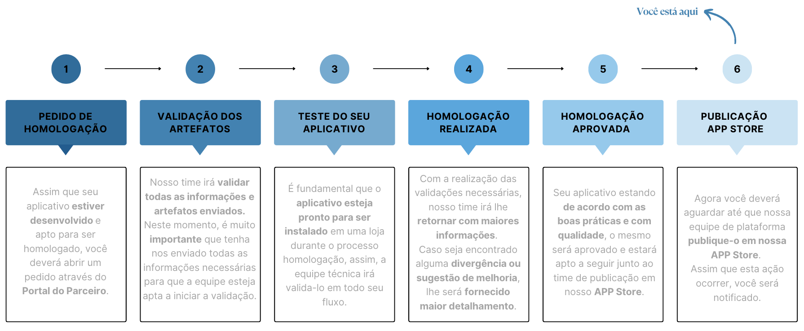

# Processo de Publicação do App

Nesta seção, fornecemos um guia passo a passo para publicar o seu aplicativo na [Loja de Aplicativos da Nuvemshop](https://www.nuvemshop.com.br/loja-aplicativos-nuvem).

Para a publicação do aplicativo, existem duas etapas a serem realizadas de forma independente e paralela:

## Etapa 1: Envio dos artefatos

* Assim que a solicitação de homologação for feita, você receberá um e-mail com instruções e o pedido de envio de arquivos.
* Estes arquivos são denominados **artefatos**, que contemplam documentos relacionados ao fluxo de homologação e à publicação.
* O conjunto completo de artefatos deve ser enviado para que a equipe possa iniciar as validações do aplicativo.

:::warning ATENÇÃO
A etapa de homologação e publicação inicia-se apenas após o envio de **todos** os artefatos.
:::

## Etapa 2: Preenchimento dos dados do aplicativo

* É necessário preencher todos os campos obrigatórios no Painel do Parceiro da Nuvemshop, na seção **"Dados de Publicação"**.
* Isso garante que seu aplicativo tenha as informações necessárias para uma publicação mais ágil na Loja de Aplicativos.

Nesta documentação, você obterá orientação para realizar todas as etapas.

---

## Publicando um aplicativo na Nuvemshop

Através da seção **"Dados de Publicação"**, você pode configurar o seu aplicativo para disponibilizá-lo na Loja de Aplicativos.

1. Dentro do painel, clique em **"Dados de publicação"**.
2. Clique em **"Editar dados"** para continuar.

* Certifique-se de que todos os campos em **"URLs e contato"** e **"Handle do aplicativo"** estão devidamente preenchidos.