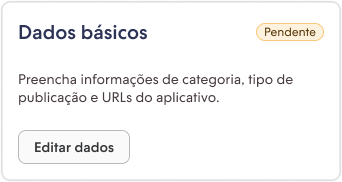
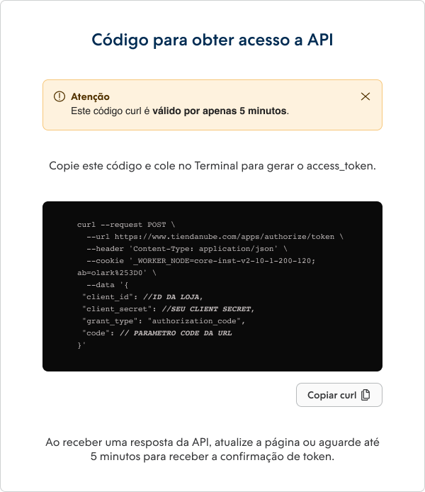
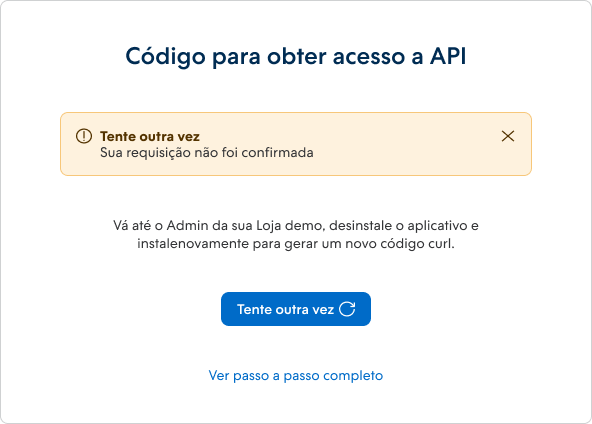

import { Alert } from '@nimbus-ds/components';

# Authentication

This guide presents methods for application authentication with the Nuvemshop platform. Discover how to ensure security and authorized access for seamless integrations between your applications and our platform.

## API Authentication

User authentication and authorization are provided through a restricted implementation of OAuth 2. Currently, we only support the ["Authorization Code"](https://oauth.net/2/grant-types/authorization-code/) flow for granting access. By following this flow, you obtain [access tokens](https://oauth.net/2/access-tokens/) that do not expire and remain valid until renewed.

## Access Tokens and Identification

The access tokens we provide do not have an expiration date. They only become invalid when a new token is obtained or when the user uninstalls the application. Along with the access token, a `user_id` is also provided, corresponding to the store ID. This `user_id` is essential for making requests to our API and can also be used to authenticate application users on your site.

Authentication is a fundamental step to access our services via API. Be sure to include the `user_id` in your requests to ensure proper authentication and authorization.

## Types of Authentication Methods

The choice of authentication method depends on the type of application you are developing:

- If you are creating standalone applications, with or without our template, you need to use OAuth 2.
- For integrated applications with the Nuvemshop admin using Nexo, access tokens generated in the Nuvemshop admin are used.

Our application creation templates already include an authentication system integrated with our API. This significantly reduces development time for partners who choose to use these templates. However, if the partner chooses not to use one of our templates, authentication can be done manually. Below, we will show you how this can be done effectively.

## Obtaining the Access Token

<Alert appearance="warning" title="Attention">
    When you complete the acquisition process, you will receive a cURL code, essential for generating the access_token. It's important to note that this code is valid for only 5 minutes. Make sure to use it within that period to ensure successful access.
</Alert>

<br />

### Changing the Redirect URL

If you have modified the redirect URL, please replace it and save the new URL at `https://partners.nuvemshop.com.br/applications/authentication/:app-id` to access the page with the cURL code. The redirect URL field can be found in the **Basic Data** form.



This step is crucial to ensure that redirection works correctly and that you can access the cURL code page without any issues. Be sure to update the redirect URL as needed.

### Making the Request with the cURL Code

After completing the installation, you will be redirected to a new page containing the cURL code necessary to generate your `access_token`. Simply copy this code and make the request using the tool of your choice.



The structure of the generated cURL consists of:

- **client_id**: Your application's App ID;
- **client_secret**: Your client secret;
- **code**: The code obtained in the URL after installing the application in the demo store.

This step is essential to successfully obtain the access_token and ensure authorized access to our platform.

If the request is successful, you will receive a response in a format similar to this example:


```javascript
{
    "access_token": "88a2fdd17e10327ed96f4f2dc96b00bca60dfe60",
    "token_type": "bearer",
    "scope": "write_products",
    "user_id": 2093261
}
```

You can manually assemble the cURL command based on the provided example. Here's the cURL command to make the POST request using the mentioned information:

```bash
curl -X POST "https://www.tiendanube.com/apps/authorize/token" \
-d "client_id=client_id" \
-d "client_secret=client_secret" \
-d "code=code"
```

Make sure to replace `client_id`, `client_secret`, and `code` with the correct values from your app created in the Partner Portal.
Remember, you can run this command in a terminal or a tool that supports cURL to test the request and obtain the access_token.

### How to Obtain a New cURL Code

To do this, follow these steps:

1. When you receive the alert indicating that the request was not confirmed, click the **Try Again** button.
2. You will be redirected to the **My Apps** section in the admin of your Demo Store.
3. In the admin of your demo store, in the **My Apps** section, check if the app is installed. If it's installed, proceed to [uninstall it](./overview.md#uninstalling-an-app).

If the request failed due to the expiration of the cURL code or some error, you can obtain a new code by [uninstalling](./overview.md#uninstalling-an-app) and [reinstalling](./overview.md#installing-your-app) your app in the store again.



By following these steps, you'll be able to get a new valid cURL code and successfully resume the [authentication](./authentication#getting-the-access-token) process. Make sure to follow the instructions carefully to avoid future issues.

---

## Next Steps

- Learn more about [Apps](./overview.md)
