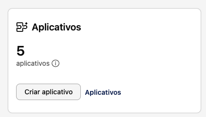
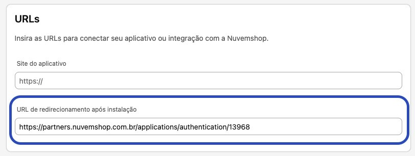
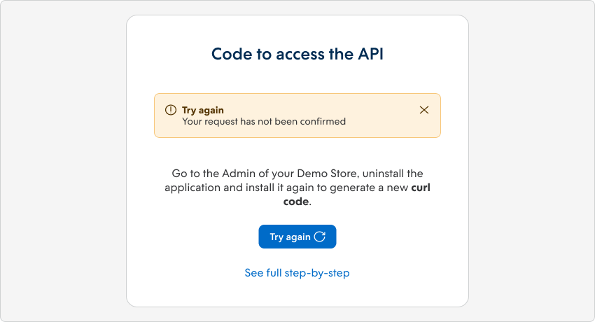

import { Alert } from '@nimbus-ds/components';

# Authentication

This guide presents methods for application authentication with the Nuvemshop platform. Discover how to ensure security and authorized access for seamless integrations between your applications and our platform.

## API Authentication

User authentication and authorization are provided through a restricted implementation of OAuth 2. Currently, we only support the ["Authorization Code"](https://oauth.net/2/grant-types/authorization-code/) flow for granting access. By following this flow, you obtain [access tokens](https://oauth.net/2/access-tokens/) that do not expire and remain valid until renewed.

## Access Tokens and Identification

The access tokens we provide do not have an expiration date. They only become invalid when a new token is obtained or when the user uninstalls the application. Along with the access token, a `user_id` is also provided, corresponding to the store ID. This `user_id` is essential for making requests to our API and can also be used to authenticate application users on your site.

Authentication is a fundamental step to access our services via API. Be sure to include the `user_id` in your requests to ensure proper authentication and authorization.

## Types of Authentication Methods

The choice of authentication method depends on the type of application you are developing:

- If you are creating external applications, with or without our template, you need to use OAuth 2.
- For integrated applications with the Nuvemshop admin using Nexo, access tokens generated in the Nuvemshop admin are used.

Our application creation templates already include an authentication system integrated with our API. This significantly reduces development time for partners who choose to use these templates. However, if the partner chooses not to use one of our templates, authentication can be done manually. Below, we will show you how this can be done effectively.

## Obtaining the Access Token

### Creating the Application

Within the partner panel, go to:

Applications > Create Application

Fill in the application name and select the app distribution option:

App Store: Available to all merchants.

For your clients: Available only to the merchants chosen by you.

After creation, you will see a success message containing the `app_id`.

### Basic Data
Click on "Edit data"

<Alert appearance="warning" title="Attention"> In Basic Data, the automatically generated link in the Redirect URL field after installation is only for testing support but should not be used in production. </Alert>   Replace this URL with your application URL that will be ready to receive our code that will be generated, so you can partner to do the POST/Authorization. 

  
 

- Fill in the application information

- Make sure to activate only the necessary permissions. Unnecessary scopes can result in rejection during the approval process.

- For applications developed in Brazil, it is essential to configure the webhooks according to the requirements established by the General Data Protection Law (LGPD) in force. Filling out this configuration is mandatory for approval in the homologation phase.

- To ensure the approval of your application, it is mandatory that you consult the webhook documentation available in our API documentation. Use webhooks whenever necessary, aiming to reduce pulling.

- Don't forget to save all filled information.

 

### Back to the Application Panel
Find the `app_id` and `client_secret` at the top right, in the <u>Access Keys</u> area.

Select your demo store for testing during app development.

Install the application to connect to the API using the URL:

`https://www.tiendanube.com/apps/{app_id}/authorize`

 

<Alert appearance="warning" title="Attention"> Upon completing the obtaining process, you will receive a cURL code, essential for generating the access_token. It is important to note that this code is valid for only 5 minutes. Make sure to use it within this period to ensure successful access. </Alert>

 

### How to Obtain a New cURL Code

To do this, follow these steps:

1. When you receive the alert indicating that the request was not confirmed, click the **Try Again** button.
2. You will be redirected to the **My Apps** section in the admin of your Demo Store.
3. In the admin of your demo store, in the **My Apps** section, check if the app is installed. If it's installed, proceed to [uninstall it](./overview.md#uninstalling-an-app).

If the request failed due to the expiration of the cURL code or some error, you can obtain a new code by [uninstalling](./overview.md#uninstalling-an-app) and [reinstalling](./overview.md#installing-your-app) your app in the store again.

By following these steps, you'll be able to get a new valid cURL code and successfully resume the [authentication](./authentication#getting-the-access-token) process. Make sure to follow the instructions carefully to avoid future issues.

---

## Next Steps

- Learn more about [Apps](./overview.md)
