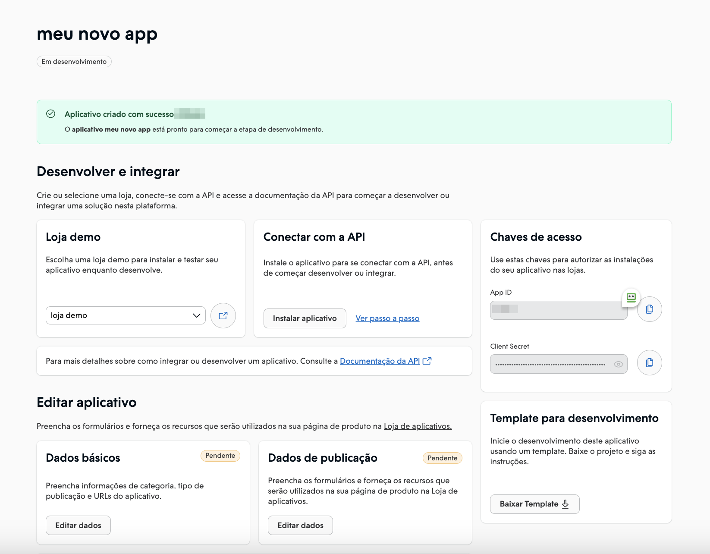
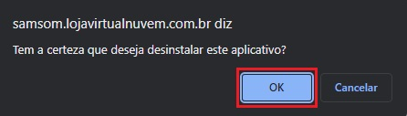

import { Alert, Text, Box } from '@nimbus-ds/components';
import ImageCreateApp from '@site/static/img/create-app.png';
import AppTypes from '@site/src/components/AppTypes';

# Overview

In this section, we will provide a step-by-step guide for you to create an application and integrate it into the Nuvemshop platform. Before starting the development of your application, it's necessary to create an account in the Nuvemshop Partners Portal. Learn how to create your account in the 📝 Guide: [details of the Nuvemshop Technology Partners program](https://atendimento.nuvemshop.com.br/pt_BR/parceiros-tecnologicos/como-fazer-um-aplicativo-para-a-loja-de-aplicativos-nuvemshop).

## Creating an Application in Nuvemshop

Through our tools, you can create an application to be made available in the 📱 [Nuvemshop App Store](https://www.nuvemshop.com.br/loja-aplicativos-nuvem).

This way, merchants have visibility of the tool and can install it in their online stores, increasing recognition of your service.

1. Access the 👉 [Partners Portal](https://partners.nuvemshop.com.br) and log in to your account using your access credentials.

2. After logging in, you will be redirected to the partners' dashboard.

3. Within the dashboard, click on **"Create application"** to continue.

4. A new screen will appear where you should enter the name of your application and select how you want to make it available.

   

   We have two options for the availability of your application:

   - **App Store**: If you want the application to be available in our official store, choose this option. After the homologation process is completed, the application will be available in the store, allowing any merchant to install, test, or purchase it.

   - **For Your Customers**: With this option, there is no need to go through the homologation process. However, your application will only be available to the merchants you select.

5. When you click **"Create application"**, we will take you to the dedicated page for your application.

   

   The page for your application is divided into 3 sections:

   - **Develop and Test**: In this section, you will find the necessary information to develop and test your application before making it available to the merchants of your choice or before requesting homologation.

   - **Edit application**: In the application editing section, you can customize and adjust the settings of your application. For example: add features, set preferences, and make the necessary changes to make your application even more attractive and functional.

   - **Tracking Metrics**: This section is dedicated to tracking the performance of your application. Here you will find relevant data and statistics. Use these metrics to continuously optimize and improve the user experience of your application.

Now that you have created your application, it's time to move on to the development and testing phase. It's time to get your hands dirty for real! Let's explore the development process and make sure you're prepared to create your application for Nuvemshop.

## Developing and Testing Your Application

In this section, we will provide all the essential information to authenticate your application with the Nuvemshop API, leverage our services, make adjustments, and test the functionality of the application in a demo store before making it available. Get ready to dive into development and ensure a quality application for our merchants.

### Demo Store

To proceed with the installation of your application and carry out the authentication process, it's necessary to have a test store. If you don't already have a test store, click on **"Create demo store"** to create your first test store.

This demo store will allow you to test the functionality of the application in a controlled environment before making it available to customers.

<Alert appearance="primary" title="📌 Note">
   Remember that this store is for testing purposes only and has some limitations.
</Alert>

 

### Access Keys for Your Application

Access keys are essential to initiate the authentication process of your application with our API.
These keys provide the necessary authorization for your application to communicate with our services and obtain the essential data and resources for its proper functioning.

### Installing Your Application

If you have a demo store, click on the **"Install application"** button. You will be redirected to the login for your demo store. Use the same credentials you used to log in to the Partners Portal.

If you don't have a demo store, [click here](https://partners.nuvemshop.com.br/stores/create?type=demo) to create a new one.

<Alert title="💡 Tip">
   <Text>If you want to install your application in another store, add <Text as="span" fontWeight="bold">/admin/apps/:app-id/authorize</Text> to the end of the URL. Be sure to replace <Text as="span" fontWeight="bold">:app-id</Text> with your application's ID.</Text>
</Alert>

 

When you access the Admin of your demo store, you will need to confirm the installation by clicking **"Accept and start using"**.

### Uninstalling an Application

In this tutorial, we explain how to **uninstall an application** in your Nuvemshop admin panel.

<Alert title="💡 Tip">
   In this tutorial, we use Melhor Envio as an example. However, you can perform the same procedure on any application that appears on this page, whether it's for shipping, payments, marketing, sales channels, dropshipping, management, etc.
</Alert>

1. Access the Nuvemshop admin panel.

2. In the side menu, locate the Boost section and click on **"My applications"**.

   

3. When the page loads, look for the tool you want to deactivate and, on the right, click **"Uninstall"**.

   

4. Next, a pop-up window will appear asking if you want to proceed with the uninstallation of the application. Simply click **"OK"**.

   

5. Once uninstalled, a confirmation message will appear at the top of the page.

   

   Check out an example in the GIF below:

   

The application has been successfully uninstalled. If you want to **reactivate it in your store**, simply look for the application on the same page and click **"Install"**.

## Authenticating Your Application

A fundamental step is to authenticate your application to access the [Nuvemshop API](../developer-tools/nuvemshop-api.md). If you are using one of our [templates](../developer-tools/templates.md), the authentication process will be ready to use, including the connection to the Nuvemshop Product API. This significantly automates the process; follow the setup guide in the chosen template repository, and you'll be on your way to development.

On the other hand, if you choose not to use our templates, you can access this [guide](./authentication.md) for manual integration. Our goal is to make application development easier, regardless of the path you choose.

## Choosing Your Application Type

After creating your application and being ready to start development, it's essential to understand the two types of applications that can be developed on our platform: Integrated and Standalone. These options offer flexibility and unique advantages to meet the specific needs of merchants. Let's explore these types in detail so you can make the best decision for your application.

<AppTypes />

## Editing Your Application's Permissions

When creating your application, the **"Products"** permission will be chosen by default. However, during development, you may need to obtain [access to other permissions](../developer-tools/nuvemshop-api.md#permissões-e-escopos) for your application. All permissions that the partner adds or edits will require the application to be reinstalled. To do this, select the permissions in **"Basic Data"** in the portal, save the changes, go to the store where the application is installed, click **"Uninstall"** (see how to uninstall an [application](./overview.md#desinstalando-um-aplicativo)), and then **"Install"**. This will generate a new access token, and the process of integrating with the Nuvemshop API can be restarted, including the updated permissions.

---

## Next Steps

- Learn more about [Integrated Applications](./native.md)
- Learn more about [External Applications](./standalone.md)
