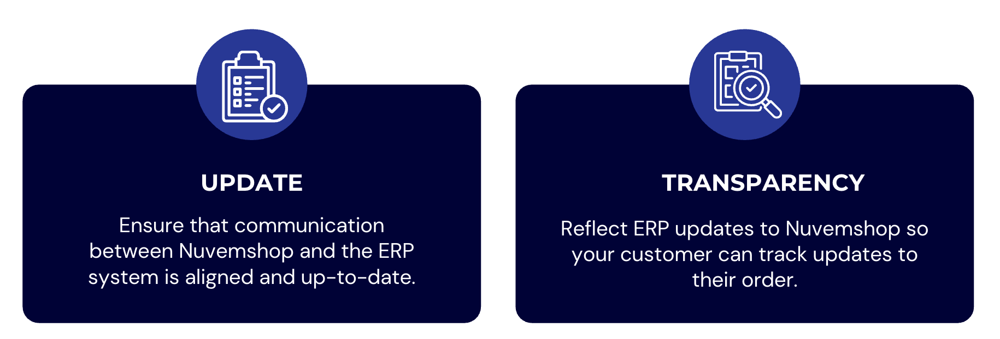
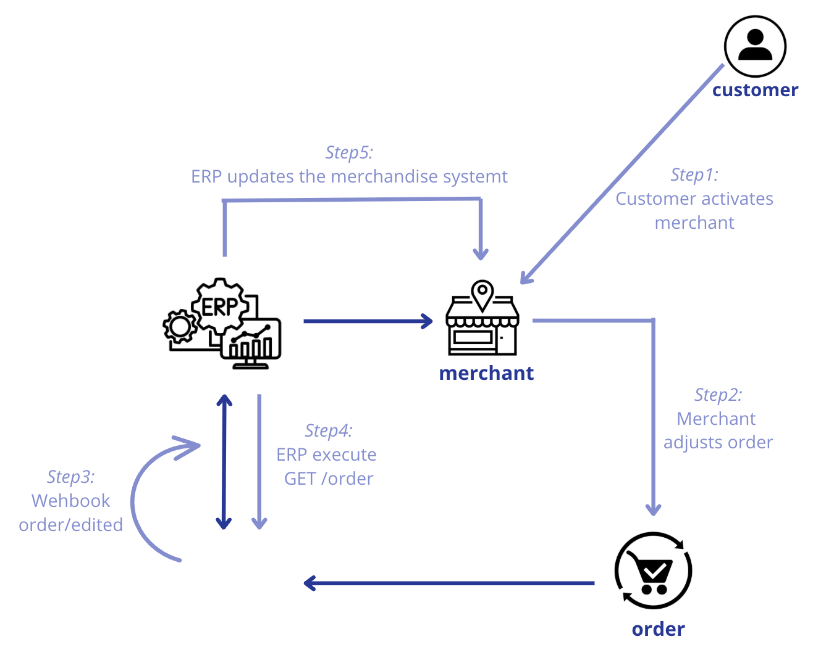
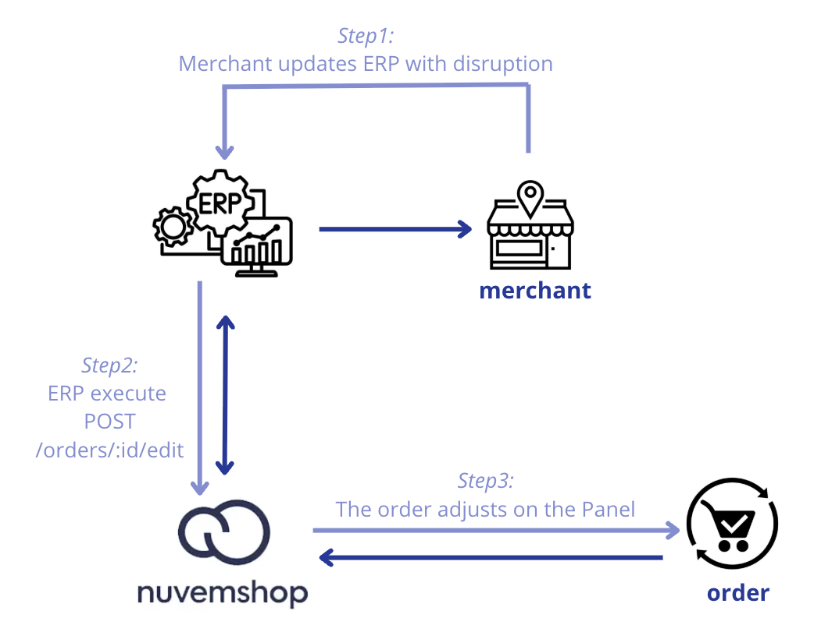

**🔹Partner guide \- EditOrders**

This document aims to guide and assist merchants and their partners through the **EditOrders** workflow provided by Nuvemshop for scenarios where order modifications are required.

In this process, ensuring **consistency**, **continuous updates**, and accurate **mapping** of changes is fundamental especially for merchants utilizing integrations between an ERP and Nuvemshop.

📌**Important:** When a change is made at the order item level, Nuvemshop recalculates the shipping quote, which causes the rates to change. Consequently, it is crucial that shipping applications offering prepaid services, fulfillment services, or pickups listen to this webhook, as it modifies information relevant to their management.

⚠️ **Attention:** The order editing process can only occur while the order has not yet been packed (the Fulfillment Order status must be `UNPACKED`).

Please note that packed orders can be reverted to unpacked through the store administrator panel, whereas a dispatched order can no longer return to the unpacked state.

Nuvemshop communicates any changes to order information via [webhooks](https://tiendanube.github.io/api-documentation/resources/webhook), ensuring rapid data synchronization. Consequently, for every change, Nuvemshop sends the `order/edited` webhook, and these changes also trigger the `order/updated` webhook.

- **FFO Product Management:**   
  - It is now possible to add or remove products from an existing FFO. This action will trigger a recalculation of shipping costs.  
- **FFO Deletion Restriction:**   
  - To maintain order integrity, an FFO containing products cannot be deleted.  
- **Discount Management:**   
  - We have developed the capability to add or remove discounts on orders.  
- **Destination Change Notifications:**   
  - We notify any modifications made to the destination data within the order.  
- **Payment Method Changes:**   
  - For unpaid orders, as well as those where payment was rejected, consumers can modify the payment method.

**◀️Possible order status on Nuvemshop**

FulfillmentOrderStatus

* `UNPACKED`: Initial status of the request: it has not yet been initiated.  
* `PACKED`: The order has been packaged and is ready for shipment.  
* `DISPATCHED`: The request has been sent.  
* `READY_FOR_PICKUP`: The order was ready for pickup.  
* `DELIVERED`: The order was fully fulfilled and delivered.

**◀️Simulations** 

Two scenarios were simulated in which updating order data may be required, as detailed below.

It should be noted that such changes can only be made if the order has not yet been updated to the "packed" status (`UNPACKED`).

1- \[Nuvemshop as the main editing agent\]

Consider the following scenario: a customer contacts the merchant, reporting an error in the order generation and requesting a change, for example, in the numbering.  
Thus, the merchant accesses the Nuvemshop administrative panel to make the necessary change requested by the customer.  
Therefore, this information change occurs in Nuvemshop.

However, the merchant has integration with an ERP, and since this change occurred in the Nuvemshop system, the ERP will need to be modified to adapt to the new data.

To this end, when the change occurs in the Nuvemshop system, Nuvemshop itself will trigger a notification [webhook](https://tiendanube.github.io/api-documentation/next/resources/webhook).  
Therefore, since Nuvemshop is the main agent in this change, it will inform users that a change has occurred.

Important point: When this action occurs, Nuvemshop triggers a webhook that notifies you that the order has been changed.  
Therefore, the ERP system needs to be reading this webhook communication to perform a new order query (via GET/orders).  
With the new query performed, it will identify the changed data and must update the information within the order in the ERP system to ensure data consistency between systems.

Thus, the merchant can proceed with packaging and shipping the order.

📌 How does Nuvemshop send notifications via the merchant/ERP webhook API for tracking?  

2- \[ERP as the primary editing agent\]

Assuming a scenario where the merchant has a single inventory, considering both physical and online sales, when separating the products of an order placed via Nuvemshop, they identify that there was a sales interruption (an order was generated without available stock).

It is understood that it will not be possible to fulfill the shipment of the missing product, so it will be necessary to remove that product from the order and notify the customer that they will not receive it.

In this case, the merchant makes the adjustment through the ERP, and the ERP must update the order to adapt it to Nuvemshop through an API request (using [**POST /orders/{id}/edit**](https://tiendanube.github.io/api-documentation/next/resources/order#post-ordersidedit)). 

It is worth emphasizing that a FForder cannot be left without products.

It's important to emphasize that it will not be possible to leave a FForder without products. Therefore, the data that needs to be changed in the Nuvemshop Panel will be effectively adjusted, ensuring continued synchronization of all order information.

📌 How does the ERP system notify Nuvemshop via API to update the dashboard and the customer's information?

