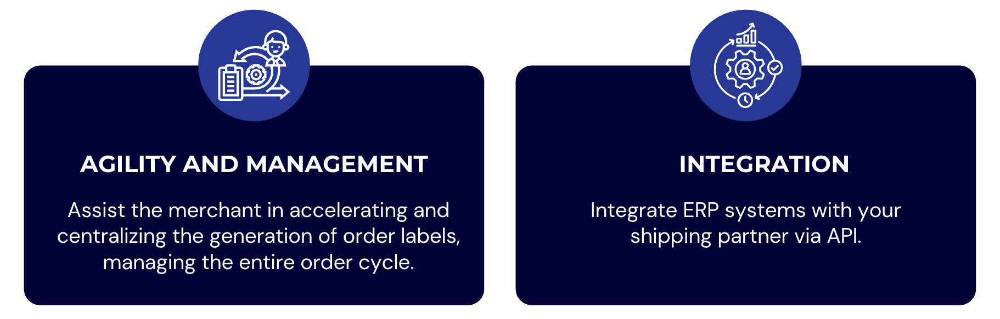
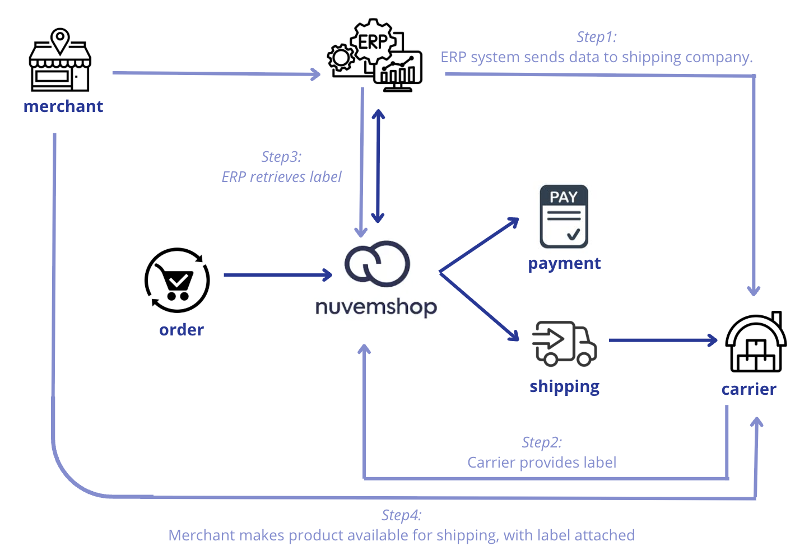

**🔹Partner guide \- Label**

The **[Labels API](https://tiendanube.github.io/api-documentation/next/resources/fulfillment-order#labels-api)** enables **asynchronous creation**, **status tracking**, and controlled **download** of shipping **labels** for orders.  
This means that, instead of the merchant having to generate labels directly with the carrier, using the API allows the coordination of label requests between the Labels API and third-party applications (carriers).  
Once labels are requested, the shipping partner processes them and makes them available for download through secure URLs managed by Nuvemshop.

This API offers:

* Complete label lifecycle management (creation, processing, download, failure/cancellation)  
* Detailed status history for auditing and error handling  
* Webhook support to track label updates  
* Integration with shipping applications through `callback_labels_url`

**◀️Possible label statuses:**

* `STARTED`: Request initiated, pending processing by the partner.  
* `IN PROGRESS`: The partner has received the request and is processing the label.  
* `READY TO DOWNLOAD`: The label has been generated by the carrier and is ready for internal download through the Labels API.  
* `READY TO USE`: The label has already been internally downloaded and is available for use.  
* `DOWNLOADED`: The label was downloaded through the Labels API.  
* `FAILED`: Processing failed.  
* `CANCELED`: The label has been canceled.

⚠️All label status updates are notified through the `fulfillment_order/label_status_updated` webhook.  
However, the intermediate `READY_TO_DOWNLOAD` status is only internal and is not notified via webhook. This status is used during internal processing, and only after a successful or failed validation is the next webhook sent with the final status.

**◀️Request to the carrier:** `callback_labels_url`  
When a label is created, an internal event is triggered.  
This event is processed by a background service that groups fulfillment orders by carrier and sends a request to the carrier's application using the configured `callback_labels_url`.

**⚠️Important information:** 

* There is a limit of 50 orders per request.  
* Tiendanube expects to receive a response to the carrier request (accepted, partially accepted, or failed) within 5 seconds. After this time, it times out. A sequence of 3 new attempts is then made with a 2-second interval between each.  
* Regarding the time a carrier has to return the label, once acceptance of label generation is responded, it is expected that the same lists are generated and downloaded within 1 hour.  
* There are certain [label formats](https://tiendanube.github.io/api-documentation/next/resources/fulfillment-order#fulfillmentorderlabeldocumentformattype) such as PDF and ZPL.

**⚠️[Status workflow rules](https://tiendanube.github.io/api-documentation/next/resources/fulfillment-order#labels-api):**

* **Expected flow:** STARTED → IN\_PROGRESS → \[FAILED | CANCELED | READY\_TO\_USE\] → DOWNLOADED  
* **Final status restriction:** Labels in final status (FAILED, CANCELED, READY\_TO\_USE, DOWNLOADED) cannot accept further status updates.  
* **Cancellation exception:** CANCELED status can be applied at any point in the workflow, except when the label is in READY\_TO\_DOWNLOAD (internal processing).  
* **No reverse flow:** Status updates cannot rewind to previous states or skip intermediate states.  
* **Automatic timeout:** Labels that remain in STARTED or IN\_PROGRESS status for more than 30 minutes will automatically be marked as FAILED.

**◀️Simulations**   
   
An order may contain several products from the merchant. Therefore, a merchant working with multi-DC (Distribution Centers) may have multiple shipping methods.  
Products can be grouped in a single location and shipped, or shipped separately from the Distribution Centers.  
In a context where shipments are separated, each carrier provides its own shipping label, and it is the merchant who must access each of these companies to effectively issue and insert the label into the order.

Thinking about agility and centralization for the merchant, it is important that the carrier itself can make its label available to the ERP that the merchant uses, so that in a single place the merchant can export these labels from each carrier they are connected with.

With this in mind, Tiendanube provides an **API** that allows **communicating this information** and making it available for **download** in a **secure** way, using **webhooks** for better integration between systems.

📌 How does the label issuance workflow work technically?  
Through our documentation available in the [Developer Portal](https://tiendanube.github.io/api-documentation/next/resources/fulfillment-order#labels-api), we provide technical details and their respective request and return flow for the complete operation of label issuance, along with communication between Tiendanube and its partners.

