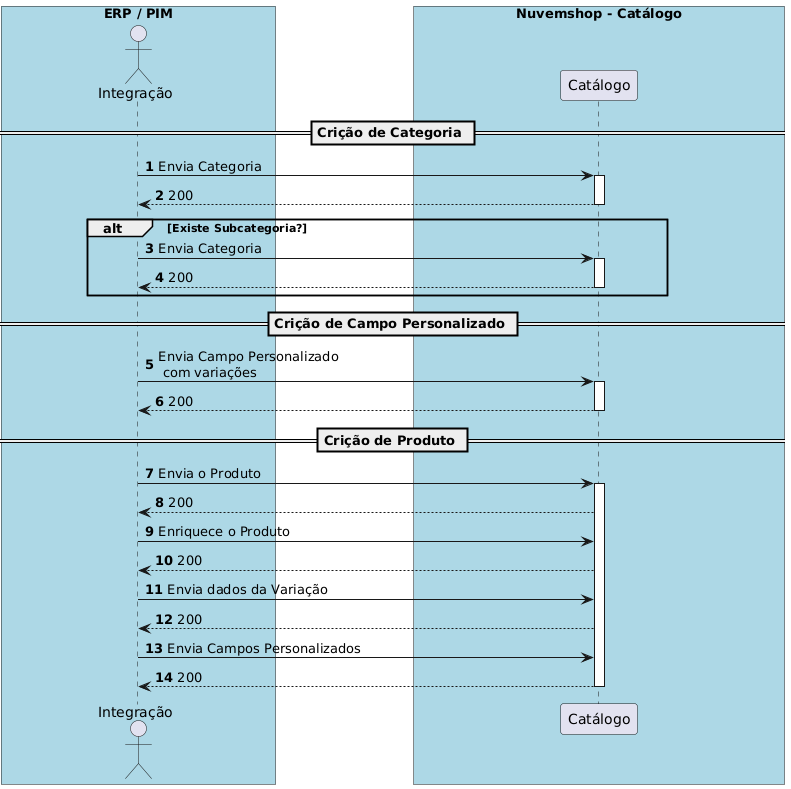

# Product Management

The Nuvemshop API offers complete endpoints to manage products, including creation, updating, and enriching data, along with managing variants.

Products can be classified into two main types: **products without variation** and **products with variation**.
The distinction between these two types affects how product data is managed and displayed on the platform.

**Products Without Variation**

These are simple products that do not have additional options for customers to choose.

**Examples include:**
- A book with a single title and language.
- A poster with fixed size and design.

**Features:**
- **SKU:** Each product is identified by a SKU code, generated by the ERP/PIM.
- **Direct stock management:** Stock, price, and other attributes are managed directly at the product level.

**Products with Variation**

These products offer options for customers, such as size, color, or material.

Each combination of options is called a variant, and these variants share the same base product.

**How attributes and values work:**

Products with variation use the concepts of **attributes** and **values**:

- **Attributes:** Represent the options available for the product. Examples:
    - Size
    - Color
    - Material

- **Values:** Are the choices within each attribute. Examples:
    - For the "Size" attribute: S, M, L.
    - For the "Color" attribute: Blue, Red, Black.
    - Each variant is formed by a specific combination of values for the product's attributes.



**Creating Products**

Use this endpoint to create a new product in the store.

[Example request:](https://tiendanube.github.io/api-documentation/resources/product)

```bash
curl -X POST https://api.nuvemshop.com/v1/{{store_id}}/products \
-H 'Authentication: bearer {{app_token}}' \
-H 'User-Agent: Your App Name ({{app_id}})' \
-H 'Content-Type: application/json' \
-d '{
  "name": "Basic T-shirt",
  "description": "100% cotton T-shirt",
  "price": 49.99,
  "sku": "CAM-001",
  "stock": 0,
  "inventory_levels": [
 	{
		"location_id": "01GQ2ZHK064BQRHGDB7CCV0Y6N",
		"stock": 5
}
  ],
  "categories": [12345],
  "images": [] // Send images using the enrichment API
}'
```

**Listing Products**

List all products registered in the store.

[Example request:](https://tiendanube.github.io/api-documentation/resources/product#get-products-1)

```bash
curl -X GET https://api.nuvemshop.com/v1/{{store_id}}/products \
-H 'Authentication: bearer {{app_token}}' \
-H 'User-Agent: Your App Name ({{app_id}})' \
-H 'Content-Type: application/json'
```

**Updating Products**

Use this endpoint to update information for an existing product.

[Example request:](https://tiendanube.github.io/api-documentation/resources/product#put-productsid)

```bash
curl -X PUT https://api.nuvemshop.com/v1/{{store_id}}/products/98765 \
-H 'Authentication: bearer {{app_token}}' \
-H 'User-Agent: Your App Name ({{app_id}})' \
-H 'Content-Type: application/json' \
-d '{
  "price": 54.99,
  "stock": 150
}'
```

**Updating Variants**

Allows changing specific details of a **product variant (SKU)**.

[Example request:](https://tiendanube.github.io/api-documentation/resources/product-variant#get-productsproduct_idvariantsid)

```bash
curl -X PUT https://api.nuvemshop.com/v1/{{store_id}}/products/98765/variants/12345 \
-H 'Authentication: bearer {{app_token}}' \
-H 'User-Agent: Your App Name ({{app_id}})' \
-H 'Content-Type: application/json' \
-d '{
  "id": 144,
  "image_id": null,
  "promotional_price": "19.00",
  "created_at": "2013-01-03T09:11:51-03:00",
  "depth": null,
  "height": null,
  "values": [
    {
      "en": "X-Large"
    }
  ],
  "price": "25.00",
  "product_id": 1234,
  "stock_management": true,
  "stock": 5,
  "sku": "BSG1234D",
  "mpn": null,
  "age_group": null,
  "gender": null,
  "updated_at": "2013-06-01T09:15:11-03:00",
  "weight": "2.75",
  "width": null,
  "cost": "10.99"
}
'
```

**Enriching Product Data**

To enrich product data, include fields like images, more detailed descriptions, or additional information.

[Example request to add an image:](https://tiendanube.github.io/api-documentation/resources/product-image)

```bash
curl -X POST https://api.nuvemshop.com/v1/{{store_id}}/products/98765/images \
-H 'Authentication: bearer {{app_token}}' \
-H 'User-Agent: Your App Name ({{app_id}})' \
-H 'Content-Type: application/json' \
-d '{
  "src": "https://example.com/image2.jpg"
}'
```

**Deleting Products**

Allows you to delete a product from the store.

[Example request:](https://tiendanube.github.io/api-documentation/resources/product#delete-productsid)

```bash
curl -X DELETE https://api.nuvemshop.com/v1/{{store_id}}/products/98765 \
-H 'Authentication: bearer {{app_token}}' \
-H 'User-Agent: Your App Name ({{app_id}})' \
-H 'Content-Type: application/json'
```

**Register a Product Variation**

Product variations in Nuvemshop represent different versions of the same item, differentiated by attributes such as size, color, or material.

[Example request:](https://tiendanube.github.io/api-documentation/resources/product-variant#post-productsproduct_idvariants)

```bash
curl -X POST "https://api.nuvemshop.com/v1/{store_id}/products/{product_id}/variants" \
-H "Content-Type: application/json" \
-H "Authentication: Bearer {{app_token}}" \
-H "User-Agent: Your App Name ({{app_id}})" \
-d '{
  "price": 120.50,
  "stock": 20,
  "sku": "SKU-123",
  "attributes": [
    {
      "name": "Size",
      "value": "M"
    },
    {
      "name": "Color",
      "value": "Blue"
    }
  ]
}'
```

**Update a Product Variation**

URL: /products/{product_id}/variants/{variant_id}

[Example request:](https://tiendanube.github.io/api-documentation/resources/product-variant#put-productsproduct_idvariantsid)

```bash
curl -X PUT "https://api.nuvemshop.com/v1/{store_id}/products/{product_id}/variants/{variant_id}" \
-H "Content-Type: application/json" \
-H "Authentication: Bearer {{app_token}}" \
-H "User-Agent: Your App Name ({{app_id}})" \
-d '{
  "id": 144,
  "image_id": null,
  "promotional_price": "19.00",
  "created_at": "2013-01-03T09:11:51-03:00",
  "depth": null,
  "height": null,
  "values": [
    {
      "en": "X-Large"
    }
  ],
  "price": "25.00",
  "product_id": 1234,
  "stock_management": true,
  "stock": 5,
  "sku": "BSG1234D",
  "mpn": null,
  "age_group": null,
  "gender": null,
  "updated_at": "2013-06-01T09:15:11-03:00",
  "weight": "2.75",
  "width": null,
  "cost": "10.99"
}'
```

**List Product Variations**

URL: products/{product_id}/variants

[Example request:](https://tiendanube.github.io/api-documentation/resources/product-variant#put-productsproduct_idvariantsid)

```bash
curl -X GET "https://api.nuvemshop.com/v1/{store_id}/products/{product_id}/variants" \
-H "Authentication: Bearer {{app_token}}" \
-H "User-Agent: Your App Name ({{app_id}})"
```

**Get Specific Product Variation Details**
URL: products/{product_id}/variants/{variant_id}

[Example request:](https://tiendanube.github.io/api-documentation/resources/product-variant#get-productsproduct_idvariantsid)

```bash
curl -X GET "https://api.nuvemshop.com/v1/{store_id}/products/{product_id}/variants/{variant_id}" \
-H "Authentication: Bearer {{app_token}}" \
-H "User-Agent: Your App Name ({{app_id}})"
```

### Product Variants Management

**List Product Variants**

URL: `products/{product_id}/variants`

Example Request:
```bash
curl -X GET "https://api.nuvemshop.com/v1/{store_id}/products/{product_id}/variants" \
-H "Authentication: Bearer {{app_token}}" \
-H "User-Agent: Your App Name ({{app_id}})"
```

**Get Specific Variant Details**

URL: `products/{product_id}/variants/{variant_id}`

Example Request:
```bash
curl -X GET "https://api.nuvemshop.com/v1/{store_id}/products/{product_id}/variants/{variant_id}" \
-H "Authentication: Bearer {{app_token}}" \
-H "User-Agent: Your App Name ({{app_id}})"
```

**Delete Product Variant**

URL: `/products/variants/custom-fields/{{custom-field_id}}`

Example Request:
```bash
curl -X DELETE "https://api.nuvemshop.com/v1/{store_id}/products/variants/custom-fields/{{custom-field_id}}" \
-H "Authentication: Bearer {{app_token}}" \
-H "User-Agent: Your App Name ({{app_id}})"
```
