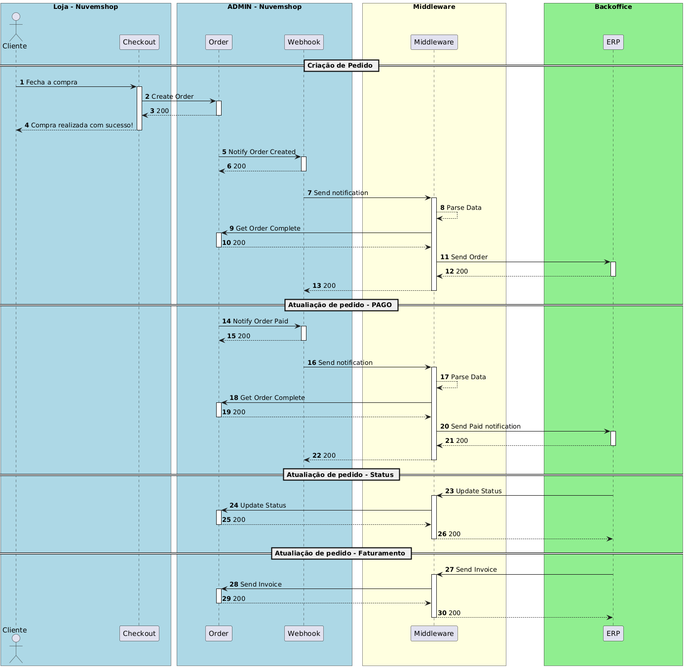

### Order Management

Nuvemshop API provides various endpoints for managing orders, allowing you to create, query, update, and process orders, giving you complete control over the lifecycle of an order in your online store.

**Managing Orders should primarily be done through webhooks.**

Webhooks are used to notify your application in real-time about events related to order management, such as creating, updating, or canceling orders. With webhooks, you can automate processes when events occur in your store.

**Order Identifiers in Nuvemshop**

There are two types of order identifiers:

- **NUMBER** – Displayed to customers in a user-friendly format but not accepted as an identifier for integrations.
- **Order ID** – A 10-digit internal identifier used by the platform.

For integration purposes, it is recommended to use the **Order ID**, as it ensures greater accuracy in system communication and avoids possible conflicts or errors that could arise from using the NUMBER, which, despite being fixed, is not supported for this purpose.

