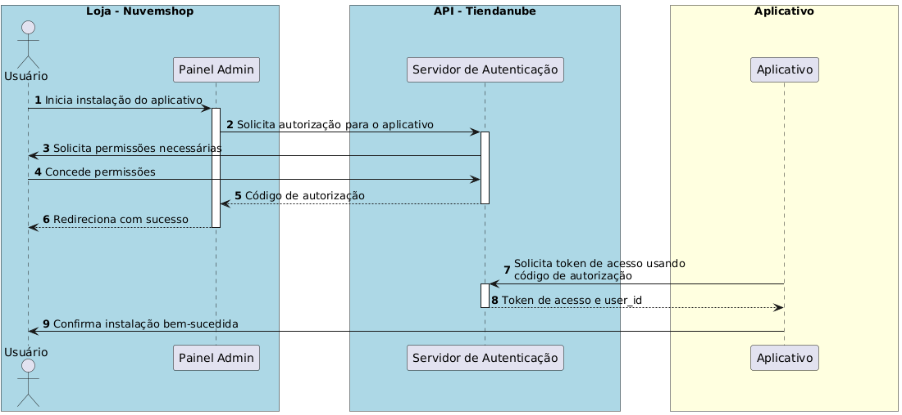
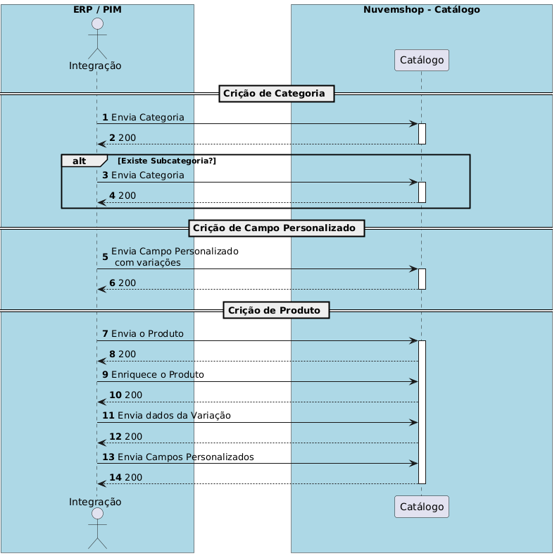

# Integration Guide

In this guide, we will cover the practical way to integrate your ERP or PIM system with the Nuvemshop platform. Here, you will find instructions to synchronize critical information such as orders, products, and inventories, ensuring efficiency and automation in back-office operations.

This guide covers:

- **Product and variation management**: Registration, updates, and stock control.
- **Order synchronization**: Automated processing using webhooks.
- **Inventory and invoice management**: Efficient control of stock levels and issuing invoices.

We include examples in cURL with headers and endpoint details to make your implementation easier. Ideal for businesses seeking fast and reliable integration, this guide helps optimize processes and improve your e-commerce operation.

# Guide Summary

**1. Application Creation**
- Process to create a partner profile on Nuvemshop and connect the application with the platform.

Useful links:

- [How to create an application on Nuvemshop](https://ayuda.tiendanube.com/es_AR/socios-tecnologicos/como-creo-una-aplicacion-para-tiendanube)
- [Developer documentation](https://dev.nuvemshop.com.br/en/docs/applications/overview)


**2. Installation and Onboarding**
- Guide to create an efficient installation experience for public apps on the app store.
- Focus on granting permissions and linking between stores and ERPs.

Useful links:

[Installation Guide](https://tiendanube.github.io/api-documentation/guides/installation)

[Authentication](https://tiendanube.github.io/api-documentation/authentication)


**3. Inventory and Locations**

- Management of inventories distributed across different locations.

- Features by plan:
    - Freemium/Plan A: 1 location
    - Plan B: 2 locations
    - Plan C: 3 locations
    - Enterprise: unlimited

Useful links:

 [Multi-Inventory](https://tiendanube.github.io/api-documentation/multi-inventory-guides)
 [API Locations](https://tiendanube.github.io/api-documentation/authentication)

 **4. Products and Variations**
- Management of products, categories, and variations, allowing full synchronization between Nuvemshop and the ERP.

- Basic flow:
    - Synchronize created products/categories.
    - Update stock, price, and attributes.
    - Create variations with SKU, name, and initial stock.

Useful links:
 [Products](https://tiendanube.github.io/api-documentation/resources/product)
 [Variations](https://tiendanube.github.io/api-documentation/resources/product-variant)
 [Product Images](https://tiendanube.github.io/api-documentation/resources/product-image)
 [Categories](https://tiendanube.github.io/api-documentation/resources/category)

**5. Orders**
- Capture and process orders for inventory control, billing, and logistics.
- Key features:
    - Synchronize existing and new orders.
    - Update payment and shipping status.
    - Generate invoices and reintegrate stock on cancellations.

Useful links:
 [Orders](https://tiendanube.github.io/api-documentation/resources/order)
 [Order Webhooks](https://tiendanube.github.io/api-documentation/resources/webhook)

**6. Customers**
- Synchronization of customer information between Nuvemshop and the management system.
- Features:
    - Capture existing customer list.
    - Create and update customer records in the ERP and Nuvemshop.

Useful links:
 [Customers](https://tiendanube.github.io/api-documentation/resources/client)

**7. Additional Resources**
- Best practices:
    - [JSON and Rate Limits](https://tiendanube.github.io/api-documentation/intro#just-json)
    - [Pagination](https://tiendanube.github.io/api-documentation/intro#pagination)
    - [Postman Collection](https://tiendanube.github.io/api-documentation/utils/postman-collections)

**8. Certification Checklist**
- Detailed checklist for app certification in the app store:
    - Certification Checklist


# Authentication

Authentication in the Nuvemshop API uses a restricted implementation of OAuth 2.0, specifically the "Authorization Code" flow. This process allows applications to obtain access tokens that do not expire, remaining valid until they are renewed or until the user uninstalls the application.


[Link to create the application](https://partners.nuvemshop.com.br/)

**Authorization Flow:**

- **Installation Start**: The user, from the Nuvemshop admin panel, clicks to install the app or directly accesses a specific URL for authorization.
- **Permission Request**: The user is redirected to a page where they must authorize the scopes the app requests. If previously authorized, this step is skipped.
- **Redirection with Authorization Code**: After authorization, the user is redirected to the app's redirect URL with an authorization code that expires in 5 minutes.
- **Exchange for Access Token**: The application uses its credentials and the authorization code to obtain an access token through a POST request to a specific endpoint.

**Example Request to Obtain the Access Token:**

```bash
curl -d '{
"client_id": "123",
"client_secret": "abcdef",
"grant_type": "authorization_code",
"code": "xyz"
}' \
-H 'Content-Type: application/json' \
-X POST "https://www.nuvemshop.com/apps/authorize/token"

```

Along with the access token, a **user_id** is provided, which corresponds to the **store ID**.

This **user_id** is essential for making requests to the API and can be used to authenticate users of the app on your website.

# Rate Limit - API Usage Control

Currently, we use the Leaky Bucket algorithm to limit API usage. 

By default, the bucket has a capacity for **40 requests**, with a leak rate of 2 requests per second.

This means you can make up to **2 requests per second** in batches of up to **40 requests**, without receiving error **429 (Too Many Requests)**.

To monitor API consumption, we provide the following headers:

- **x-rate-limit-limit**: Total requests allowed in a given period (equivalent to the bucket size).
- **x-rate-limit-remaining**: Number of remaining requests to fill the bucket.
- **x-rate-limit-reset**: Remaining time in milliseconds for the bucket to be completely emptied.

**Important Note**: The API usage limit is applied individually for each store and app.

**For stores on the Next or Evolution plans (higher plans), the rate limit is multiplied by 10, allowing greater request capacity.**

# General Filters and Pagination

Requests that return multiple items **do not have pagination enabled by default**. 

To navigate through the results, use the **page** parameter to specify additional pages.

Additionally, you can customize the size of each page using the **per_page** parameter, which accepts values of up to **200 items per page**.

Page numbering starts at 1. If the page parameter is omitted, the request will return the first page by default.

**Useful Information:**

- **Total results count**: The **x-total-count** header indicates the total number of available items.

```bash
x-total-count: 156
```

**Navigation Links**: The Link header provides URLs for the next and previous pages, facilitating the implementation of pagination.

This mechanism allows for organized and efficient results retrieval, even with large data sets.

# Inventory
The Nuvemshop Inventory API allows managing locations and stock levels across different sales points.

With it, you can create, update, and query stock at specific locations, such as physical stores or warehouses. 

The API also offers location prioritization to define the order in which orders are fulfilled, enabling efficient and integrated inventory management.

#Create a New Stock

To create a new stock, use the [POST /locations](https://tiendanube.github.io/api-documentation/resources/location) endpoint.

Request:

```bash
curl -X POST https://api.nuvemshop.com/v1/{{store_id}}/locations \
-H 'Authentication: bearer {{app_token}}' \
-H 'User-Agent: Your App Name ({{app_id}})' \
-H 'Content-Type: application/json' \
-d '{
  "name": {
    "es_AR": "Nombre del stock",
    "pt_BR": "Nome do estoque",
    "en_US": "Stock name"
  },
  "address": {
    "zipcode": "12910802",
    "street": "Rua Exemplo",
    "number": "123",
    "floor": "1º Andar",
    "locality": "Bairro Exemplo",
    "city": "São Paulo",
    "province": {
      "code": "SP",
      "name": "São Paulo"
    },
    "region": {
      "code": "SE",
      "name": "Sudeste"
    },
    "country": {
      "code": "BR",
      "name": "Brasil"
    },
    "reference": "Ponto de referência",
    "between_streets": "Entre a Rua A e Rua B"
  },
  "is_default": false,
  "allows_pickup": true,
  "priority": 1
}'
```

**Update an Existing Stock**

To update an existing stock, use the [PUT /locations/{id}](https://tiendanube.github.io/api-documentation/resources/location#put-locationsid) endpoint, replacing {id} with the stock ID.

Request:

```bash
curl -X PUT https://api.nuvemshop.com/v1/{{store_id}}/locations/{id} \
-H 'Authentication: bearer {{app_token}}' \
-H 'User-Agent: Your App Name ({{app_id}})' \
-H 'Content-Type: application/json' \
-d '{
  "name": {
    "es_AR": "Nombre actualizado del stock",
    "pt_BR": "Nome atualizado do estoque",
    "en_US": "Updated stock name"
  },
  "address": {
    "zipcode": "12910802",
    "street": "Rua Atualizada",
    "number": "456",
    "floor": "2º Andar",
    "locality": "Bairro Atualizado",
    "city": "Rio de Janeiro",
    "province": {
      "code": "RJ",
      "name": "Rio de Janeiro"
    },
    "region": {
      "code": "SE",
      "name": "Sudeste"
    },
    "country": {
      "code": "BR",
      "name": "Brasil"
    },
    "reference": "Novo ponto de referência",
    "between_streets": "Entre a Rua X e Rua Y"
  },
  "is_default": false,
  "allows_pickup": false,
  "priority": 2
}'
```

**List All Stocks**

To list all registered stocks, use the [GET /locations](https://tiendanube.github.io/api-documentation/resources/location#get-locations) endpoint.

```bash
curl -X GET https://api.nuvemshop.com/v1/{{store_id}}/locations \
-H 'Authentication: bearer {{app_token}}' \
-H 'User-Agent: Your App Name ({{app_id}})' \
-H 'Content-Type: application/json'
```

**Change Stock Priorities**

To set stock priorities, use the [PATCH /locations/priorities](https://tiendanube.github.io/api-documentation/resources/location#patch-locationspriorities) endpoint.

Stock prioritization will directly impact the store's shipping rate. 
Prioritized stocks will be considered when assembling the shipping package. 
Therefore, selected products based on this prioritization will define the shipping origin, directly influencing transportation costs, delivery times, and the final customer experience.

Request:

```bash
curl -X PATCH https://api.nuvemshop.com/v1/{{store_id}}/locations/priorities \
-H 'Authentication: bearer {{app_token}}' \
-H 'User-Agent: Your App Name ({{app_id}})' \
-H 'Content-Type: application/json' \
-d '[
  {
    "id": "01HTMFDH09VC6E2Q8KGTGP44D3",
    "priority": 0
  },
  {
    "id": "01HTMFFHWXRC8TRS40M43XGQFB",
    "priority": 1
  },
  {
    "id": "01HTMFG5VYQ8X5QW8FQ9Z7W3E1",
    "priority": 2
  }
]'
```

---

**Define a Stock as Default**

To define a specific stock as default, use the [PATCH /locations/{id}/chosen-as-default](https://tiendanube.github.io/api-documentation/resources/location#patch-locationsidchosen-as-default) endpoint, replacing **{id}** with the stock's ID.

Request:

```bash
curl -X PATCH https://api.nuvemshop.com/v1/{{store_id}}/locations/{id}/chosen-as-default \
-H 'Authentication: bearer {{app_token}}' \
-H 'User-Agent: Your App Name ({{app_id}})' \
-H 'Content-Type: application/json'
```

# Catalog

The Nuvemshop Catalog API allows full management of a store's products.

With it, you can create, update, list, and delete products, as well as manage their variations, prices, stocks, images, and customizations.

The API offers advanced features, such as adding custom attributes and detailed control over each aspect of the product, allowing a robust integration with ERP, PIM, or other management systems.

It is important to note that these fields are used when the store aims to be multilingual. Otherwise, just send the **Name** field with the corresponding value, for example: **"name":"name"**.

# Category

**Creating a Category**

To create a new category, make a [POST request to the /categories](https://tiendanube.github.io/api-documentation/resources/category#post-categories) endpoint.

Be sure to include the following headers:
- Authentication: bearer {{app_token}}
- User-Agent: Your App Name ({{app_id}})
Example in curl:

```bash
curl -X POST https://api.nuvemshop.com/v1/categories \
-H "Content-Type: application/json" \
-H "Authentication: bearer {{app_token}}" \
-H "User-Agent: Your App Name ({{app_id}})" \
-d '{
  "name": {
    "pt": "Eletrônicos",
    "en": "Electronics",
    "es": "Electrónica"
  },
  "description": {
    "pt": "Categoria de produtos eletrônicos",
    "en": "Category of electronic products",
    "es": "Categoría de productos electrónicos"
  },
  "handle": {
    "pt": "eletronicos",
    "en": "electronics",
    "es": "electronica"
  },
  "parent": null,
 "google_shopping_category": "Clothing & Accessories > Jewelry",
	 "seo_title": "Categoría de productos electrónicos",
	 "seo_description": "Categoría de productos electrónicos"
}'
```

**Creating a Subcategory**

The process for creating a subcategory is similar to creating a category.

You need to specify the [parent category ID in the parent field](https://tiendanube.github.io/api-documentation/resources/category#post-categories-2).

Example in curl:

```bash
curl -X POST https://api.nuvemshop.com/v1/categories \
-H "Content-Type: application/json" \
-H "Authentication: bearer {{app_token}}" \
-H "User-Agent: Your App Name ({{app_id}})" \
-d '{
  "name": {
    "pt": "Smartphones",
    "en": "Smartphones",
    "es": "Smartphones"
  },
  "description": {
    "pt": "Subcategoria de smartphones",
    "en": "Smartphones subcategory",
    "es": "Subcategoría de smartphones"
  },
  "handle": {
    "pt": "smartphones",
    "en": "smartphones",
    "es": "smartphones"
  },
  "parent": 12345
}'
```

**Updating a Category or Subcategory**

To update an existing category or subcategory, make a [PUT request to the /categories/{id}](https://tiendanube.github.io/api-documentation/resources/category#put-categoriesid) endpoint, where **{id}** is the ID of the category you want to update.

Example in curl:

```bash
curl -X PUT https://api.nuvemshop.com/v1/categories/12345 \
-H "Content-Type: application/json" \
-H "Authentication: bearer {{app_token}}" \
-H "User-Agent: Your App Name ({{app_id}})" \
-d '{
  "name": {
    "pt": "Eletrônicos e Gadgets",
    "en": "Electronics and Gadgets",
    "es": "Electrónica y Gadgets"
  },
  "description": {
    "pt": "Categoria atualizada de produtos eletrônicos e gadgets",
    "en": "Updated category of electronic products and gadgets",
    "es": "Categoría actualizada de productos electrónicos y gadgets"
  }
}'
```

# Product Management

The Nuvemshop API offers complete endpoints to manage products, including creation, updating, and enriching data, along with managing variants.

Products can be classified into two main types: **products without variation** and **products with variation**.
The distinction between these two types affects how product data is managed and displayed on the platform.

**Products Without Variation**

These are simple products that do not have additional options for customers to choose.

**Examples include:**
- A book with a single title and language.
- A poster with fixed size and design.

**Features:**
- **SKU:** Each product is identified by a SKU code, generated by the ERP/PIM.
- **Direct stock management:** Stock, price, and other attributes are managed directly at the product level.

**Products with Variation**

These products offer options for customers, such as size, color, or material.

Each combination of options is called a variant, and these variants share the same base product.

**How attributes and values work:**

Products with variation use the concepts of **attributes** and **values**:

- **Attributes:** Represent the options available for the product. Examples:
    - Size
    - Color
    - Material

- **Values:** Are the choices within each attribute. Examples:
    - For the "Size" attribute: S, M, L.
    - For the "Color" attribute: Blue, Red, Black.
    - Each variant is formed by a specific combination of values for the product's attributes.



**Creating Products**

Use this endpoint to create a new product in the store.

[Example request:]((https://tiendanube.github.io/api-documentation/resources/product))

```bash
curl -X POST https://api.nuvemshop.com/v1/{{store_id}}/products \
-H 'Authentication: bearer {{app_token}}' \
-H 'User-Agent: Your App Name ({{app_id}})' \
-H 'Content-Type: application/json' \
-d '{
  "name": "Basic T-shirt",
  "description": "100% cotton T-shirt",
  "price": 49.99,
  "sku": "CAM-001",
  "stock": 0,
  "inventory_levels": [
 	{
		"location_id": "01GQ2ZHK064BQRHGDB7CCV0Y6N",
		"stock": 5
}
  ],
  "categories": [12345],
  "images": [] // Send images using the enrichment API
}'
```

**Listing Products**

List all products registered in the store.

[Example request:](https://tiendanube.github.io/api-documentation/resources/product#get-products-1)

```bash
curl -X GET https://api.nuvemshop.com/v1/{{store_id}}/products \
-H 'Authentication: bearer {{app_token}}' \
-H 'User-Agent: Your App Name ({{app_id}})' \
-H 'Content-Type: application/json'
```

**Updating Products**

Use this endpoint to update information for an existing product.

[Example request:](https://tiendanube.github.io/api-documentation/resources/product#put-productsid)

```bash
curl -X PUT https://api.nuvemshop.com/v1/{{store_id}}/products/98765 \
-H 'Authentication: bearer {{app_token}}' \
-H 'User-Agent: Your App Name ({{app_id}})' \
-H 'Content-Type: application/json' \
-d '{
  "price": 54.99,
  "stock": 150
}'
```

**Updating Variants**

Allows changing specific details of a **product variant (SKU)**.

[Example request:](https://tiendanube.github.io/api-documentation/resources/product-variant#get-productsproduct_idvariantsid)

```bash
curl -X PUT https://api.nuvemshop.com/v1/{{store_id}}/products/98765/variants/12345 \
-H 'Authentication: bearer {{app_token}}' \
-H 'User-Agent: Your App Name ({{app_id}})' \
-H 'Content-Type: application/json' \
-d '{
  "id": 144,
  "image_id": null,
  "promotional_price": "19.00",
  "created_at": "2013-01-03T09:11:51-03:00",
  "depth": null,
  "height": null,
  "values": [
    {
      "en": "X-Large"
    }
  ],
  "price": "25.00",
  "product_id": 1234,
  "stock_management": true,
  "stock": 5,
  "sku": "BSG1234D",
  "mpn": null,
  "age_group": null,
  "gender": null,
  "updated_at": "2013-06-01T09:15:11-03:00",
  "weight": "2.75",
  "width": null,
  "cost": "10.99"
}
'
```

**Enriching Product Data**

To enrich product data, include fields like images, more detailed descriptions, or additional information.

[Example request to add an image:](https://tiendanube.github.io/api-documentation/resources/product-image)

```bash
curl -X POST https://api.nuvemshop.com/v1/{{store_id}}/products/98765/images \
-H 'Authentication: bearer {{app_token}}' \
-H 'User-Agent: Your App Name ({{app_id}})' \
-H 'Content-Type: application/json' \
-d '{
  "src": "https://example.com/image2.jpg"
}'
```

**Deleting Products**

Allows you to delete a product from the store.

[Example request:](https://tiendanube.github.io/api-documentation/resources/product#delete-productsid)

```bash
curl -X DELETE https://api.nuvemshop.com/v1/{{store_id}}/products/98765 \
-H 'Authentication: bearer {{app_token}}' \
-H 'User-Agent: Your App Name ({{app_id}})' \
-H 'Content-Type: application/json'
```

**Register a Product Variation**

Product variations in Nuvemshop represent different versions of the same item, differentiated by attributes such as size, color, or material.

[Example request:](https://tiendanube.github.io/api-documentation/resources/product-variant#post-productsproduct_idvariants)

```bash
curl -X POST "https://api.nuvemshop.com/v1/{store_id}/products/{product_id}/variants" \
-H "Content-Type: application/json" \
-H "Authentication: Bearer {{app_token}}" \
-H "User-Agent: Your App Name ({{app_id}})" \
-d '{
  "price": 120.50,
  "stock": 20,
  "sku": "SKU-123",
  "attributes": [
    {
      "name": "Size",
      "value": "M"
    },
    {
      "name": "Color",
      "value": "Blue"
    }
  ]
}'
```

**Update a Product Variation**

URL: /products/{product_id}/variants/{variant_id}

[Example request:](https://tiendanube.github.io/api-documentation/resources/product-variant#put-productsproduct_idvariantsid)

```bash
curl -X PUT "https://api.nuvemshop.com/v1/{store_id}/products/{product_id}/variants/{variant_id}" \
-H "Content-Type: application/json" \
-H "Authentication: Bearer {{app_token}}" \
-H "User-Agent: Your App Name ({{app_id}})" \
-d '{
  "id": 144,
  "image_id": null,
  "promotional_price": "19.00",
  "created_at": "2013-01-03T09:11:51-03:00",
  "depth": null,
  "height": null,
  "values": [
    {
      "en": "X-Large"
    }
  ],
  "price": "25.00",
  "product_id": 1234,
  "stock_management": true,
  "stock": 5,
  "sku": "BSG1234D",
  "mpn": null,
  "age_group": null,
  "gender": null,
  "updated_at": "2013-06-01T09:15:11-03:00",
  "weight": "2.75",
  "width": null,
  "cost": "10.99"
}'
```

**List Product Variations**

URL: products/{product_id}/variants

[Example request:](https://tiendanube.github.io/api-documentation/resources/product-variant#put-productsproduct_idvariantsid)

```bash
curl -X GET "https://api.nuvemshop.com/v1/{store_id}/products/{product_id}/variants" \
-H "Authentication: Bearer {{app_token}}" \
-H "User-Agent: Your App Name ({{app_id}})"
```

**Get Specific Product Variation Details**
URL: products/{product_id}/variants/{variant_id}

[Example request:](https://tiendanube.github.io/api-documentation/resources/product-variant#get-productsproduct_idvariantsid)

```bash
curl -X GET "https://api.nuvemshop.com/v1/{store_id}/products/{product_id}/variants/{variant_id}" \
-H "Authentication: Bearer {{app_token}}" \
-H "User-Agent: Your App Name ({{app_id}})"
```

### Product Variants Management

**List Product Variants**

URL: `products/{product_id}/variants`

Example Request:
```bash
curl -X GET "https://api.nuvemshop.com/v1/{store_id}/products/{product_id}/variants" \
-H "Authentication: Bearer {{app_token}}" \
-H "User-Agent: Your App Name ({{app_id}})"
```

**Get Specific Variant Details**

URL: `products/{product_id}/variants/{variant_id}`

Example Request:
```bash
curl -X GET "https://api.nuvemshop.com/v1/{store_id}/products/{product_id}/variants/{variant_id}" \
-H "Authentication: Bearer {{app_token}}" \
-H "User-Agent: Your App Name ({{app_id}})"
```

**Delete Product Variant**

URL: `/products/variants/custom-fields/{{custom-field_id}}`

Example Request:
```bash
curl -X DELETE "https://api.nuvemshop.com/v1/{store_id}/products/variants/custom-fields/{{custom-field_id}}" \
-H "Authentication: Bearer {{app_token}}" \
-H "User-Agent: Your App Name ({{app_id}})"
```

### Managing Custom Fields in Product Variants

Nuvemshop provides endpoints to manage custom fields associated with product variants. These fields allow you to add additional information to each variant, enriching the product data with specific properties that can also be used as filters.

**List Custom Fields for a Variant**

Retrieve all custom fields associated with a specific product variant.

URL: `/products/variants/custom-fields`

Example Request:
```bash
curl -X GET "https://api.nuvemshop.com/v1/{{store_id}}/products/variants/custom-fields" \
-H 'Authentication: bearer {{app_token}}' \
-H 'User-Agent: Your App Name ({{app_id}})' \
-H 'Content-Type: application/json'
```

**Create a Custom Field**

Add a new custom field to a product variant.

URL: `/products/variants/custom-fields`

Example Request:
```bash
curl -X POST "https://api.nuvemshop.com/v1/{{store_id}}/products/variants/custom-fields" \
-H 'Authentication: bearer {{app_token}}' \
-H 'User-Agent: Your App Name ({{app_id}})' \
-H 'Content-Type: application/json' \
-d '{
    "name": "Production status",
    "description": "Possible product production status",
    "value_type": "text_list",
    "read_only": false,
    "values": [
        "Started",
        "In Production",
        "Finished"
    ]
}'
```

**Update a Custom Field**

Update an existing custom field's value.

URL: `/products/variants/custom-fields/{{custom-field_id}}`

Example Request:
```bash
curl -X PUT "https://api.nuvemshop.com/v1/{{store_id}}/products/variants/custom-fields/{{custom-field_id}}" \
-H 'Authentication: bearer {{app_token}}' \
-H 'User-Agent: Your App Name ({{app_id}})' \
-H 'Content-Type: application/json' \
-d '{
  "value": "polyester"
}'
```

**Delete a Custom Field**

Remove a custom field from a variant.

URL: `/products/{product_id}/variants/{variant_id}/custom_fields/{custom_field_id}`

Example Request:
```bash
curl -X DELETE "https://api.nuvemshop.com/v1/{{store_id}}/products/variants/custom-fields/{custom_field_id}./variants/{{variant_id}}/custom_fields/{{custom_field_id}}" \
-H 'Authentication: bearer {{app_token}}' \
-H 'User-Agent: Your App Name ({{app_id}})' \
-H 'Content-Type: application/json'
```

### Summary of Operations

- **List Custom Fields**: Use `GET /products/variants/custom-fields` to view all custom fields for a variant.
- **Create Custom Fields**: Add new fields with `POST /products/variants/custom-fields`.
- **Update Custom Fields**: Modify existing fields with `PUT /products/variants/custom-fields/{custom_field_id}`.
- **Delete Custom Fields**: Remove fields with `DELETE /products/variants/custom-fields/{custom_field_id}`.

---

### Order Management

Nuvemshop API provides various endpoints for managing orders, allowing you to create, query, update, and process orders, giving you complete control over the lifecycle of an order in your online store.

**Managing Orders should primarily be done through webhooks.**

Webhooks are used to notify your application in real-time about events related to order management, such as creating, updating, or canceling orders. With webhooks, you can automate processes when events occur in your store.

**Order Identifiers in Nuvemshop**

There are two types of order identifiers:

- **NUMBER** – Displayed to customers in a user-friendly format but not accepted as an identifier for integrations.
- **Order ID** – A 10-digit internal identifier used by the platform.

For integration purposes, it is recommended to use the **Order ID**, as it ensures greater accuracy in system communication and avoids possible conflicts or errors that could arise from using the NUMBER, which, despite being fixed, is not supported for this purpose.


**Create a Webhook for Orders**

Register a new webhook for order-related events.

URL: `/webhooks`

Example Request:
```bash
curl -X POST "https://api.nuvemshop.com/v1/{{store_id}}/webhooks" \
-H 'Authentication: bearer {{app_token}}' \
-H 'User-Agent: Your App Name ({{app_id}})' \
-H 'Content-Type: application/json' \
-d '{
  "event": "order/created",
  "url": "https://yoursystem.com.br/webhooks/orders",
  "headers": {
    "Custom-Header": "Value"
  }
}'
```

### Webhooks Management

**List Configured Webhooks**

Returns a list of all registered webhooks in the store.

URL: `/webhooks`

Example Request:
```bash
curl -X GET "https://api.nuvemshop.com/v1/{{store_id}}/webhooks" \
-H 'Authentication: bearer {{app_token}}' \
-H 'User-Agent: Your App Name ({{app_id}})' \
-H 'Content-Type: application/json'
```

**Update a Webhook**

Update the URL or headers of an existing webhook.

URL: `/webhooks/{webhook_id}`

Example Request:
```bash
curl -X PUT "https://api.nuvemshop.com/v1/{{store_id}}/webhooks/{{webhook_id}}" \
-H 'Authentication: bearer {{app_token}}' \
-H 'User-Agent: Your App Name ({{app_id}})' \
-H 'Content-Type: application/json' \
-d '{
  "url": "https://yoursystem.com.br/newurl/orders"
}'
```

**Delete a Webhook**

Remove a previously configured webhook.

URL: `/webhooks/{webhook_id}`

Example Request:
```bash
curl -X DELETE "https://api.nuvemshop.com/v1/{{store_id}}/webhooks/{{webhook_id}}" \
-H 'Authentication: bearer {{app_token}}' \
-H 'User-Agent: Your App Name ({{app_id}})' \
-H 'Content-Type: application/json'
```

**Process Received Notifications**

When a configured event occurs, your application will receive a POST with the following data:

Example Notification Payload:
```bash
{
  "store_id": 5665778,
  "event": "order/created",
  "id": 1639882221
}
```

**Ensure to:**

- **Validate the Request**: Check if the payload matches the expected format and was sent by Nuvemshop.
- **Process the Event**: Perform actions such as creating or updating data in your system.
- **Respond with Status 200**: Return a 200 OK to confirm receipt.

### Summary of Webhook Management

- **Register Webhooks:** Use `POST /webhooks` to create notifications for order events.
- **List Configurations:** Use `GET /webhooks` to view existing webhooks.
- **Maintain Webhooks:** Update (PUT) or delete (DELETE) webhooks as needed.
- **Process Events:** Receive and process notifications to manage orders automatically.

---

### Order Management

Nuvemshop's Order API allows you to manage all transactions made in the store, offering features for querying, updating, and tracking orders. It also facilitates integration with ERP and logistics systems for efficient and centralized order management.

**List Orders**

Returns a list of orders placed in the store. The results can be filtered by several parameters such as creation date, status, etc.

URL: `/orders`

Example Request:
```bash
curl -X GET "https://api.nuvemshop.com/v1/{{store_id}}/orders" \
-H 'Authentication: bearer {{app_token}}' \
-H 'User-Agent: Your App Name ({{app_id}})' \
-H 'Content-Type: application/json'
```

**Optional Parameters:**

- **page:** Page number.
- **per_page:** Number of items per page.
- **status:** Filter by order status (e.g., open, closed, cancelled).
- **created_at_min:** Minimum creation date (ISO 8601 format).
- **created_at_max:** Maximum creation date (ISO 8601 format).

**Get Order Details**

Returns detailed information about a specific order, including items, shipping methods, payments, etc.

URL: `/orders/{order_id}`

Example Request:
```bash
curl -X GET "https://api.nuvemshop.com/v1/{{store_id}}/orders/{{order_id}}" \
-H 'Authentication: bearer {{app_token}}' \
-H 'User-Agent: Your App Name ({{app_id}})' \
-H 'Content-Type: application/json'
```

**Update an Order**

Allows updating information on an existing order, such as status or customer details.  
Possible values for the status are "open", "paid", "closed", or "cancelled".

URL: `/orders/{order_id}`

Example Request:
```bash
curl -X PUT "https://api.nuvemshop.com/v1/{{store_id}}/orders/{{order_id}}" \
-H 'Authentication: bearer {{app_token}}' \
-H 'User-Agent: Your App Name ({{app_id}})' \
-H 'Content-Type: application/json' \
-d '{
    "owner_note": "Need to gift wrap this order",
    "status": "paid"
}'
```

**Cancel an Order**

Cancel a specific order.

URL: `/orders/{order_id}/cancel`

Example Request:
```bash
curl --location "https://api.nuvemshop.com.br/v1/{{store_id}}/orders/{{order_id}}/cancel" \
-H 'Authentication: bearer {{app_token}}' \
-H 'User-Agent: Your App Name ({{app_id}})' \
-H 'Content-Type: application/json'
```

### Summary of Order Management

- **List Orders:** Use `GET /orders` to get an overview.
- **Query Details:** Use `GET /orders/{order_id}` for detailed information.
- **Create Orders:** Use `POST /orders` to create new orders.
- **Update Orders:** Use `PUT /orders/{order_id}` to update order data.
- **Cancel Orders:** Use `DELETE /orders/{order_id}` to cancel orders.

This API provides flexibility to integrate and efficiently manage orders within external systems.

---

### Fulfillment Orders

Nuvemshop's Fulfillment Order feature allows managing order shipments when there are multiple sources (locations). It splits an order into different fulfillment orders, each representing a specific shipment with its own products, costs, and delivery methods.

**What can we do with it?**

- Query fulfillment orders associated with an order.
- Update information about shipment processing.
- Mark an order as shipped when dispatched.
- Manage multiple locations to define the origin of products.

**List Fulfillment Orders**

URL: `/v1/{store_id}/orders/{order_id}/fulfillment-orders`

Returns all fulfillment orders for the store.


**Get a Specific Fulfillment Order**

URL: `/v1/{store_id}/orders/{order_id}/fulfillment-orders/{fulfillment_order_id}`


### Fulfillment Order Tracking Events

**Return the details of a specific Fulfillment Order.**

**Create an Event**

POST /v1/{store_id}/orders/{order_id}/fulfillment-orders/{fulfillment_order_id}/tracking-events

Example Request:
```bash
{
   "status": "dispatched",
   "description": "The package was dispatched",
   "address": "St. Paul 123, São Paulo - Brazil 02910802",
   "geolocation": {
      "longitude": 73.856077,
      "latitude": 40.848447
   },
   "happened_at": "2022-11-24T10:20:19+00:00",                  
   "estimated_delivery_at": "2022-11-24T10:20:19+00:00"                  
}
```

**Update a Fulfillment Order Event**

PUT /v1/{store_id}/orders/{order_id}/fulfillment-orders/{fulfillment_order_id}/tracking-events/{fulfillment_order_tracking_event_id}

Example Request:
```bash
{
   "status": "in_transit",
   "description": "The package was sent to cd address.",
   "address": "St. Paul 123, São Paulo - Brazil 02910802",
   "geolocation": {
      "longitude": 73.856077,
      "latitude": 40.848447
   },
   "happened_at": "2022-11-24T10:20:19+00:00",                  
   "estimated_delivery_at": "2022-11-24T10:20:19+00:00"                  
}
```

**Delete an Event**

DELETE /v1/{store_id}/orders/{order_id}/fulfillment-orders/{fulfillment_order_id}/tracking-events/{fulfillment_order_tracking_event_id}

---

### Invoice Management for Orders in Nuvemshop

The Nuvemshop API allows you to create and manage invoices for orders programmatically. Below are the key actions related to invoice creation and management.

**Create an Invoice**

Creates an invoice for a specific order. Invoices are fiscal documents associated with an order.

POST /metafields

Example Request:
```bash
curl -X POST /metafields \
-H 'Authentication: bearer {{app_token}}' \
-H 'User-Agent: Your App Name ({{app_id}})' \
-H 'Content-Type: application/json' \
-d '{
  "namespace": "nfe",
  "key": "list",
  "value": "[{\"key\": \"55555555555555555555555555555\", \"link\": \"http://nfe.com.br/nsaasb\", \"fulfillment_order_id\": \"01FHZXHK8PTP9FVK99Z66GXASS\"}]",
  "description": "Lista de NFes",
  "owner_resource": "Order",
  "owner_id": 12345678
}'
```

**Invoice Notes**

1. **Fiscal Requirements:**
   - The implementation of invoices may vary depending on the fiscal requirements of the store's country.
   - The `access_key` is important in countries that use integrated fiscal systems.

2. **Invoice URL:**
   - The URL provides a direct link for the customer to view or download the invoice.

3. **Relationship with the Order:**
   - Each invoice is associated with a specific order identified by the `order_id`.

4. **Common Errors:**
   - **401 Unauthorized**: Ensure you are using the correct token in the `Authentication` header.
   - **404 Not Found**: The provided `order_id` was not found. Check if the order exists.
   - **422 Unprocessable Entity**: The sent data (e.g., `access_key` or `url`) may be in an invalid or incomplete format.

**Complete Invoice Management Process Example:**

1. **Create the Invoice**:  
   Generate an invoice using the order details.

2. **Associate with the Order**:  
   Use the endpoint to link the invoice to the corresponding order.

3. **Send to the Customer**:  
   Use the invoice URL to send it to the customer via email or display it on the store dashboard.

With this approach, invoice management in Nuvemshop is carried out in a centralized way, integrated with the order, ensuring fiscal compliance and an optimized customer experience.
