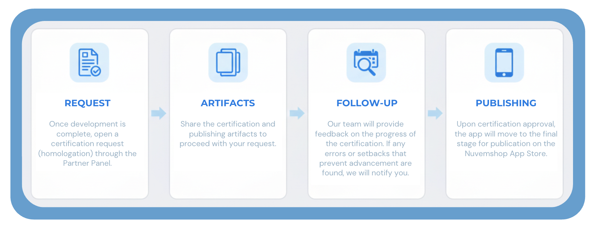

## App Homologation Process - Nuvemshop

### What is an app homologation?

Homologation is the process of **validating and certifying** an application within the Nuvemshop ecosystem.

This process ensures that the app meets the expected technical and functional criteria, guaranteeing an efficient and secure integration.

Depending on the type of application developed, homologation may proceed in different ways, being:

Applications of type **ERP**, **Payments**, and **Shipping**, which handle sensitive data and have higher complexity, will go through a more complementary validation. In these cases, our team will send a functionality and usability guide script that must be demonstrated, so we can validate the application based on the defined checklist.

For other types of applications, such as marketing tools, etc., they have lower complexity as they do not handle sensitive data transactions. In this case, our team can install the app in internal stores and perform tests and validations directly in the app.

### Visibility and Next Steps

 

:::warning Important
If discrepancies, difficulties, or anything that prevents our team from continuing with homologation are found, we will contact you within your request.
:::

 

### Homologation Process

- Once all artifacts are submitted, the team will analyze the inputs and perform the necessary tests.
- If all criteria are met, the app will move to the publication stage, and you will receive further information for tracking.
- If issues are identified during tests based on the submitted artifact, we will provide feedback listing each point to adjust.
- After making the adjustments, the partner must return through the same channel with the evidence, so we can revalidate the scenarios.
- This cycle will repeat until all necessary adjustments are completed, ensuring the app's quality before publication.

### Homologation process for ERP, Payments, and Shipping types

- Through your homologation request, our team will send a guide script for recording a video demonstrating the requested steps.
- With these demonstrations, we will validate all points on the *checklist*, ensuring a more robust and complete process.
- If the checklist is validated and no adjustments are needed, the app will move to the publication stage in the App Store.
- If adjustments are required, they will be recorded on the checklist and can be accessed by the partner in the ‘Action Plan’ tab.
- After implementing the adjustments, a new demonstration must be sent as evidence to validate pending points.
- This process will repeat until all points are completed, allowing the app to proceed to App Store publication.

\*Checklist = document containing the required scopes and processes, used as a guide during homologation.

Apps that do not handle sensitive data allow internal tests and validations (since they do not perform real merchant data transactions), in which the technical team will analyze the submitted artifacts and perform tests in the app.

Feedback from this analysis, as well as any necessary communication, will be provided directly within the open request.

Therefore, it is extremely important to follow the flows indicated below to ensure an agile, coherent homologation process that meets Nuvemshop standards.

**The stages are:**

1. **Request submission:** with development completed, submit the homologation request
2. **Artifacts:** Share homologation and publication artifacts
3. **Tracking:** Our team will provide feedback on homologation progress. Stay alert; if our team finds errors or issues preventing progress, you will be notified.
4. **Publication:** upon homologation approval, the app will move to the final stage, for publication in the App Store.

## 1. Homologation Request Flow

To ensure an efficient and organized process, follow the flow below for asynchronous app homologation on the platform:

### 1.1. Homologation Request

- Access the app page in your partner panel.
- Click on "Request homologation."
- The platform will send a communication informing the next steps.

### 1.2. Artifact Submission

- After receiving feedback from our team, you must submit the artifacts according to the [mandatory requirements](https://dev.nuvemshop.com.br/docs/homologation/requirements)
- Make sure to include all necessary elements for a complete evaluation.

### 1.3. Artifact Validation

- The **homologation team** will review each submitted item.
- **Installation and configuration reproduction** of the app will be performed, ensuring a smooth and intuitive merchant experience.
- The process will follow **API usability best practices**, ensuring adherence to expected standards.

### 1.4. Homologation Feedback

- The partner must **wait for the stipulated period** (informed in the first contact from our team) to receive feedback through the same communication channel.
- If all tests are successfully validated, the app will move to the **publication phase**.
- If **pending issues, access limitations, or bugs are identified, the homologation team will provide a detailed report** with necessary adjustments.
- The partner must make the corrections and return with evidence that the issues have been resolved.
- After this stage, the app will proceed to **App Store publication**.

For ERP, Payments, and Shipping apps handling sensitive data and higher complexity, an additional validation stage with complementary demonstrations will occur.

## 2. Initial Validation

- The **homologation team** will perform initial validation of the submitted artifacts.
- **Installation and configuration reproduction** of the app will be carried out, ensuring an intuitive experience aligned with API best practices.

## 3. Demonstrative Flow Stage

- The homologation team will share a script with a descriptive step-by-step guide of stages that require more detailed demonstration.
- This ensures that all processes, integrations, and flow effectiveness are shown.
- Shared demonstrations in the script will be reviewed **against each checklist item** used during app development.
- We will ensure all points are correctly implemented and function as expected.

## 4. Adjustment Logging (If Needed)

- If pending items are identified in the checklist, they will be recorded in the "Action Plan" tab of the checklist.
- Through this checklist, you should track points that need correction.

## 5. Re-Validation and Publication

- After making necessary corrections, share a new demonstration video of the adjusted steps for **re-validation** with the homologation team.
- This process will repeat until all adjustments are completed.
- Once all items are successfully validated, the app will move to **App Store publication**.

### Homologation Process Checklist

The **checklist** will be used as a **guide for the app homologation process** for the following types:

<ul>
    <li><a href="https://docs.google.com/spreadsheets/d/1Pf-6Bbr8ebQGNoqkMuyK5DylP66n8FLInYbbJVRyb5Y/edit?usp=sharing" target="_blank">ERP</a></li>
    <li><a href="https://docs.google.com/spreadsheets/d/14K4y3GTYL-NDhHQOP1XTe-Clsh-UcFC6aevyVq59CoY/edit?usp=sharing" target="_blank">Payments</a></li>
    <li><a href="https://docs.google.com/spreadsheets/d/1dgKY2Ze9ZB4bqIXDuGiJzdVCCNEZgtO7BodrunRGowI/edit?usp=sharing" target="_blank">Shipping</a></li>
</ul>

We share this checklist in advance so the team is prepared for the stages to be validated and is aware of potential mandatory items that may impact app approval.

It is worth emphasizing that this script and checklist validation stage ensures:

- Compliance with platform rules;
- Functional and integration testing via API;
- User experience and usability;
- Security and performance.