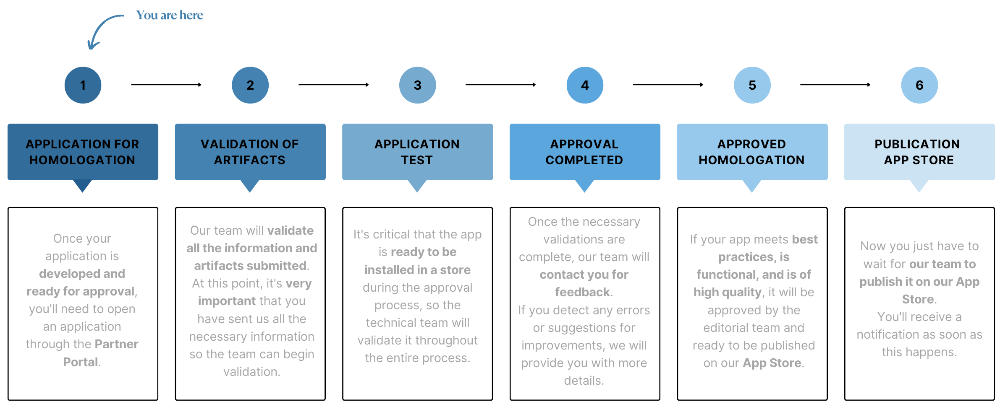

## App Homologation Process - Nuvemshop

### 💡 What is app homologation?

Homologation is the process of **validation and certification** of an application within the Nuvemshop ecosystem.

This process ensures that the app meets the expected technical and functional criteria, guaranteeing an efficient and secure integration.

Depending on the type of application developed, the homologation may proceed in different ways, as follows:

Applications of the **ERP**, **Payments**, and **Shipping** types, which deal with sensitive data and have higher complexity, will undergo a more comprehensive validation. In these cases, our team will send a functional and usability guide script that must be demonstrated, allowing us to validate the application based on the defined checklist.

For other types of applications, such as marketing tools, utilities, etcs, they have lower complexity because they do not handle sensitive data transactions. In this case, our team will be able to install the application in internal stores and perform tests and validations directly within the application.

### 💡 Visibility and Next Steps

 

:::warning Important
If any discrepancies, difficulties, or anything that prevents our team from proceeding with the homologation are found, we will contact you within your request.
:::

 

### 💡 Homologation Process

- Once all artifacts are submitted, the team will analyze the inputs and perform the necessary tests.
- If all criteria are met, the app will proceed to the publication stage, and you will receive further information for tracking.
- If issues are identified in the tests based on the submitted artifact, we will provide feedback listing each point that needs to be adjusted.
- After the adjustments are made, the partner must return via the same channel with the evidence so we can revalidate the scenarios.
- This cycle will repeat until all necessary adjustments are completed, ensuring the quality of the app before publication.

### 💡 Homologation Process for ERP, Payments, and Shipping types

- Through your homologation request, our team will send a guide script so you can record a video demonstrating the requested steps.
- With these demonstrations in hand, we will validate all points of the *checklist*, ensuring a more robust and complete process.
- If the checklist is validated and no adjustments are required, the app will proceed to the publication stage in the App Store.
- If adjustments are needed, they will be recorded in the checklist and can be accessed by the partner in the ‘Action Plan’ tab.
- After implementing the adjustments, a new demonstration must be submitted as evidence so we can validate the pending points.
- This process will be repeated until all points have been completed, allowing the app to proceed to publication in the App Store.

::: info Checklist
Document containing the mandatory scopes and processes, which will be used as a guide during the homologation process.
:::