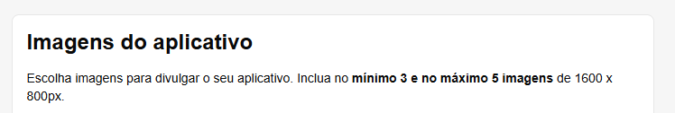
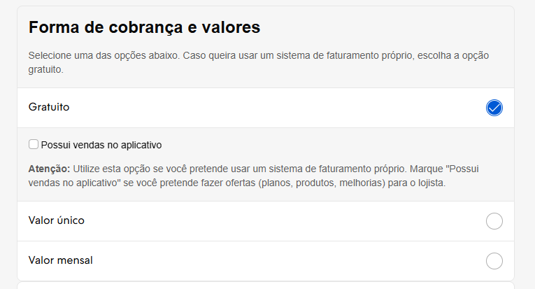

# Mandatory requirements

## 1. App images

* Download the promotional images for the app from **“App Images”**, which will only be approved if they are the correct required size of **1600 x 800px**.

These images should showcase the app's screens and highlight its main features, sparking the retailer's interest in installing it. The same images are shared across all languages, so if your app is published in all countries, the text in the images must be in both Portuguese and Spanish.

## 2. Application icon

Download the app icon from **“Icon”**, which will only be approved if it is the correct required size of **600 x 600px**. This image will be your app’s logo.

## 3. Billing method

* In **“App store languages”**, select the country where the app will be published, then fill in all the requested fields.
* Select the type of payment to be used under **“Billing method”**:
    - Free (partner's own billing, with or without the option of having **“In-app Sales”**)
    - One-time fee (Nuvemshop billing, one-time fee)
    - Monthly fee (Nuvemshop billing, monthly fee)

## 4. App profile description

* In the **"Information"** section, fill in the application description fields. This is the most important part. The information in the **"short"** and **"long"** description fields will be your app's showcase in the App Store — what merchants will see and what will encourage them to install it.

Nuvemshop has created a guide to ensure your description includes as many keywords as possible, guaranteeing good performance in App Store searches when merchants look for a feature or need that your app solves. Use this exact structure:

**App profile description**

Full App Description Template - Nuvemshop

**App name:** App "X"

**Short description field:** [Enter a description that summarizes the function of your app with up to 64 characters (including spaces)].

Example: Cheaper shipping with the best carriers in the country.

**Full description field**

1. **Introduction:**

Clearly state your app's value proposition and its competitive advantage in the market. This will encourage merchants to continue reading.

Example: “App X is the solution for digital entrepreneurs who need cheaper and more flexible shipping for their online store. Enjoy complete integration with the postal service and the country’s main carriers without needing a contract. It also includes exclusive features such as shipping quotes, label generation, and pickup scheduling.”

If you have one, you can insert a short video introducing the app. Audiovisual media enriches your page and encourages users to stay longer on the page.

2. **What is App X?**

Get straight to the point and explain what your app does and the impact or ease it brings to the merchant.

Example: “App X is an app developed by [company name] to facilitate the integration of your Nuvemshop online store with various Brazilian shipping companies. You only need to install the app to access numerous shipping options and find faster and cheaper solutions to send your products.”

3. **How does App X work?**

Be direct and use bullet points to facilitate reading and understanding.

Example: “App X connects your online store to carriers throughout the country, with coverage for more than 3,000 municipalities.”

* You have the option to schedule pickups and also set up reverse logistics.
* Allowed packages must have dimensions of up to **80cm x 80cm x 80cm** and weigh up to **30 kg**. Check the coverage area at this link.

4. **What are the features of App X?**

Be direct and use bullet points to make reading and understanding easier.

Example: “App X offers the following features:

* Shipping carrier search based on product and delivery profile;
* Direct integration with freight rate tables;
* Creation of cheaper shipping and free shipping promotions;
* Label generation;
* Automatic sending of shipping and delivery emails;
* Online order tracking.”

5. **Advantages of installing the X App**

Be direct and use bullet points to make reading and understanding easier.

Example: “You have the following advantages when you install App X on your Nuvemshop:

* Cheaper and more competitive shipping rates;
* Centralization of all logistics activity in a single app;
* Tracking of orders at all stages of shipment;
* Greater coverage in Brazil for logistics operators;
* Simplified shipping cost calculation in your online store.”

6. **Plans and Pricing for Nuvemshop Merchants**

If possible, please detail the plans and prices, as well as any specific offers for Nuvemshop customers.

Example: “You can try App X for free for 30 days and choose from the following plans:

* Essential plan for $59/month;
* Control plan for $99/month;
* Complete plan for $199/month.

See more details about plans and prices at this link.”

7. **How do I integrate App X with Nuvemshop?**

Provide a step-by-step summary of how to install the application.

*Example: “To integrate App X with your Nuvemshop store, just follow the steps below:*
* Click on **“Install App”**;
* Accept the app permissions;
* Create an account on App X;
* Validate the code in your Nuvemshop dashboard;
* Done! You can now use App X to get cheaper shipping.”

If you have any questions, check out the step-by-step instructions on how to install the X App. (Link)

8. **Support for the merchant**

Please provide all support channels, as well as response SLAs and hours of operation.

Example: “If you have any questions, please contact us through the following customer service channels:
* By email: **suporte@app.com** — average response time of 24 hours;
* Online chat via the website — Monday to Friday from 9 am to 6 pm and Saturdays from 9 am to 3 pm;
* WhatsApp at xx-xxxx-xxxx — Monday to Friday from 9 am to 6 pm and Saturdays from 9 am to 3 pm;
* Phone: xx-xxxx-xxxx — 24-hour service.”

## ⭐ Good practices for these forms

Follow the structure of the application description guide above exactly.

You also have the option of using Nuvemshop's Artificial Intelligence Agent, the **"App Description Generator in the Nuvemshop App Store"**, to help you create this complete description quickly and easily.

1. Access the ChatGPT agent **[“Tiendanube Appstore Description Generator”](https://chatgpt.com/g/g-684a0c4e5ee8819199c155f69f465e4e-tiendanube-appstore-description-generator)**. Clicking the link will start the interactive generation of the long description.
2. **Define the information sources:** insert the URL of your app's official website, links to articles or tutorials from the Help Center, and/or upload a document (PDF or DOCX) with an overview of the features, ensuring coverage of all sections of the guide (purpose, benefits, features, etc.).
3. **Specify the publication regions and specific details:** indicate the countries where the app will be available and detail any differences in features by region (for example, a tax module active only in Chile), so that the agent can adapt the content accordingly.
4. **Please wait for the generation of SEO-optimized HTML blocks for embedding:** the agent will deliver, directly in the chat, an HTML code block for each defined country, preceded by a comment. These blocks will be ready to be incorporated into the existing application page, respecting the heading hierarchy and avoiding element conflicts, adapted to the local language, such as Portuguese for Brazil or Spanish for Argentina.
5. **Publish in the Nuvemshop integration panel:** copy each returned HTML block and paste it into the description field corresponding to each country in the integration editor; then save and publish the changes.

## 5. FAQs (Frequently Asked Questions)

It is mandatory to provide the Nuvemshop team, during the approval phase and along with the other shared artifacts, with the FAQ document containing the most frequently asked questions about your application.

Pay special attention to support contacts (level 1, level 2, technical, and commercial) and the availability of trial accounts.

Nuvemshop has created a template for each category for standard use, which you should use as a guide.

* The questions in the FAQ document should vary depending on your application category.
* Copy the document template below and share it with your homologation request.

> ▶️ **FAQs ERP**  
[Template FAQ ERP](https://docs.google.com/document/d/132lUrxGcUTn0UaUcUnahFOaT8OtsF7vA3kpgdE932JM/edit?tab=t.0)

> ▶️ **FAQs Payment Methods**  
[Template FAQ Payments](https://docs.google.com/document/d/1nuBFVAL9JsH1TaNSGBHm2VJdBBi6A50ACv_wcjc5WGI/edit?tab=t.0)

> ▶️ **FAQs Logistics Resources**  
[Template FAQ Shipping](https://docs.google.com/document/d/1ZWSWyVp0X3mxOMzbuP8d0_JXFeu1stOebWQ63wvE_34/edit?tab=t.0)

> ▶️ **FAQs Marketing and other categories**  
[Template FAQ Marketing and other categories](https://docs.google.com/document/d/1RMy2SpqRm2k1QVPBjngeMePFWb3RdObvdcg7wACIrjQ/edit?tab=t.0)