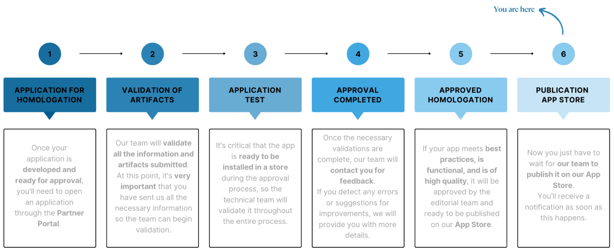

# App Publishing Process

Nesta seção, forneceremos um guia passo a passo para que você possa publicar seu aplicativo na [Nuvemshop App Store](https://www.nuvemshop.com.br/loja-aplicativos-nuvem).

Para que a aplicação seja publicada, existem dois passos a serem realizados, de forma **independente e em paralelo**:

### Step 1: Sending the artifacts

* Once the homologation request is made, you will receive an email with instructions and a request to send files.
* These files are called **artifacts**, which will include files related to the homologation workflow and others related to the publication workflow.
* All these files, that is, the complete artifact, must be sent so that the team can begin validating the application.

:::warning
 
**Attention:** the approval and publication phase only begins after all artifacts have been submitted.
 
:::

### Step 2: Filling in the application data

- It is necessary to fill in all the required fields in the Nuvemshop Partner Panel, in the "Publication Data" section.
- This will ensure that your application has all the data already filled in and, consequently, will be published more quickly in the Nuvemshop App Store.

This documentation will provide you with guidance on how to complete all the steps.

## Publishing an app on Nuvemshop

Through the **"Publication Data"** section, you can publish your application to be made available in the Nuvemshop App Store.

* Within the dashboard, click on "Publication data" and then "Edit data" to continue.

* Make sure all the **"URLs and contact"** and **"Application handle"** fields are properly filled in.

