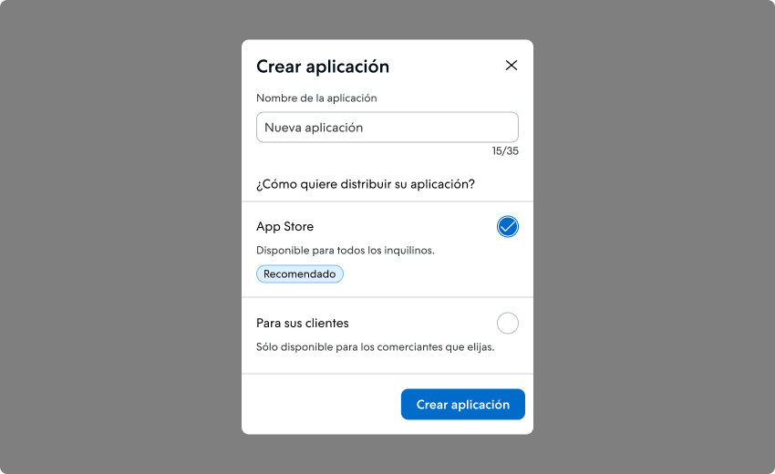
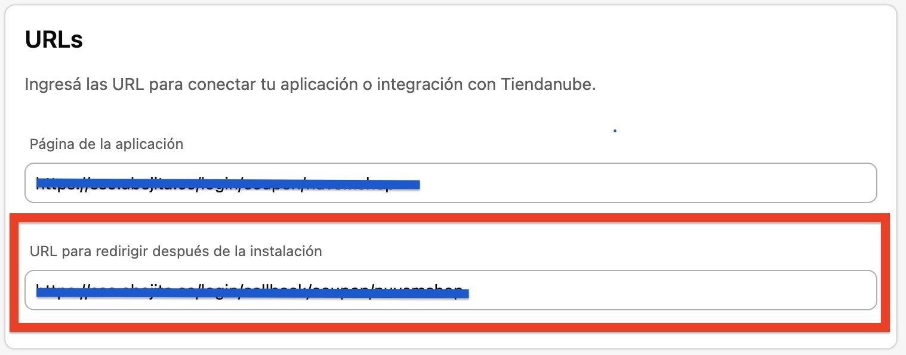
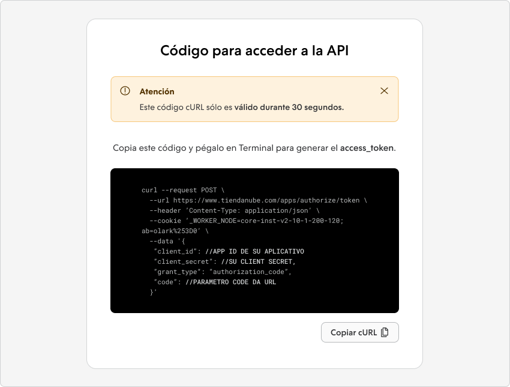
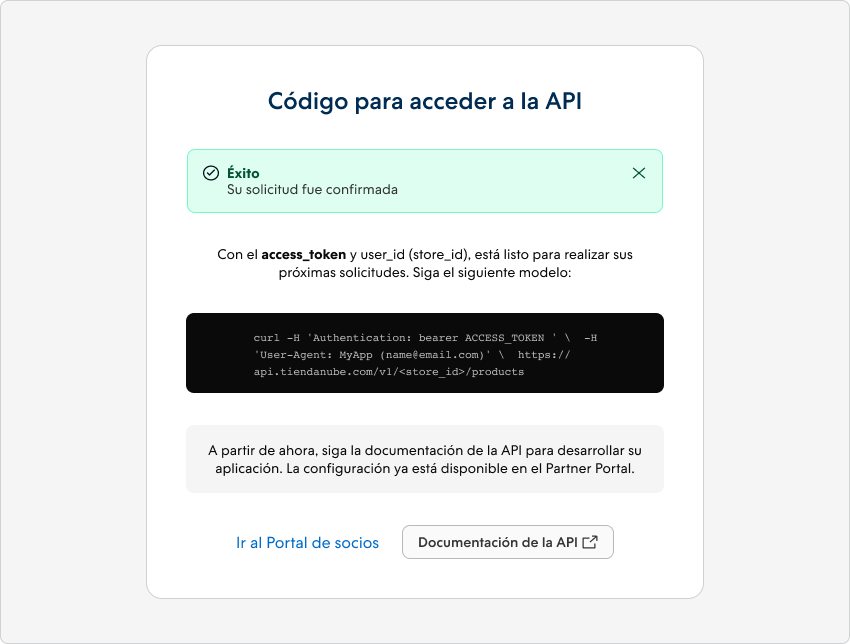
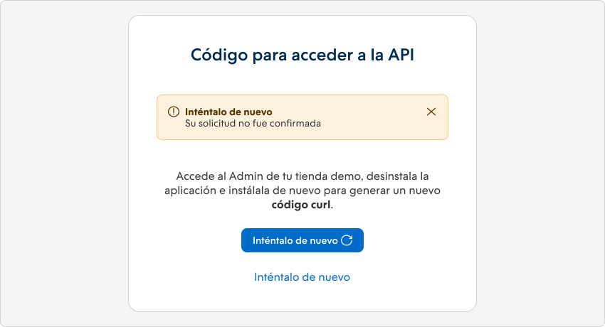

import { Alert } from '@nimbus-ds/components';

# Autenticación

Este guía presenta métodos de autenticación de aplicaciones con la plataforma Tiendanube. Descubre cómo garantizar seguridad y acceso autorizado para integraciones perfectas entre tus aplicaciones y nuestra plataforma.

## Autenticación de la API

La autenticación y autorización del usuario se proporcionan mediante una implementación restringida de OAuth 2. Actualmente, solo admitimos el flujo de ["Código de Autorización"](https://oauth.net/2/grant-types/authorization-code/) para otorgar acceso. Al seguir este flujo, obtienes [tokens de acceso](https://oauth.net/2/access-tokens/) que no caducan y permanecen válidos hasta que se renuevan.

## Tokens de Acceso e Identificación

Los tokens de acceso que proporcionamos no tienen fecha de vencimiento. Solo se vuelven inválidos cuando se obtiene un nuevo token o cuando el usuario desinstala la aplicación. Junto con el token de acceso, también se proporciona un `user_id`, que corresponde al ID de la tienda. Este `user_id` es esencial para realizar solicitudes a nuestra API y también se puede utilizar para autenticar a los usuarios de la aplicación en tu sitio.

La autenticación es un paso fundamental para acceder a nuestros servicios a través de la API. Asegúrate de incluir el `user_id` en tus solicitudes para garantizar una autenticación y autorización adecuadas.

## Tipos de Métodos de Autenticación

La elección del método de autenticación depende del tipo de aplicación que estás desarrollando:

- Si estás creando aplicaciones independientes, ya sea con o sin nuestra plantilla, es necesario utilizar OAuth 2.
- Para aplicaciones que se integran con el administrador de Tiendanube utilizando Nexo, se utilizan tokens de acceso generados en el administrador de Tiendanube.

Nuestros modelos de creación de aplicaciones ya incluyen un sistema de autenticación integrado con nuestra API. Esto reduce significativamente el tiempo de desarrollo para nuestros socios que eligen utilizar estas plantillas. Sin embargo, si el socio decide no usar una de nuestras plantillas, es posible realizar la autenticación manualmente. A continuación, te mostraremos cómo se puede hacer de manera efectiva.

## Obtención del token de acceso

<br />

### Creación de la Aplicación

<br />

Dentro del panel de socio acceda a:

Aplicaciones > Crear Aplicación

Complete el nombre de la aplicación y seleccione la opción de distribución de la aplicación:

- Tienda de Aplicaciones: Disponible para todos los comerciantes.

- Para sus clientes: Disponible solo para los comerciantes elegidos por usted.



Después de la creación, verá el mensaje de éxito que contiene el `app_id`.

## Datos Básicos
<br />

- Haga clic en "Editar datos"

<Alert appearance="warning" title="Atención"> En Datos Básicos, el enlace generado automáticamente en el campo URL de redireccionamiento después de la instalación sirve solo para apoyar en las pruebas, pero no debe usarse en producción. </Alert> 
<br/> 

Reemplace esta URL por la URL de su aplicación que estará lista para recibir nuestro código que se generará, para que usted, socio, realice el POST/Authorization. 
<br/> 
<br/>


<br/>

- Complete la información de la aplicación

- Asegúrese de activar solo los permisos necesarios. Alcances innecesarios pueden resultar en la **reprobación** durante el proceso de homologación.

- Para garantizar la homologación de su aplicación, es **obligatorio** que consulte la documentación sobre webhook disponible en nuestra documentación API. Utilice los webhooks siempre que sea necesario, con el objetivo de reducir el pulling.

- No olvide guardar toda la información completada.

<br />

### De Vuelta al Panel de la Aplicación
- Encuentre el `app_id` y el `client_secret` en la parte superior derecha, en el área <u>Claves de Acceso</u>.

- Seleccione su tienda demo para pruebas durante el desarrollo de la aplicación.

Instale la aplicación para conectarse con la API usando la URL:

`https://www.tiendanube.com/apps/{app_id}/authorize`

<br />

<Alert appearance="warning" title="Atención"> Al concluir el proceso de obtención, recibirá un código cURL, esencial para generar el access_token. Es importante destacar que este código tiene una validez de solo 5 minutos. Asegúrese de utilizarlo dentro de ese período para garantizar un acceso exitoso. </Alert>

<br />

### Realizar la Solicitud con el Código cURL

Después de completar la instalación, serás redirigido a una nueva página que contiene el código cURL necesario para generar tu `access_token`. Simplemente copia este código y realiza la solicitud utilizando la herramienta de tu elección.



La estructura del cURL generado consta de:

- **client_id**: El ID de la aplicación;
- **client_secret**: Tu secreto de cliente;
- **code**: El código obtenido en la URL después de instalar la aplicación en la tienda de demostración.

Este paso es fundamental para obtener con éxito el access_token y garantizar el acceso autorizado a nuestra plataforma.

Si la solicitud tiene éxito, recibirás una respuesta en un formato similar a este ejemplo:



```javascript
{
    "access_token": "88a2fdd17e10327ed96f4f2dc96b00bca60dfe60",
    "token_type": "bearer",
    "scope": "write_products",
    "user_id": 2093261
}
```

Puedes armar manualmente el comando cURL en función del ejemplo proporcionado. Aquí tienes el comando cURL para realizar la solicitud POST utilizando la información mencionada:

```bash
curl -X POST "https://www.tiendanube.com/apps/authorize/token" \
-d "client_id=client_id" \
-d "client_secret=client_secret" \
-d "code=code"
```

Asegúrate de reemplazar `client_id`, `client_secret` y `code` con los valores correctos de tu aplicación creada en el Portal de Socios.
Recuerda que puedes ejecutar este comando en una terminal o en una herramienta que admita cURL para probar la solicitud y obtener el access_token.

### Cómo obtener un nuevo código cURL

Para hacerlo, sigue estos pasos:

1. Cuando recibas la alerta que indique que la solicitud no se ha confirmado, haz clic en el botón **Intentar de nuevo**.
2. Serás redirigido a la sección **Mis aplicaciones** en el administrador de tu tienda de demostración.
3. En el administrador de tu tienda de demostración, en la sección **Mis aplicaciones**, verifica si la aplicación está instalada. Si está instalada, procede a [desinstalarla](./overview.md#desinstalando-un-aplicativo).

Si la solicitud falló debido a la caducidad del código cURL o algún error, puedes obtener un nuevo código [desinstalando](./overview.md#desinstalando-un-aplicativo) y [reinstalando](./overview.md#instalando-seu-aplicativo) tu aplicación en la tienda nuevamente.



Siguiendo estos pasos, podrás obtener un nuevo código cURL válido y continuar con éxito el proceso de [autenticación](./authentication#obtendo-o-token-de-acesso). Asegúrate de seguir las instrucciones cuidadosamente para evitar problemas futuros.

---

## Próximos pasos

- Aprende más sobre [Aplicaciones](./overview.md)
