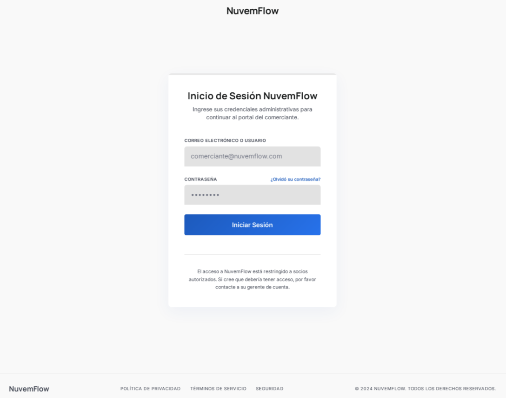
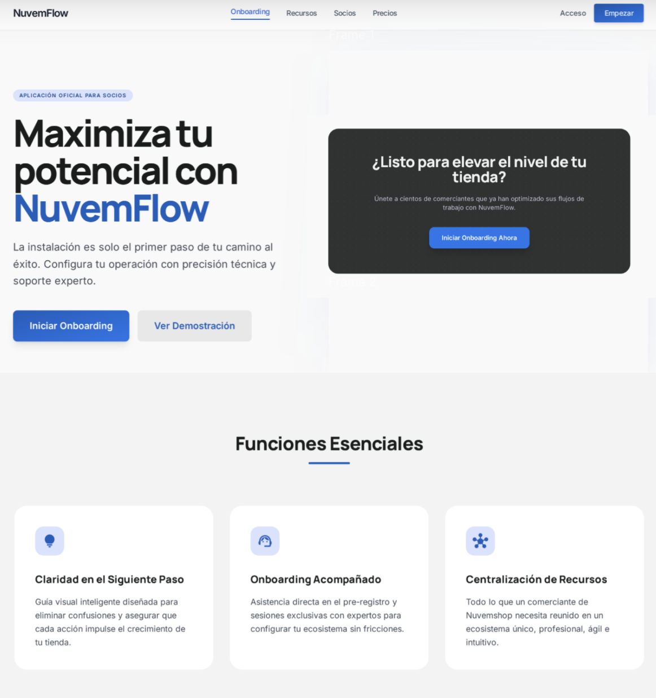

# Landing Page

La instalación de la aplicación representa solo el primer paso del recorrido del socio. Para aquellos que ingresarán en un flujo de gestión y onboarding acompañado, la visualización de una **Landing Page** proporciona mayor **claridad, alineación y comprensión de los próximos pasos** para el merchant.

## 🎯 Funciones Esenciales de la Landing Page

### 1. Claridad y Dirección del Próximo Paso

- Después de la instalación, la Landing Page debe actuar como una **guía visual**, orientando al merchant sobre las próximas acciones.
- Esta dirección es esencial para evitar la caída del engagement inmediatamente después de la instalación de la aplicación.

### 2. Preparación para el Onboarding Acompañado

- En flujos que requieren gestión y acompañamiento, la Landing Page debe ser el punto central para que el socio:
  - complete el **pre-registro**;
  - agende el primer contacto (cuando corresponda); o
  - obtenga la información de que el equipo responsable se pondrá en contacto.

### 3. Centralización de Recursos

- La Landing Page funciona como un **hub temporal**, centralizando la documentación esencial, como **FAQs, videos tutoriales y políticas de asociación**.
- Esto optimiza la conexión con el merchant, permitiendo que obtenga, de forma **self-service**, el conocimiento inicial necesario sobre procesos y próximos pasos.

Sin una etapa intermedia de orientación, corremos el riesgo de generar un abandono del merchant en el uso de la aplicación. A continuación, comparamos dos escenarios de flujo post-instalación:

### ▶️ Escenario 1: Instalación Directa (sin landing page)

En este modelo, el merchant instala la app y es inmediatamente confrontado con la pantalla de Login/Autenticación.

- **El Problema:** Si el merchant descubrió la app a través de la App Store y aún no posee una asociación comercial o cuenta activa, encontrará una barrera infranqueable.
- **La Frustración:** ¿Cómo obtiene las credenciales?
  - ¿Existe un portal de registro?
  - ¿Dónde están los canales de soporte o ventas?
- **Consecuencia:** Sin instrucciones claras, el merchant desinstala la aplicación por no saber cómo continuar con la asociación, resultando en pérdida de oportunidad de negocio.
- **La Falla de Experiencia (UX):** En muchas implementaciones, la solución adoptada es la redirección directa al sitio institucional. Esta práctica no es considerada una buena experiencia, ya que:
  - **Ruptura de Contexto:** El usuario es removido abruptamente del entorno nativo de la aplicación hacia un navegador externo, generando desorientación.
  - **Fricción de Conversión:** El esfuerzo requerido para salir de la app, completar registros en otro sitio y luego volver a la app aumenta drásticamente la tasa de abandono.
  - **Percepción de Valor:** La app deja de parecer una herramienta de trabajo y pasa a ser vista solo como un "atajo" a un sitio, disminuyendo la relevancia de la instalación.

   

### ▶️ Escenario 2: Flujo Optimizado (con landing page)

Al incluir una Landing Page inmediatamente después de la instalación, ofrecemos un mapa claro para dos perfiles distintos de usuarios:

1. Para el usuario que ya es socio, la landing page ofrece un camino directo y rápido.
   - **Acción:** Botón de "Ya soy socio / Iniciar sesión".
   - **Resultado:** Experiencia fluida y sin fricción para quien ya sabe qué hacer.
2. Para el prospecto (nuevo usuario), donde la landing page actúa como una guía de onboarding.
   - **Acción:** Botón de "Quiero ser socio" o "Saber más".
   - **Flujo de Onboarding:**
     - **Visibilidad:** Presentación rápida de los beneficios de la app.
     - **Próximos Pasos:** Instrucciones claras sobre cómo iniciar la asociación comercial.
     - **Conversión:** Dirección a un formulario de contacto, WhatsApp de ventas o página de pre-registro.

     

## ✨ Beneficios del Flujo

- **Aumento de la tasa de activación:** Socios bien informados y correctamente dirigidos presentan mayor probabilidad de completar el onboarding y convertirse en usuarios activos de la aplicación.
- **Calificación anticipada:** La Landing Page puede incluir formularios que ayudan en la calificación y segmentación del socio, permitiendo un enfoque más personalizado antes del primer contacto.
- **Experiencia profesional y confiable:** Un flujo estructurado transmite profesionalismo y confianza, reforzando el valor de la asociación y de la aplicación desde el inicio.
