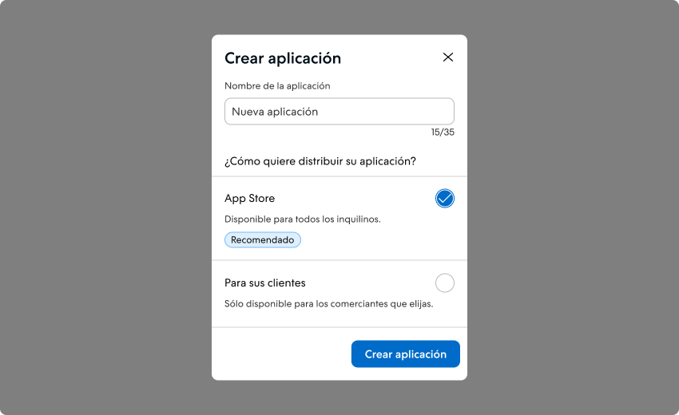
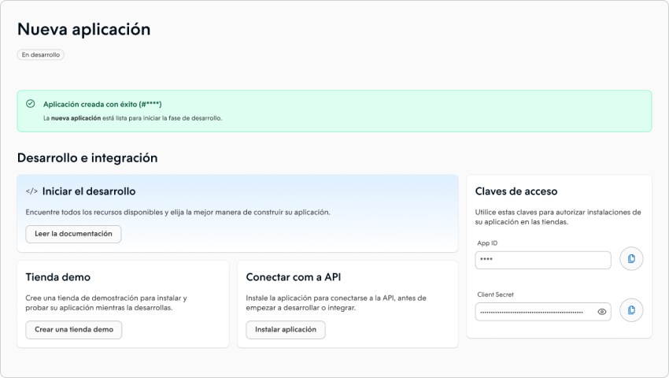
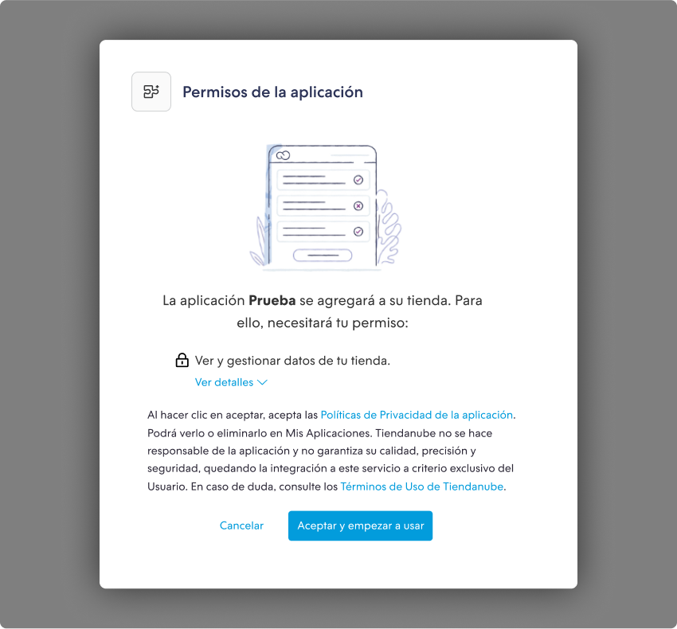
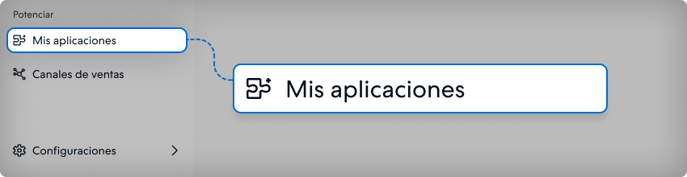
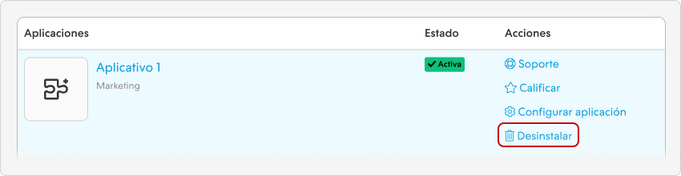
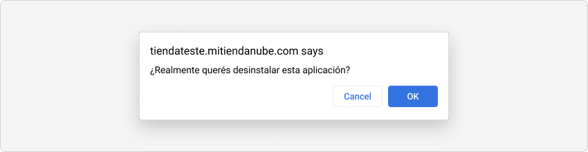
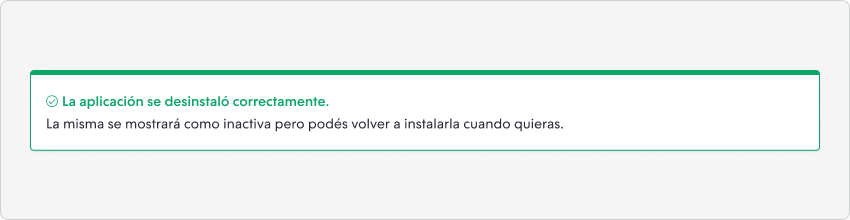

import { Alert, Text, Box } from '@nimbus-ds/components';
import AppTypes from '@site/src/components/AppTypes';

# Visión general

## Plazo de adopción del NubeSDK

<Alert appearance="warning" title="📅 30 de agosto de 2026 — el uso del NubeSDK pasa a ser obligatorio para nuevas instalaciones">
   <Text>A partir del <Text as="span" fontWeight="bold">30 de agosto de 2026</Text>, las apps que no estén desarrolladas con el <Text as="span" fontWeight="bold">NubeSDK</Text> no podrán recibir nuevas instalaciones. Las tiendas que ya tienen la app instalada <Text as="span" fontWeight="bold">no se verán afectadas</Text>. Estamos llevando progresivamente todas las tiendas al modelo con SDK.</Text>
    
   <Text>👉 <Text as="span" fontWeight="bold">¿Quieres validar tu app antes del plazo?</Text> <a href="https://docs.google.com/forms/d/e/1FAIpQLScaGFRHmLgGf-PnoXjPz8MdOcrtAM7PLmP6-LjmIXdEs-Uphw/viewform" target="_blank" rel="noopener noreferrer">Solicita la tag de SDK en tu tienda de prueba a través del formulario</a> y valida tu app en el nuevo modelo de forma self-service, sin esperar a que el rollout llegue a tu tienda.</Text>
    
   <Text>Si aún no migraste, comienza por la <a href="./nube-sdk/migration-guide"><Text as="span" fontWeight="bold">Guía de migración al NubeSDK</Text></a>.</Text>
</Alert>

 

**Qué cambia y qué no cambia:**

- ✅ **30 de agosto de 2026** — las nuevas instalaciones quedan **bloqueadas** para apps sin SDK.
- ✅ **30 de octubre de 2026** — inicio de la **deprecación y desinstalación progresiva**, con recomendación de app alternativa a los comerciantes.
- ✅ Las tiendas con la app ya instalada **continúan funcionando normalmente** después del 30/08/2026 (hasta la etapa de deprecación).
- ✅ El **proceso de homologación en sí no cambia** — solo se agrega la verificación de uso del SDK. Consulta la [visión general de la Homologación](../homologation/overview.md) y los [Requisitos de Homologación](../homologation/requirements.md#4-uso-del-nubesdk).

 

En esta sección, proporcionaremos una guía paso a paso para que pueda crear una aplicación e integrarla en la plataforma Tiendanube. Antes de comenzar el desarrollo de su aplicación, es necesario crear una cuenta en el Portal de Socios de Tiendanube. Aprenda cómo crear su cuenta en el 📝 Guía: [detalles del programa de Socios Tecnológicos de Tiendanube](https://ayuda.tiendanube.com/es_ES/socios-tecnologicos/como-creo-una-aplicacion-para-tiendanube).

## Creación de una aplicación en Tiendanube

A través de nuestras herramientas, puede crear una aplicación para ser incluida en la 📱 [Tienda de Aplicaciones de Tiendanube](https://www.tiendanube.com/tienda-aplicaciones-nube).

De esta manera, los comerciantes tienen visibilidad de la herramienta y pueden instalarla en sus tiendas en línea, lo que aumenta el reconocimiento de su servicio.

1. Acceda al 👉 [Portal de Socios](https://partners.tiendanube.com) e inicie sesión en su cuenta utilizando sus credenciales de acceso.

2. Después de iniciar sesión, será redirigido al panel de socios.

3. Dentro del panel, haga clic en **"Crear aplicación"** para continuar.

4. Se mostrará una nueva pantalla donde deberá ingresar el nombre de su aplicación y seleccionar cómo desea ponerla a disposición.

   

   Tenemos dos opciones para la disponibilidad de su aplicación:

   - **Tienda de Aplicaciones**: Si desea que la aplicación esté disponible en nuestra tienda oficial, elija esta opción. Después de que se complete el proceso de homologación, la aplicación estará disponible en la tienda, lo que permitirá que cualquier comerciante la instale, pruebe o compre.

   - **Para Sus Clientes**: Con esta opción, no es necesario pasar por el proceso de homologación. Sin embargo, su aplicación solo estará disponible para los comerciantes que seleccione.

5. Al hacer clic en **"Crear aplicación"**, lo llevaremos a la página dedicada a su aplicación.

   

   La página de su aplicación se divide en 3 secciones:

   - **Desarrollo y Pruebas**: En esta sección, encontrará la información necesaria para desarrollar y probar su aplicación antes de ponerla a disposición de los comerciantes de su elección o antes de solicitar la homologación.

   - **Editar aplicación**: En la sección de edición de la aplicación, puede personalizar y ajustar la configuración de su aplicación. Por ejemplo: agregar características, establecer preferencias y realizar los cambios necesarios para hacer que su aplicación sea aún más atractiva y funcional.

   - **Métricas de Seguimiento**: Esta sección está dedicada al seguimiento del rendimiento de su aplicación. Aquí encontrará datos y estadísticas relevantes. Utilice estas métricas para optimizar y mejorar constantemente la experiencia de su aplicación.

Ahora que ha creado su aplicación, es hora de avanzar a la etapa de desarrollo y pruebas. ¡Es hora de poner manos a la obra de verdad! Vamos a explorar el proceso de desarrollo y asegurarnos de que esté listo para crear su aplicación para Tiendanube.

## Desarrollo y Pruebas de su Aplicación

En esta sección, proporcionaremos toda la información esencial para autenticar su aplicación con la API de Tiendanube, aprovechar nuestros servicios, realizar ajustes y probar la funcionalidad de la aplicación en una tienda de demostración antes de ponerla a disposición. Prepárese para sumergirse en el desarrollo y garantizar una aplicación de calidad para nuestros comerciantes.

### Tienda de demostración

Para continuar con la instalación de su aplicación y llevar a cabo el proceso de autenticación, es necesario tener una tienda de prueba. Si aún no tiene una tienda de prueba, haga clic en **"Crear tienda de demostración"** para crear su primera tienda de prueba.

Esta tienda de demostración le permitirá realizar pruebas de funcionamiento de la aplicación en un entorno controlado antes de ponerla a disposición de los clientes.

<Alert appearance="primary" title="📌 Observación">
   Recuerde que esta tienda es solo para pruebas y tiene algunas limitaciones.
</Alert>

 

### Claves de acceso de su aplicación

Las claves de acceso son esenciales para iniciar el proceso de autenticación de su aplicación con nuestra API.
Estas claves proporcionan la autorización necesaria para que su aplicación se comunique con nuestros servicios y obtenga los datos y recursos esenciales para su funcionamiento adecuado.

### Instalación de su aplicación

Si tiene una tienda de demostración, haga clic en el botón **Instalar aplicación**. Será redirigido al inicio de sesión de su tienda de demostración. Utilice las mismas credenciales que utilizó para iniciar sesión en el Portal de Socios.

Si no tiene una tienda de demostración, [haga clic aquí](https://partners.tiendanube.com/stores/create?type=demo) para crear una nueva.

<Alert title="💡 Consejo">
   <Text>Si desea instalar su aplicación en otra tienda, agregue <Text as="span" fontWeight="bold">/admin/apps/:app-id/authorize</Text> al final de la URL. Asegúrese de reemplazar <Text as="span" fontWeight="bold">:app-id</Text> por el ID de su aplicación.</Text>
</Alert>

 

Al acceder al Administrador de su tienda de demostración, deberá confirmar la instalación haciendo clic en **Aceptar y comenzar a usar**.

### Desinstalar una aplicación

En este tutorial, explicamos cómo **desinstalar una aplicación** en su panel administrativo de Tiendanube.

<Alert title="💡 Consejo">
   En este tutorial, usamos Melhor Envio como ejemplo. Sin embargo, puede realizar el mismo procedimiento en cualquier aplicación que aparezca en esta página, ya sea de envío, pagos, marketing, canales de venta, dropshipping, gestión, etc.
</Alert>

1. Acceda al panel administrativo de Tiendanube.

2. En el menú lateral, ubique la sección Potenciar y haga clic en **"Mis aplicaciones"**.

   

3. Cuando la página se cargue, busque la herramienta que desea desactivar y, a la derecha, haga clic en **"Desinstalar"**.

   

4. A continuación, se abrirá **una ventana emergente preguntando si desea continuar** con la desinstalación de la aplicación. Simplemente haga clic en **"Aceptar"**.

   

5. Una vez desinstalada, aparecerá un mensaje de confirmación en la parte superior de la página.

   

La aplicación se ha desinstalado correctamente. Si desea **reactivarla en su tienda**, simplemente busque la aplicación en la misma página y haga clic en **"Instalar"**.

## Autenticación de su aplicación

Un paso fundamental es autenticar su aplicación para acceder a la [API de Tiendanube](../developer-tools/nuvemshop-api.md). Si está utilizando uno de nuestros [templates](../developer-tools/templates.md), el proceso de autenticación estará listo para su uso, incluida la conexión con la API de productos de Tiendanube. Esto automatiza en gran medida el proceso; siga la guía de configuración en el repositorio del template elegido y estará en camino al desarrollo.

Por otro lado, si opta por no utilizar nuestros templates, puede acceder a esta [guía](./authentication.md) para una integración manual. Nuestro objetivo es facilitar el desarrollo de su aplicación, independientemente del camino que elija.

## Elección del tipo de su aplicación

Después de crear su aplicación y estar listo para comenzar el desarrollo, es fundamental comprender los dos tipos de aplicaciones que se pueden desarrollar en nuestra plataforma: Integrada y Externa. Estas opciones ofrecen flexibilidad y ventajas únicas para satisfacer las necesidades específicas de los comerciantes. Exploraremos estos tipos en detalle para que pueda tomar la mejor decisión para su aplicación.

<AppTypes />

## Edición de los permisos de su aplicación

Al crear su aplicación, se elegirá el permiso **"Productos"** de forma predeterminada. Sin embargo, durante el desarrollo, es posible que necesite obtener [acceso a otros permisos](../developer-tools/nuvemshop-api.md#permissões-e-escopos) para su aplicación. Todos los permisos que el socio agregue o edite requerirán que la aplicación sea reinstalada. Para ello, debe seleccionar los permisos en **"Datos Básicos"** en el portal, guardar los cambios, ir a la tienda donde está instalada la aplicación, hacer clic en **"Desinstalar"** (vea cómo desinstalar una [aplicación](./overview.md#desinstalando-um-aplicativo)) y luego en **"Instalar"**. De esta manera, se generará un nuevo token de acceso y se podrá iniciar nuevamente el proceso de integración con la API de Tiendanube, incluyendo los permisos actualizados.

## Tratamento de erros no seu aplicativo

El manejo adecuado de errores es fundamental y obligatorio para garantizar que sus aplicaciones sean confiables y brinden una excelente experiencia de usuario. Para facilitar este proceso, el paquete [Nexo](../developer-tools/nexo.md) ofrece un componente llamado `ErrorBoundary`.

ErrorBoundaries son componentes que atrapan errores de JavaScript en cualquier parte de su árbol de componentes, proporcionando una interfaz de usuario alternativa. Esto significa que se muestra una interfaz de ayuda cuando ocurre un error en su árbol de componentes. La interfaz de usuario alternativa está integrada en el panel de administración de los comerciantes y se activa a través de una [acción](../developer-tools/nexo.md#action_log_error) interna de `Nexo`, que es llamada automáticamente por `ErrorBoundary`.

Para configurar `ErrorBoundary` en su aplicación, consulte nuestro tutorial detallado en [enlace](../developer-tools/nexo.md#manejo-de-errores).

Recordando que el uso de `ErrorBoundary` en tu aplicación es obligatorio para publicarla en nuestra tienda de aplicaciones.

---

## Próximos pasos

- Aprenda más sobre [Aplicaciones Integradas](./native.md)
- Aprenda más sobre [Aplicaciones Externas](./standalone.md)
